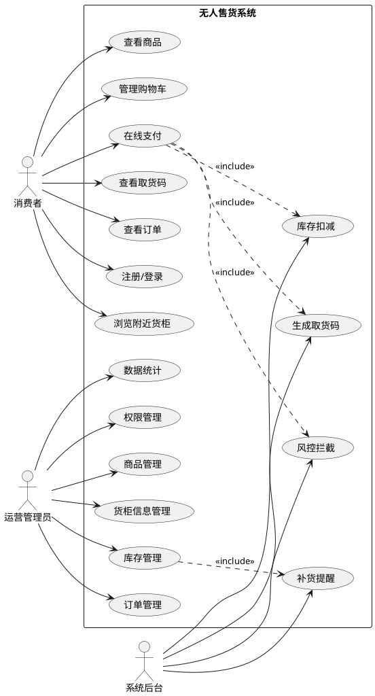
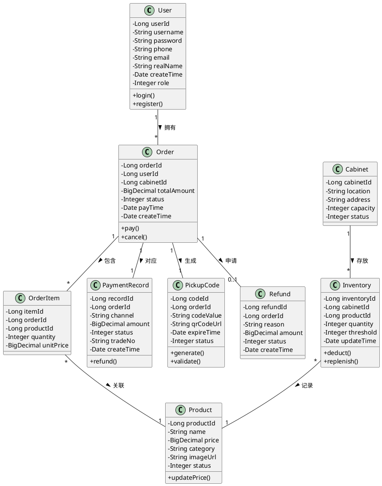
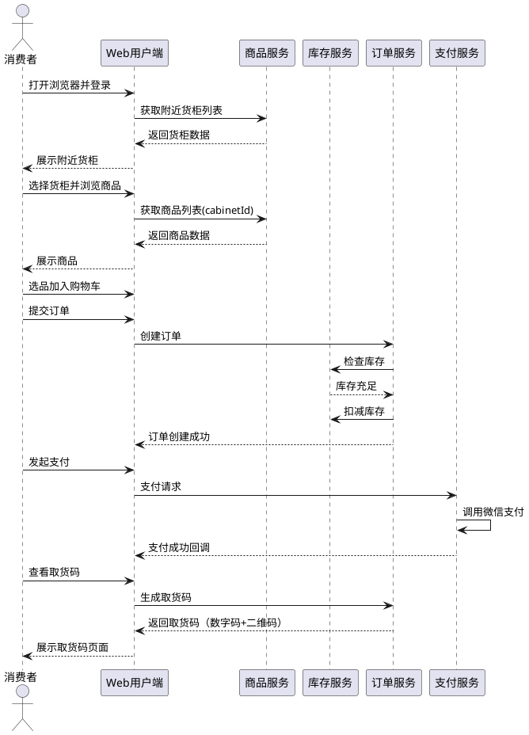
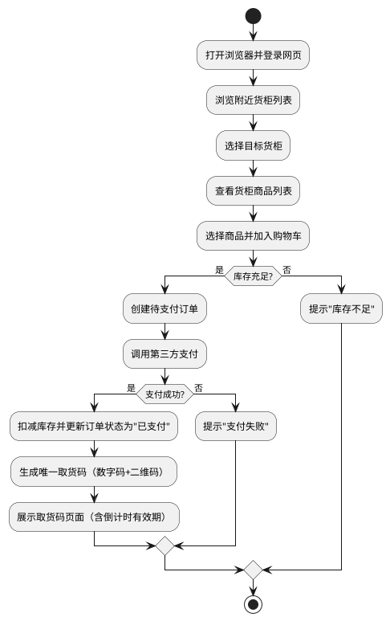

# 无人售货系统 —— 开发文档

> 本文档基于软件工程结课报告（第一、二阶段）编写，涵盖从环境搭建到原型交付的完整开发过程。

---

## 目录

- [1 项目概述](#1-项目概述)
- [2 技术栈选型](#2-技术栈选型)
- [3 系统架构设计](#3-系统架构设计)
- [4 数据库设计](#4-数据库设计)
- [5 后端开发](#5-后端开发)
- [6 前端开发](#6-前端开发)
- [7 核心业务流程实现](#7-核心业务流程实现)
- [8 开发环境搭建](#8-开发环境搭建)
- [9 开发规范](#9-开发规范)
- [10 原型开发路线图](#10-原型开发路线图)
- [11 测试方案](#11-测试方案)
- [12 部署指南](#12-部署指南)
- [附录 PlantUML 图代码汇总](#附录-plantuml-图代码汇总)

---

## 1 项目概述

### 1.1 项目背景

随着移动支付和电子商务技术的快速发展，无人零售行业迎来了爆发式增长。传统零售模式面临着人力成本高、营业时间受限、运营效率低等痛点。无人售货系统通过线上选购与自助结算相结合的模式，有效降低了运营成本，提升了用户购物体验，已成为新零售领域的重要发展方向。

### 1.2 项目目标

开发一套纯软件平台的无人售货管理系统，实现：
- 消费者通过 Web 网页浏览货柜商品、在线支付、获取取货码
- 运营管理员通过 Web 后台管理商品、库存、订单、查看数据统计
- 通过取货码机制衔接线上线下流程

### 1.3 系统范围

| 包含 | 不包含 |
|------|--------|
| Web 用户端（Vue.js） | 硬件货柜控制 |
| Web 管理后台（Vue.js） | 物联网设备通信 |
| Spring Boot 后端服务 | 移动端 App |
| MySQL / Redis / MinIO | 智能推荐算法 |

### 1.4 项目意义

- **降低运营成本**：减少收银员、导购员等人力投入，实现24小时无人值守运营
- **提升购物效率**：用户在线选购，无需排队等待结账，支付后凭取货码即可提货
- **优化管理决策**：通过销售数据统计分析，帮助运营方精准补货、调整商品策略
- **技术实践价值**：综合运用软件工程方法，完成从需求分析到系统设计的完整流程

---

## 2 技术栈选型

### 2.1 后端技术栈

| 技术 | 版本 | 用途 | 选型理由 |
|------|------|------|---------|
| Java | 17 | 开发语言 | LTS 版本，生态成熟 |
| Spring Boot | 3.2.x | 后端框架 | 开箱即用，简化配置 |
| Spring Security | 6.x | 安全框架 | JWT 鉴权、权限控制 |
| MyBatis-Plus | 3.5.x | ORM 框架 | 简化 CRUD，内置分页 |
| MySQL | 8.0 | 主数据库 | 事务支持，稳定性强 |
| Redis | 6.2 | 缓存 | 热点数据缓存、分布式锁 |
| MinIO | latest | 对象存储 | 商品图片存储 |
| Maven | 3.9.x | 构建工具 | 依赖管理，标准化 |

### 2.2 前端技术栈

| 技术 | 版本 | 用途 | 选型理由 |
|------|------|------|---------|
| Vue.js | 3.4.x | 前端框架 | 组合式 API，响应式 |
| Vite | 5.x | 构建工具 | 极速冷启动，HMR |
| Element Plus | 2.x | UI 组件库 | 管理后台首选 |
| Pinia | 2.x | 状态管理 | Vue 3 官方推荐 |
| Vue Router | 4.x | 路由管理 | 单页应用路由 |
| Axios | 1.6.x | HTTP 客户端 | 请求拦截、响应处理 |
| ECharts | 5.x | 数据可视化 | 统计图表 |

### 2.3 开发工具

| 工具 | 用途 |
|------|------|
| IntelliJ IDEA | 后端开发 IDE |
| VS Code | 前端开发 IDE |
| Postman / Apifox | API 调试 |
| DBeaver | 数据库管理 |
| Docker Desktop | 本地服务部署 |
| Git | 版本控制 |
| PlantUML | UML 图生成 |

---

## 3 系统架构设计

### 3.1 整体架构

本系统采用 **前后端分离的三层架构**，整体分为：表现层、业务服务层、数据层。

```
┌─────────────────────────────────────────────────────────────┐
│                        表现层 (Presentation)                  │
│  ┌──────────────┐  ┌──────────────┐                        │
│  │  Web用户端    │  │ Web管理后台   │                        │
│  │   (Vue.js)   │  │   (Vue.js)   │                        │
│  └──────────────┘  └──────────────┘                        │
└────────────────────────┬────────────────────────────────────┘
                         │ HTTPS / JSON
┌────────────────────────▼────────────────────────────────────┐
│                      业务服务层 (Business)                    │
│                                                             │
│   ┌───────────────────────────────────────────────────┐     │
│   │           Spring Boot 单体应用                    │     │
│   │  ┌─────────┐ ┌─────────┐ ┌─────────┐ ┌─────────┐ │     │
│   │  │用户模块  │ │商品模块  │ │订单模块  │ │支付模块  │ │     │
│   │  └─────────┘ └─────────┘ └─────────┘ └─────────┘ │     │
│   │  ┌─────────┐ ┌─────────┐ ┌─────────┐             │     │
│   │  │库存模块  │ │货柜模块  │ │统计模块  │             │     │
│   │  └─────────┘ └─────────┘ └─────────┘             │     │
│   └───────────────────────────────────────────────────┘     │
│                                                             │
└────────────────────────┬────────────────────────────────────┘
                         │
┌────────────────────────▼────────────────────────────────────┐
│                        数据层 (Data)                          │
│  ┌──────────────┐  ┌──────────────┐  ┌──────────────────┐  │
│  │    MySQL     │  │    Redis     │  │    MinIO         │  │
│  │  (主数据库)   │  │ (缓存/会话)   │  │   (图片存储)     │  │
│  └──────────────┘  └──────────────┘  └──────────────────┘  │
└─────────────────────────────────────────────────────────────┘
```

**各层说明：**

- **表现层**：消费者通过浏览器访问 Web 用户端（Vue.js）浏览商品、下单支付、获取取货码；运营人员通过 Web 管理后台（Vue.js）进行商品、库存、订单等运营操作
- **业务服务层**：基于 Spring Boot 构建服务集群，采用**单体架构（按模块分包）**，各模块通过内部方法调用交互。原型阶段采用单体架构便于开发调试，预留了后续拆分为微服务的能力（各模块已有清晰的边界定义）
- **数据层**：MySQL 存储核心业务数据；Redis 缓存热点商品、会话 Token、库存扣减分布式锁、取货码信息；MinIO 保存商品图片

### 3.2 功能模块设计

系统共划分为七大功能模块：

| 模块名称 | 职责说明 | 核心子功能 |
|---------|---------|-----------|
| **用户服务模块** | 管理用户身份与权限 | 注册/登录、手机号绑定、JWT鉴权、角色分配 |
| **商品服务模块** | 维护商品基础信息 | 商品CRUD、分类标签、价格策略、图片管理 |
| **订单服务模块** | 处理交易全流程 | 订单创建、状态流转、取消/退款、订单查询 |
| **支付服务模块** | 对接第三方支付 | 支付下单、结果回调、对账文件、退款处理 |
| **库存服务模块** | 管理各货柜库存 | 库存扣减/回滚、多货柜库存、预警阈值、补货提醒 |
| **货柜信息服务模块** | 维护货柜基础数据 | 货柜注册、位置信息、容量配置、状态标记 |
| **数据统计模块** | 分析与报表输出 | 销售统计、库存周转、用户画像、货柜销售排行 |

### 3.3 模块依赖关系

```
用户端 ──┐
         ├──▶ 用户服务 ──▶ MySQL (用户表)
         ├──▶ 商品服务 ──▶ MySQL (商品表) + Redis (热点缓存)
         ├──▶ 货柜服务 ──▶ MySQL (货柜表)
         ├──▶ 订单服务 ──▶ MySQL (订单表/订单项表)
         │        │
         │        ├──▶ 库存服务 ──▶ MySQL (库存表) + Redis (分布式锁)
         │        │
         │        └──▶ 支付服务 ──▶ MySQL (支付记录表)
         │
管理端 ──┤
         ├──▶ 用户服务 ──▶ 权限校验
         ├──▶ 商品服务 ──▶ 商品CRUD
         ├──▶ 货柜服务 ──▶ 货柜管理
         ├──▶ 库存服务 ──▶ 库存调整/预警
         ├──▶ 订单服务 ──▶ 订单查询/退款
         └──▶ 数据统计 ──▶ 聚合查询 (读所有模块数据)
```

---

## 4 数据库设计

### 4.1 数据库概览

数据库名称：`vending_db`

共 9 张核心表：

| 表名 | 说明 | 关键字段数 |
|------|------|-----------|
| `sys_user` | 用户表 | 10 |
| `product` | 商品表 | 11 |
| `cabinet` | 货柜表 | 9 |
| `inventory` | 库存表 | 7 |
| `orders` | 订单主表 | 11 |
| `order_item` | 订单明细表 | 6 |
| `payment_record` | 支付记录表 | 9 |
| `pickup_code` | 取货码表 | 8 |
| `refund` | 退款表 | 8 |

### 4.2 完整 DDL

#### 4.2.1 用户表 (sys_user)

```sql
CREATE TABLE `sys_user` (
    `user_id` BIGINT NOT NULL AUTO_INCREMENT COMMENT '用户ID',
    `username` VARCHAR(50) NOT NULL COMMENT '用户名',
    `password` VARCHAR(100) NOT NULL COMMENT '密码(Bcrypt加密)',
    `phone` VARCHAR(20) DEFAULT NULL COMMENT '手机号',
    `email` VARCHAR(100) DEFAULT NULL COMMENT '邮箱',
    `real_name` VARCHAR(50) DEFAULT NULL COMMENT '真实姓名',
    `avatar` VARCHAR(255) DEFAULT NULL COMMENT '头像URL',
    `role` TINYINT NOT NULL DEFAULT 0 COMMENT '角色: 0-普通用户 1-运营管理员 2-超级管理员',
    `status` TINYINT NOT NULL DEFAULT 1 COMMENT '状态: 0-禁用 1-正常',
    `create_time` DATETIME NOT NULL DEFAULT CURRENT_TIMESTAMP COMMENT '创建时间',
    `update_time` DATETIME NOT NULL DEFAULT CURRENT_TIMESTAMP ON UPDATE CURRENT_TIMESTAMP COMMENT '更新时间',
    PRIMARY KEY (`user_id`),
    UNIQUE KEY `uk_username` (`username`),
    UNIQUE KEY `uk_phone` (`phone`),
    KEY `idx_role` (`role`),
    KEY `idx_status` (`status`)
) ENGINE=InnoDB DEFAULT CHARSET=utf8mb4 COLLATE=utf8mb4_unicode_ci COMMENT='用户表';
```

#### 4.2.2 商品表 (product)

```sql
CREATE TABLE `product` (
    `product_id` BIGINT NOT NULL AUTO_INCREMENT COMMENT '商品ID',
    `name` VARCHAR(100) NOT NULL COMMENT '商品名称',
    `description` TEXT DEFAULT NULL COMMENT '商品描述',
    `category` VARCHAR(50) NOT NULL COMMENT '商品分类',
    `price` DECIMAL(10, 2) NOT NULL COMMENT '价格(元)',
    `cost_price` DECIMAL(10, 2) DEFAULT NULL COMMENT '成本价(元)',
    `image_url` VARCHAR(255) DEFAULT NULL COMMENT '主图URL',
    `images` JSON DEFAULT NULL COMMENT '图片列表(JSON数组)',
    `spec` VARCHAR(255) DEFAULT NULL COMMENT '规格(如: 500ml/瓶)',
    `status` TINYINT NOT NULL DEFAULT 1 COMMENT '状态: 0-下架 1-上架',
    `create_time` DATETIME NOT NULL DEFAULT CURRENT_TIMESTAMP COMMENT '创建时间',
    `update_time` DATETIME NOT NULL DEFAULT CURRENT_TIMESTAMP ON UPDATE CURRENT_TIMESTAMP COMMENT '更新时间',
    PRIMARY KEY (`product_id`),
    KEY `idx_category` (`category`),
    KEY `idx_status` (`status`),
    KEY `idx_name` (`name`)
) ENGINE=InnoDB DEFAULT CHARSET=utf8mb4 COLLATE=utf8mb4_unicode_ci COMMENT='商品表';
```

#### 4.2.3 货柜表 (cabinet)

```sql
CREATE TABLE `cabinet` (
    `cabinet_id` BIGINT NOT NULL AUTO_INCREMENT COMMENT '货柜ID',
    `cabinet_code` VARCHAR(50) NOT NULL COMMENT '货柜编号(唯一)',
    `name` VARCHAR(100) NOT NULL COMMENT '货柜名称',
    `city` VARCHAR(50) NOT NULL COMMENT '所在城市',
    `address` VARCHAR(255) NOT NULL COMMENT '详细地址',
    `image_url` VARCHAR(255) DEFAULT NULL COMMENT '货柜图片URL',
    `latitude` DECIMAL(10, 7) DEFAULT NULL COMMENT '纬度',
    `longitude` DECIMAL(10, 7) DEFAULT NULL COMMENT '经度',
    `capacity` INT NOT NULL DEFAULT 50 COMMENT '货柜容量(商品格数)',
    `status` TINYINT NOT NULL DEFAULT 1 COMMENT '状态: 0-停用 1-营业中 2-维护中',
    `create_time` DATETIME NOT NULL DEFAULT CURRENT_TIMESTAMP COMMENT '创建时间',
    `update_time` DATETIME NOT NULL DEFAULT CURRENT_TIMESTAMP ON UPDATE CURRENT_TIMESTAMP COMMENT '更新时间',
    PRIMARY KEY (`cabinet_id`),
    UNIQUE KEY `uk_cabinet_code` (`cabinet_code`),
    KEY `idx_city` (`city`),
    KEY `idx_status` (`status`)
) ENGINE=InnoDB DEFAULT CHARSET=utf8mb4 COLLATE=utf8mb4_unicode_ci COMMENT='货柜表';
```

#### 4.2.4 库存表 (inventory)

```sql
CREATE TABLE `inventory` (
    `inventory_id` BIGINT NOT NULL AUTO_INCREMENT COMMENT '库存ID',
    `cabinet_id` BIGINT NOT NULL COMMENT '货柜ID',
    `product_id` BIGINT NOT NULL COMMENT '商品ID',
    `quantity` INT NOT NULL DEFAULT 0 COMMENT '当前库存数量',
    `threshold` INT NOT NULL DEFAULT 5 COMMENT '预警阈值',
    `create_time` DATETIME NOT NULL DEFAULT CURRENT_TIMESTAMP COMMENT '创建时间',
    `update_time` DATETIME NOT NULL DEFAULT CURRENT_TIMESTAMP ON UPDATE CURRENT_TIMESTAMP COMMENT '更新时间',
    PRIMARY KEY (`inventory_id`),
    UNIQUE KEY `uk_cabinet_product` (`cabinet_id`, `product_id`),
    KEY `idx_cabinet` (`cabinet_id`),
    KEY `idx_product` (`product_id`),
    KEY `idx_quantity` (`quantity`),
    CONSTRAINT `fk_inventory_cabinet` FOREIGN KEY (`cabinet_id`) REFERENCES `cabinet` (`cabinet_id`),
    CONSTRAINT `fk_inventory_product` FOREIGN KEY (`product_id`) REFERENCES `product` (`product_id`)
) ENGINE=InnoDB DEFAULT CHARSET=utf8mb4 COLLATE=utf8mb4_unicode_ci COMMENT='库存表';
```

#### 4.2.5 订单主表 (orders)

```sql
CREATE TABLE `orders` (
    `order_id` BIGINT NOT NULL AUTO_INCREMENT COMMENT '订单ID',
    `order_no` VARCHAR(32) NOT NULL COMMENT '订单号(业务唯一)',
    `user_id` BIGINT NOT NULL COMMENT '用户ID',
    `cabinet_id` BIGINT NOT NULL COMMENT '货柜ID',
    `total_amount` DECIMAL(10, 2) NOT NULL COMMENT '订单总金额',
    `status` TINYINT NOT NULL DEFAULT 0 COMMENT '状态: 0-待支付 1-已支付 2-已完成 3-已取消 4-退款中 5-已退款',
    `pay_time` DATETIME DEFAULT NULL COMMENT '支付时间',
    `pay_channel` VARCHAR(20) DEFAULT NULL COMMENT '支付渠道: wechat/alipay',
    `remark` VARCHAR(255) DEFAULT NULL COMMENT '备注',
    `create_time` DATETIME NOT NULL DEFAULT CURRENT_TIMESTAMP COMMENT '创建时间',
    `update_time` DATETIME NOT NULL DEFAULT CURRENT_TIMESTAMP ON UPDATE CURRENT_TIMESTAMP COMMENT '更新时间',
    PRIMARY KEY (`order_id`),
    UNIQUE KEY `uk_order_no` (`order_no`),
    KEY `idx_user_id` (`user_id`),
    KEY `idx_cabinet_id` (`cabinet_id`),
    KEY `idx_status` (`status`),
    KEY `idx_create_time` (`create_time`),
    CONSTRAINT `fk_order_user` FOREIGN KEY (`user_id`) REFERENCES `sys_user` (`user_id`),
    CONSTRAINT `fk_order_cabinet` FOREIGN KEY (`cabinet_id`) REFERENCES `cabinet` (`cabinet_id`)
) ENGINE=InnoDB DEFAULT CHARSET=utf8mb4 COLLATE=utf8mb4_unicode_ci COMMENT='订单主表';
```

#### 4.2.6 订单明细表 (order_item)

```sql
CREATE TABLE `order_item` (
    `item_id` BIGINT NOT NULL AUTO_INCREMENT COMMENT '明细ID',
    `order_id` BIGINT NOT NULL COMMENT '订单ID',
    `product_id` BIGINT NOT NULL COMMENT '商品ID',
    `product_name` VARCHAR(100) NOT NULL COMMENT '商品名称(快照)',
    `quantity` INT NOT NULL COMMENT '购买数量',
    `unit_price` DECIMAL(10, 2) NOT NULL COMMENT '购买时单价',
    PRIMARY KEY (`item_id`),
    KEY `idx_order_id` (`order_id`),
    KEY `idx_product_id` (`product_id`),
    CONSTRAINT `fk_item_order` FOREIGN KEY (`order_id`) REFERENCES `orders` (`order_id`)
) ENGINE=InnoDB DEFAULT CHARSET=utf8mb4 COLLATE=utf8mb4_unicode_ci COMMENT='订单明细表';
```

#### 4.2.7 支付记录表 (payment_record)

```sql
CREATE TABLE `payment_record` (
    `record_id` BIGINT NOT NULL AUTO_INCREMENT COMMENT '记录ID',
    `order_id` BIGINT NOT NULL COMMENT '订单ID',
    `order_no` VARCHAR(32) NOT NULL COMMENT '订单号',
    `channel` VARCHAR(20) NOT NULL COMMENT '支付渠道: wechat/alipay/mock',
    `amount` DECIMAL(10, 2) NOT NULL COMMENT '支付金额',
    `status` TINYINT NOT NULL DEFAULT 0 COMMENT '状态: 0-待支付 1-支付成功 2-支付失败 3-已退款',
    `trade_no` VARCHAR(64) DEFAULT NULL COMMENT '第三方交易流水号',
    `pay_time` DATETIME DEFAULT NULL COMMENT '支付成功时间',
    `create_time` DATETIME NOT NULL DEFAULT CURRENT_TIMESTAMP COMMENT '创建时间',
    PRIMARY KEY (`record_id`),
    UNIQUE KEY `uk_order_no` (`order_no`),
    KEY `idx_order_id` (`order_id`),
    KEY `idx_trade_no` (`trade_no`),
    KEY `idx_status` (`status`),
    CONSTRAINT `fk_payment_order` FOREIGN KEY (`order_id`) REFERENCES `orders` (`order_id`)
) ENGINE=InnoDB DEFAULT CHARSET=utf8mb4 COLLATE=utf8mb4_unicode_ci COMMENT='支付记录表';
```

#### 4.2.8 取货码表 (pickup_code)

```sql
CREATE TABLE `pickup_code` (
    `code_id` BIGINT NOT NULL AUTO_INCREMENT COMMENT '取货码ID',
    `order_id` BIGINT NOT NULL COMMENT '订单ID',
    `order_no` VARCHAR(32) NOT NULL COMMENT '订单号',
    `code_value` VARCHAR(10) NOT NULL COMMENT '6位数字取货码',
    `qr_code_url` VARCHAR(255) DEFAULT NULL COMMENT '二维码图片URL',
    `status` TINYINT NOT NULL DEFAULT 0 COMMENT '状态: 0-未使用 1-已使用 2-已过期',
    `expire_time` DATETIME NOT NULL COMMENT '过期时间',
    `use_time` DATETIME DEFAULT NULL COMMENT '使用时间',
    `create_time` DATETIME NOT NULL DEFAULT CURRENT_TIMESTAMP COMMENT '创建时间',
    PRIMARY KEY (`code_id`),
    UNIQUE KEY `uk_code_value` (`code_value`),
    UNIQUE KEY `uk_order_id` (`order_id`),
    KEY `idx_status` (`status`),
    KEY `idx_expire_time` (`expire_time`),
    CONSTRAINT `fk_pickup_order` FOREIGN KEY (`order_id`) REFERENCES `orders` (`order_id`)
) ENGINE=InnoDB DEFAULT CHARSET=utf8mb4 COLLATE=utf8mb4_unicode_ci COMMENT='取货码表';
```

#### 4.2.9 退款表 (refund)

```sql
CREATE TABLE `refund` (
    `refund_id` BIGINT NOT NULL AUTO_INCREMENT COMMENT '退款ID',
    `order_id` BIGINT NOT NULL COMMENT '订单ID',
    `order_no` VARCHAR(32) NOT NULL COMMENT '订单号',
    `user_id` BIGINT NOT NULL COMMENT '申请用户ID',
    `reason` VARCHAR(255) NOT NULL COMMENT '退款原因',
    `amount` DECIMAL(10, 2) NOT NULL COMMENT '退款金额',
    `status` TINYINT NOT NULL DEFAULT 0 COMMENT '状态: 0-申请中 1-审核通过 2-审核拒绝 3-已退款',
    `audit_remark` VARCHAR(255) DEFAULT NULL COMMENT '审核备注',
    `create_time` DATETIME NOT NULL DEFAULT CURRENT_TIMESTAMP COMMENT '申请时间',
    `update_time` DATETIME NOT NULL DEFAULT CURRENT_TIMESTAMP ON UPDATE CURRENT_TIMESTAMP COMMENT '更新时间',
    PRIMARY KEY (`refund_id`),
    KEY `idx_order_id` (`order_id`),
    KEY `idx_user_id` (`user_id`),
    KEY `idx_status` (`status`),
    CONSTRAINT `fk_refund_order` FOREIGN KEY (`order_id`) REFERENCES `orders` (`order_id`),
    CONSTRAINT `fk_refund_user` FOREIGN KEY (`user_id`) REFERENCES `sys_user` (`user_id`)
) ENGINE=InnoDB DEFAULT CHARSET=utf8mb4 COLLATE=utf8mb4_unicode_ci COMMENT='退款表';
```

### 4.3 ER 关系图

```
sys_user(1) ────────(N) orders(N) ────────(1) cabinet
    │                       │
    │                       │
   (N)                     (1)
    │                       │
    ▼                       ▼
  refund                inventory(1) ────────(N) cabinet
    │                       │
    │                       │
   (N)                     (N)
    │                       │
    ▼                       ▼
  orders                product ──────────────(N) order_item
                            │
                            │
                           (N)
                            │
                            ▼
                       payment_record
                            │
                            │
                           (1)
                            │
                            ▼
                       pickup_code
```

**完整关系说明：**
- `sys_user` 1:N `orders` — 一个用户可以创建多个订单
- `sys_user` 1:N `refund` — 一个用户可以发起多个退款申请
- `orders` N:1 `cabinet` — 多个订单可以属于同一个货柜
- `orders` 1:N `order_item` — 一个订单包含多条订单明细
- `orders` 1:1 `payment_record` — 一个订单对应一条支付记录
- `orders` 1:1 `pickup_code` — 一个订单生成一个取货码
- `orders` 1:0..1 `refund` — 一个订单最多有一个退款申请
- `cabinet` 1:N `inventory` — 一个货柜有多条库存记录
- `product` 1:N `inventory` — 一个商品在多个货柜中有库存记录
- `product` 1:N `order_item` — 一个商品可以出现在多条订单明细中

### 4.4 数据字典

#### 4.4.1 订单状态枚举

| 值 | 含义 | 说明 |
|----|------|------|
| 0 | 待支付 | 订单已创建，等待用户支付 |
| 1 | 已支付 | 支付成功，等待取货 |
| 2 | 已完成 | 用户已取货，订单完成 |
| 3 | 已取消 | 用户取消或超时未支付 |
| 4 | 退款中 | 用户申请退款，等待审核 |
| 5 | 已退款 | 退款完成 |

#### 4.4.2 用户角色枚举

| 值 | 含义 | 说明 |
|----|------|------|
| 0 | 普通用户 | 消费者 |
| 1 | 运营管理员 | 可管理商品、订单、库存 |
| 2 | 超级管理员 | 拥有所有权限，含权限管理 |

#### 4.4.3 货柜状态枚举

| 值 | 含义 | 说明 |
|----|------|------|
| 0 | 停用 | 货柜已停用，不可下单 |
| 1 | 营业中 | 正常运营 |
| 2 | 维护中 | 临时维护，不可下单 |

### 4.5 初始化数据

```sql
-- 插入测试用户
-- 注意：密码为 123456 的 Bcrypt 加密哈希，不同 BCrypt 库生成的哈希值可能不同
-- 如果登录失败，请通过 Spring Boot 运行以下代码生成新的哈希：
--   System.out.println(new BCryptPasswordEncoder().encode("123456"));
-- 或使用在线工具生成：https://bcrypt-generator.com/
INSERT INTO `sys_user` (`username`, `password`, `phone`, `role`, `status`) VALUES
('admin', '$2a$10$4K.OlkM6X8VqB3YzK6qEiO9xJ5pR2wN7mS8tL1cA3dB5eF7gH9jK0L', '13800138000', 2, 1),
('operator1', '$2a$10$4K.OlkM6X8VqB3YzK6qEiO9xJ5pR2wN7mS8tL1cA3dB5eF7gH9jK0L', '13800138001', 1, 1),
('user001', '$2a$10$4K.OlkM6X8VqB3YzK6qEiO9xJ5pR2wN7mS8tL1cA3dB5eF7gH9jK0L', '13900139000', 0, 1);

-- 插入测试货柜
INSERT INTO `cabinet` (`cabinet_code`, `name`, `city`, `address`, `image_url`, `latitude`, `longitude`, `capacity`, `status`) VALUES
('CAB001', '科技园A栋货柜', '深圳', '深圳市南山区科技园南路A栋一楼', 'https://placehold.co/400x300/3498db/ffffff?text=Cabinet+A', 22.5329080, 113.9431060, 50, 1),
('CAB002', '科技园B栋货柜', '深圳', '深圳市南山区科技园南路B栋一楼', 'https://placehold.co/400x300/2ecc71/ffffff?text=Cabinet+B', 22.5331080, 113.9441060, 40, 1),
('CAB003', '大学城货柜', '深圳', '深圳市南山区大学城C区', 'https://placehold.co/400x300/9b59b6/ffffff?text=Cabinet+C', 22.5900080, 113.9701060, 60, 1);

-- 插入测试商品
INSERT INTO `product` (`name`, `description`, `category`, `price`, `cost_price`, `spec`, `image_url`, `status`) VALUES
('可口可乐', '经典口味 330ml', '饮料', 3.50, 2.00, '330ml/罐', 'https://placehold.co/400x400/ff6b6b/ffffff?text=Coca-Cola', 1),
('百事可乐', '经典口味 330ml', '饮料', 3.50, 2.00, '330ml/罐', 'https://placehold.co/400x400/3498db/ffffff?text=Pepsi', 1),
('农夫山泉', '天然饮用水', '饮料', 2.00, 1.00, '550ml/瓶', 'https://placehold.co/400x400/2ecc71/ffffff?text=Water', 1),
('康师傅红烧牛肉面', '经典方便面', '零食', 5.00, 3.00, '105g/袋', 'https://placehold.co/400x400/f39c12/ffffff?text=Noodles', 1),
('乐事薯片', '原味薯片', '零食', 7.50, 4.50, '70g/袋', 'https://placehold.co/400x400/9b59b6/ffffff?text=Chips', 1),
('卫龙辣条', '经典辣条', '零食', 1.50, 0.80, '65g/袋', 'https://placehold.co/400x400/e74c3c/ffffff?text=Spicy', 1);

-- 插入测试库存
INSERT INTO `inventory` (`cabinet_id`, `product_id`, `quantity`, `threshold`) VALUES
(1, 1, 20, 5), (1, 2, 15, 5), (1, 3, 30, 10), (1, 4, 10, 3), (1, 5, 8, 3), (1, 6, 25, 5),
(2, 1, 18, 5), (2, 3, 25, 10), (2, 4, 12, 3), (2, 5, 6, 3),
(3, 1, 30, 10), (3, 2, 25, 10), (3, 3, 50, 15), (3, 4, 20, 5), (3, 5, 15, 5), (3, 6, 40, 10);
```

---

## 5 后端开发

### 5.1 项目结构

采用单体架构（便于原型开发），包结构如下：

```
vending-server/
├── pom.xml
├── src/
│   ├── main/
│   │   ├── java/com/vending/
│   │   │   ├── VendingApplication.java          # 启动类
│   │   │   ├── common/                          # 公共模块
│   │   │   │   ├── config/
│   │   │   │   │   ├── SecurityConfig.java      # Spring Security 配置
│   │   │   │   │   ├── MyBatisPlusConfig.java   # MyBatis-Plus 配置
│   │   │   │   │   ├── CorsConfig.java          # 跨域配置
│   │   │   │   │   └── MinIOConfig.java         # MinIO 配置
│   │   │   │   ├── result/
│   │   │   │   │   ├── Result.java              # 统一响应对象
│   │   │   │   │   └── ResultCode.java          # 响应码枚举
│   │   │   │   ├── exception/
│   │   │   │   │   ├── GlobalExceptionHandler.java  # 全局异常处理
│   │   │   │   │   └── BusinessException.java       # 业务异常
│   │   │   │   ├── util/
│   │   │   │   │   ├── JwtUtil.java               # JWT 工具类
│   │   │   │   │   └── CodeGenerator.java         # 取货码生成器
│   │   │   │   └── annotation/
│   │   │   │       └── RequireRole.java           # 角色权限注解
│   │   │   ├── module/
│   │   │   │   ├── user/                          # 用户模块
│   │   │   │   │   ├── controller/UserController.java
│   │   │   │   │   ├── service/UserService.java
│   │   │   │   │   ├── service/impl/UserServiceImpl.java
│   │   │   │   │   ├── mapper/UserMapper.java
│   │   │   │   │   ├── entity/User.java
│   │   │   │   │   └── dto/
│   │   │   │   │       ├── LoginRequest.java
│   │   │   │   │       ├── RegisterRequest.java
│   │   │   │   │       └── UserVO.java
│   │   │   │   ├── product/                       # 商品模块
│   │   │   │   │   ├── controller/ProductController.java
│   │   │   │   │   ├── service/ProductService.java
│   │   │   │   │   ├── service/impl/ProductServiceImpl.java
│   │   │   │   │   ├── mapper/ProductMapper.java
│   │   │   │   │   ├── entity/Product.java
│   │   │   │   │   └── dto/ProductQueryDTO.java
│   │   │   │   ├── cabinet/                       # 货柜模块
│   │   │   │   │   ├── controller/CabinetController.java
│   │   │   │   │   ├── service/CabinetService.java
│   │   │   │   │   ├── service/impl/CabinetServiceImpl.java
│   │   │   │   │   ├── mapper/CabinetMapper.java
│   │   │   │   │   └── entity/Cabinet.java
│   │   │   │   ├── inventory/                     # 库存模块
│   │   │   │   │   ├── controller/InventoryController.java
│   │   │   │   │   ├── service/InventoryService.java
│   │   │   │   │   ├── service/impl/InventoryServiceImpl.java
│   │   │   │   │   ├── mapper/InventoryMapper.java
│   │   │   │   │   └── entity/Inventory.java
│   │   │   │   ├── order/                         # 订单模块
│   │   │   │   │   ├── controller/OrderController.java
│   │   │   │   │   ├── service/OrderService.java
│   │   │   │   │   ├── service/impl/OrderServiceImpl.java
│   │   │   │   │   ├── mapper/OrderMapper.java
│   │   │   │   │   ├── mapper/OrderItemMapper.java
│   │   │   │   │   ├── entity/Order.java
│   │   │   │   │   ├── entity/OrderItem.java
│   │   │   │   │   └── dto/
│   │   │   │   │       ├── CreateOrderRequest.java
│   │   │   │   │       └── OrderVO.java
│   │   │   │   ├── payment/                       # 支付模块
│   │   │   │   │   ├── controller/PaymentController.java
│   │   │   │   │   ├── service/PaymentService.java
│   │   │   │   │   ├── service/impl/PaymentServiceImpl.java
│   │   │   │   │   ├── mapper/PaymentRecordMapper.java
│   │   │   │   │   └── entity/PaymentRecord.java
│   │   │   │   ├── pickup/                        # 取货码模块
│   │   │   │   │   ├── controller/PickupCodeController.java
│   │   │   │   │   ├── service/PickupCodeService.java
│   │   │   │   │   ├── mapper/PickupCodeMapper.java
│   │   │   │   │   └── entity/PickupCode.java
│   │   │   │   ├── refund/                        # 退款模块
│   │   │   │   │   ├── controller/RefundController.java
│   │   │   │   │   ├── service/RefundService.java
│   │   │   │   │   ├── mapper/RefundMapper.java
│   │   │   │   │   └── entity/Refund.java
│   │   │   │   └── statistics/                    # 统计模块
│   │   │   │       ├── controller/StatisticsController.java
│   │   │   │       ├── service/StatisticsService.java
│   │   │   │       └── dto/StatisticsVO.java
│   │   │   └── security/                          # 安全模块
│   │   │       ├── JwtAuthenticationFilter.java   # JWT 过滤器
│   │   │       └── UserDetailsServiceImpl.java    # 用户详情服务
│   │   └── resources/
│   │       ├── application.yml                    # 主配置文件
│   │       ├── application-dev.yml                # 开发环境配置
│   │       └── mapper/                            # MyBatis XML 映射文件
│   │           ├── UserMapper.xml
│   │           ├── OrderMapper.xml
│   │           └── ...
│   └── test/
│       └── java/com/vending/
│           └── VendingApplicationTests.java
```

### 5.2 核心配置文件

#### 5.2.1 pom.xml (关键依赖)

```xml
<dependencies>
    <!-- Spring Boot Web -->
    <dependency>
        <groupId>org.springframework.boot</groupId>
        <artifactId>spring-boot-starter-web</artifactId>
    </dependency>

    <!-- Spring Security -->
    <dependency>
        <groupId>org.springframework.boot</groupId>
        <artifactId>spring-boot-starter-security</artifactId>
    </dependency>

    <!-- MyBatis-Plus -->
    <dependency>
        <groupId>com.baomidou</groupId>
        <artifactId>mybatis-plus-spring-boot3-starter</artifactId>
        <version>3.5.5</version>
    </dependency>

    <!-- MySQL Driver -->
    <dependency>
        <groupId>com.mysql</groupId>
        <artifactId>mysql-connector-j</artifactId>
        <scope>runtime</scope>
    </dependency>

    <!-- Redis -->
    <dependency>
        <groupId>org.springframework.boot</groupId>
        <artifactId>spring-boot-starter-data-redis</artifactId>
    </dependency>

    <!-- JWT -->
    <dependency>
        <groupId>io.jsonwebtoken</groupId>
        <artifactId>jjwt-api</artifactId>
        <version>0.12.3</version>
    </dependency>
    <dependency>
        <groupId>io.jsonwebtoken</groupId>
        <artifactId>jjwt-impl</artifactId>
        <version>0.12.3</version>
        <scope>runtime</scope>
    </dependency>
    <dependency>
        <groupId>io.jsonwebtoken</groupId>
        <artifactId>jjwt-jackson</artifactId>
        <version>0.12.3</version>
        <scope>runtime</scope>
    </dependency>

    <!-- MinIO -->
    <dependency>
        <groupId>io.minio</groupId>
        <artifactId>minio</artifactId>
        <version>8.5.7</version>
    </dependency>

    <!-- Lombok -->
    <dependency>
        <groupId>org.projectlombok</groupId>
        <artifactId>lombok</artifactId>
        <optional>true</optional>
    </dependency>

    <!-- Validation -->
    <dependency>
        <groupId>org.springframework.boot</groupId>
        <artifactId>spring-boot-starter-validation</artifactId>
    </dependency>

    <!-- Test -->
    <dependency>
        <groupId>org.springframework.boot</groupId>
        <artifactId>spring-boot-starter-test</artifactId>
        <scope>test</scope>
    </dependency>
</dependencies>
```

#### 5.2.2 application.yml

> **注意**：使用定时任务（如订单超时取消）需在启动类添加 `@EnableScheduling` 注解。

```yaml
server:
  port: 8080

spring:
  datasource:
    url: jdbc:mysql://localhost:3306/vending_db?useUnicode=true&characterEncoding=utf-8&serverTimezone=Asia/Shanghai&useSSL=false&allowPublicKeyRetrieval=true
    username: vending  # ⚠️ 生产环境请使用环境变量 DB_USERNAME
    password: vending1234  # ⚠️ 生产环境请使用环境变量 DB_PASSWORD
    driver-class-name: com.mysql.cj.jdbc.Driver
    hikari:
      maximum-pool-size: 20
      minimum-idle: 5
      connection-timeout: 30000

  data:
    redis:
      host: localhost
      port: 6379
      database: 0
      timeout: 3000ms

  servlet:
    multipart:
      max-file-size: 10MB
      max-request-size: 10MB

mybatis-plus:
  mapper-locations: classpath:mapper/*.xml
  type-aliases-package: com.vending.module.*.entity
  configuration:
    map-underscore-to-camel-case: true
    log-impl: org.apache.ibatis.logging.stdout.StdOutImpl
  global-config:
    db-config:
      id-type: auto
      logic-delete-field: deleted
      logic-delete-value: 1
      logic-not-delete-value: 0

# JWT 配置
jwt:
  secret: vending-system-secret-key-2026-must-be-at-least-256-bits  # ⚠️ 生产环境请使用环境变量 JWT_SECRET
  expiration: 7200000  # 2小时，单位毫秒
  header: Authorization
  prefix: "Bearer "

# MinIO 配置
minio:
  endpoint: http://localhost:9000
  access-key: minioadmin  # ⚠️ 生产环境请使用环境变量 MINIO_ACCESS_KEY
  secret-key: minioadmin1234  # ⚠️ 生产环境请使用环境变量 MINIO_SECRET_KEY
  bucket-name: vending-images

# 日志配置
logging:
  level:
    com.vending: debug
    org.springframework.security: debug
```

### 5.3 公共模块实现

#### 5.3.1 统一响应对象 Result.java

```java
package com.vending.common.result;

import lombok.Data;

@Data
public class Result<T> {
    private int code;
    private String message;
    private T data;

    public static <T> Result<T> success() {
        return success(null);
    }

    public static <T> Result<T> success(T data) {
        Result<T> result = new Result<>();
        result.setCode(ResultCode.SUCCESS.getCode());
        result.setMessage(ResultCode.SUCCESS.getMessage());
        result.setData(data);
        return result;
    }

    public static <T> Result<T> fail(String message) {
        return fail(ResultCode.FAILURE.getCode(), message);
    }

    public static <T> Result<T> fail(int code, String message) {
        Result<T> result = new Result<>();
        result.setCode(code);
        result.setMessage(message);
        return result;
    }

    public static <T> Result<T> fail(ResultCode resultCode) {
        return fail(resultCode.getCode(), resultCode.getMessage());
    }
}
```

#### 5.3.2 响应码枚举 ResultCode.java

```java
package com.vending.common.result;

import lombok.Getter;

@Getter
public enum ResultCode {
    SUCCESS(200, "操作成功"),
    FAILURE(500, "操作失败"),
    UNAUTHORIZED(401, "未登录或登录已过期"),
    FORBIDDEN(403, "无权限访问"),
    NOT_FOUND(404, "资源不存在"),
    BAD_REQUEST(400, "请求参数错误"),

    // 业务错误码
    USER_NOT_FOUND(1001, "用户不存在"),
    USER_ALREADY_EXISTS(1002, "用户已存在"),
    PASSWORD_WRONG(1003, "密码错误"),
    ACCOUNT_DISABLED(1004, "账号已被禁用"),

    CABINET_NOT_FOUND(2001, "货柜不存在"),
    CABINET_NOT_AVAILABLE(2002, "货柜不可用"),

    PRODUCT_NOT_FOUND(3001, "商品不存在"),
    PRODUCT_OFF_SHELF(3002, "商品已下架"),

    INSUFFICIENT_STOCK(4001, "库存不足"),
    INVENTORY_ERROR(4002, "库存操作失败"),

    ORDER_NOT_FOUND(5001, "订单不存在"),
    ORDER_STATUS_ERROR(5002, "订单状态异常"),
    ORDER_EXPIRED(5003, "订单已过期"),

    PAYMENT_FAILED(6001, "支付失败"),
    PAYMENT_TIMEOUT(6002, "支付超时"),

    PICKUP_CODE_EXPIRED(7001, "取货码已过期"),
    PICKUP_CODE_USED(7002, "取货码已使用");

    private final int code;
    private final String message;

    ResultCode(int code, String message) {
        this.code = code;
        this.message = message;
    }
}
```

#### 5.3.3 全局异常处理 GlobalExceptionHandler.java

```java
package com.vending.common.exception;

import com.vending.common.result.Result;
import com.vending.common.result.ResultCode;
import lombok.extern.slf4j.Slf4j;
import org.springframework.validation.BindException;
import org.springframework.web.bind.MethodArgumentNotValidException;
import org.springframework.web.bind.annotation.ExceptionHandler;
import org.springframework.web.bind.annotation.RestControllerAdvice;

@Slf4j
@RestControllerAdvice
public class GlobalExceptionHandler {

    @ExceptionHandler(BusinessException.class)
    public Result<?> handleBusinessException(BusinessException e) {
        log.warn("业务异常: code={}, message={}", e.getCode(), e.getMessage());
        return Result.fail(e.getCode(), e.getMessage());
    }

    @ExceptionHandler(MethodArgumentNotValidException.class)
    public Result<?> handleValidException(MethodArgumentNotValidException e) {
        String message = e.getBindingResult().getFieldErrors().stream()
                .map(error -> error.getField() + ": " + error.getDefaultMessage())
                .findFirst()
                .orElse("参数校验失败");
        return Result.fail(ResultCode.BAD_REQUEST.getCode(), message);
    }

    @ExceptionHandler(BindException.class)
    public Result<?> handleBindException(BindException e) {
        String message = e.getFieldErrors().stream()
                .map(error -> error.getField() + ": " + error.getDefaultMessage())
                .findFirst()
                .orElse("参数绑定失败");
        return Result.fail(ResultCode.BAD_REQUEST.getCode(), message);
    }

    @ExceptionHandler(Exception.class)
    public Result<?> handleException(Exception e) {
        log.error("系统异常", e);
        return Result.fail("系统内部错误");
    }
}
```

#### 5.3.4 业务异常 BusinessException.java

```java
package com.vending.common.exception;

import com.vending.common.result.ResultCode;
import lombok.Getter;

@Getter
public class BusinessException extends RuntimeException {
    private final int code;

    public BusinessException(ResultCode resultCode) {
        super(resultCode.getMessage());
        this.code = resultCode.getCode();
    }

    public BusinessException(ResultCode resultCode, String message) {
        super(message);
        this.code = resultCode.getCode();
    }

    public BusinessException(int code, String message) {
        super(message);
        this.code = code;
    }
}
```

#### 5.3.5 JWT 工具类 JwtUtil.java

```java
package com.vending.common.util;

import io.jsonwebtoken.Claims;
import io.jsonwebtoken.Jwts;
import io.jsonwebtoken.security.Keys;
import org.springframework.beans.factory.annotation.Value;
import org.springframework.stereotype.Component;

import javax.crypto.SecretKey;
import java.nio.charset.StandardCharsets;
import java.util.Date;

@Component
public class JwtUtil {

    @Value("${jwt.secret}")
    private String secret;

    @Value("${jwt.expiration}")
    private Long accessExpiration;

    @Value("${jwt.refreshExpiration:604800000}") // 默认 7 天
    private Long refreshExpiration;

    private SecretKey getSigningKey() {
        return Keys.hmacShaKeyFor(secret.getBytes(StandardCharsets.UTF_8));
    }

    /**
     * 生成 Access Token（短期）
     */
    public String generateAccessToken(Long userId, String username, Integer role) {
        return Jwts.builder()
                .subject(username)
                .claim("userId", userId)
                .claim("role", role)
                .claim("type", "access")
                .issuedAt(new Date())
                .expiration(new Date(System.currentTimeMillis() + accessExpiration))
                .signWith(getSigningKey())
                .compact();
    }

    /**
     * 生成 Refresh Token（长期）
     */
    public String generateRefreshToken(Long userId, String username) {
        return Jwts.builder()
                .subject(username)
                .claim("userId", userId)
                .claim("type", "refresh")
                .issuedAt(new Date())
                .expiration(new Date(System.currentTimeMillis() + refreshExpiration))
                .signWith(getSigningKey())
                .compact();
    }

    /**
     * 兼容旧方法（保留以便不会破坏现有代码）
     */
    public String generateToken(Long userId, String username, Integer role) {
        return generateAccessToken(userId, username, role);
    }

    public Claims parseToken(String token) {
        return Jwts.parser()
                .verifyWith(getSigningKey())
                .build()
                .parseSignedClaims(token)
                .getPayload();
    }

    public Long getUserId(String token) {
        return parseToken(token).get("userId", Long.class);
    }

    public Integer getRole(String token) {
        return parseToken(token).get("role", Integer.class);
    }

    public String getTokenType(String token) {
        return parseToken(token).get("type", String.class);
    }

    public boolean isTokenExpired(String token) {
        return parseToken(token).getExpiration().before(new Date());
    }

    public long getExpiration(String token) {
        return parseToken(token).getExpiration().getTime() - System.currentTimeMillis();
    }
}
```

#### 5.3.6 Redis缓存工具类 RedisCacheUtil.java

```java
package com.vending.common.cache;

import com.fasterxml.jackson.core.JsonProcessingException;
import com.fasterxml.jackson.databind.ObjectMapper;
import lombok.RequiredArgsConstructor;
import org.springframework.data.redis.core.StringRedisTemplate;
import org.springframework.stereotype.Component;

import java.util.concurrent.TimeUnit;

@Component
@RequiredArgsConstructor
public class RedisCacheUtil {

    private final StringRedisTemplate redisTemplate;
    private final ObjectMapper objectMapper;

    // 缓存 Key 前缀
    public static final String KEY_PRODUCT_LIST = "cache:product:list:";
    public static final String KEY_CABINET_LIST = "cache:cabinet:list:";
    public static final String KEY_CABINET_PRODUCTS = "cache:cabinet:products:";
    public static final String KEY_JWT_BLACKLIST = "jwt:blacklist:";
    public static final String KEY_REFRESH_TOKEN = "jwt:refresh:";

    /**
     * 设置缓存（带过期时间）
     */
    public void set(String key, Object value, long timeout, TimeUnit unit) {
        try {
            String json = objectMapper.writeValueAsString(value);
            redisTemplate.opsForValue().set(key, json, timeout, unit);
        } catch (JsonProcessingException e) {
            throw new RuntimeException("序列化失败", e);
        }
    }

    /**
     * 获取缓存
     */
    public <T> T get(String key, Class<T> clazz) {
        String json = redisTemplate.opsForValue().get(key);
        if (json == null) {
            return null;
        }
        try {
            return objectMapper.readValue(json, clazz);
        } catch (JsonProcessingException e) {
            throw new RuntimeException("反序列化失败", e);
        }
    }

    /**
     * 删除缓存
     */
    public void delete(String key) {
        redisTemplate.delete(key);
    }

    /**
     * 删除带前缀的所有缓存
     */
    public void deleteByPrefix(String prefix) {
        var keys = redisTemplate.keys(prefix + "*");
        if (keys != null && !keys.isEmpty()) {
            redisTemplate.delete(keys);
        }
    }

    /**
     * 判断 key 是否存在
     */
    public boolean exists(String key) {
        return Boolean.TRUE.equals(redisTemplate.hasKey(key));
    }
}
```

#### 5.3.7 Redis 数据内容详细说明

**1. 热点数据缓存

| Key 前缀 | 用途 | 缓存内容 | 过期时间 |
|----------|------|---------|---------|
| `cache:product:list:` | 商品列表缓存 | 分页商品数据 | 30 分钟 |
| `cache:cabinet:list:` | 货柜列表缓存 | 分页货柜数据 | 30 分钟 |
| `cache:cabinet:products:` | 货柜商品缓存 | 货柜商品列表 | 30 分钟 |

**缓存策略：**
- 查询时先查缓存，有缓存直接返回
- 无缓存则查数据库，写入缓存
- 增删改操作时清除相关缓存，保证一致性

**2. 安全认证相关缓存

| Key 前缀 | 用途 | 缓存内容 | 过期时间 |
|----------|------|---------|---------|
| `jwt:blacklist:` | JWT 黑名单 | 已注销的 Access Token | 与 Token 过期时间一致 |
| `jwt:refresh:` | Refresh Token 存储 | 用户 Refresh Token | 7 天 |

**3. 分布式锁**

| Key 前缀 | 用途 | 锁内容 | 过期时间 |
|----------|------|---------|---------|
| `inventory:lock:` | 库存扣减分布式锁 | 锁标记 | 10 秒 |

---

#### 5.3.8 库存扣减分布式锁机制

为了防止库存超卖，确保商品不会为负数，系统采用了 **Redis 分布式锁 + 乐观锁双重机制：

**1. 分布式锁实现（Redis 层面）**

```java
private static final String INVENTORY_LOCK_KEY = "inventory:lock:";

@Override
@Transactional(rollbackFor = Exception.class)
public void deductStock(Long cabinetId, Long orderId) {
    List<OrderItem> items = orderItemMapper.selectList(...);
    
    for (OrderItem item : items) {
        String lockKey = INVENTORY_LOCK_KEY + cabinetId + ":" + item.getProductId();
        
        // 使用 Redis 的 SETNX 命令获取锁
        Boolean locked = redisTemplate.opsForValue()
                .setIfAbsent(lockKey, "1", 10, TimeUnit.SECONDS);
        if (Boolean.FALSE.equals(locked)) {
            throw new BusinessException(ResultCode.INVENTORY_ERROR, "库存操作繁忙，请稍后重试");
        }
        
        try {
            // 库存扣减操作
            int affected = this.getBaseMapper().deductStock(
                    cabinetId, item.getProductId(), item.getQuantity());
            if (affected == 0) {
                throw new BusinessException(ResultCode.INSUFFICIENT_STOCK);
            }
        } finally {
            // 释放锁
            redisTemplate.delete(lockKey);
        }
    }
}
```

**2. 乐观锁实现（数据库层面）**

在 MyBatis Mapper 中使用乐观锁：

```xml
<!-- 库存扣减，使用乐观锁防止超卖 -->
<update id="deductStock">
    UPDATE inventory
    SET quantity = quantity - #{quantity},
        update_time = NOW()
    WHERE cabinet_id = #{cabinetId}
      AND product_id = #{productId}
      AND quantity >= #{quantity}
</update>
```

**双重保障机制：**

1. **Redis 分布式锁：
   - 使用 `setIfAbsent` (SETNX) 确保同一时间只有一个请求能获取锁
   - 锁超时时间 10 秒，防止死锁
   - 操作完成后释放锁

2. **数据库乐观锁：
   - SQL 条件中增加 `quantity >= #{quantity}`
   - 只有库存足够时才能扣减成功
   - 返回受影响行数为 0 表示库存不足

这种双重机制确保在高并发场景下库存绝对不会出现负数！

### 5.4 用户模块实现

#### 5.4.1 实体类 User.java

```java
package com.vending.module.user.entity;

import com.baomidou.mybatisplus.annotation.*;
import lombok.Data;
import java.time.LocalDateTime;

@Data
@TableName("sys_user")
public class User {
    @TableId(type = IdType.AUTO)
    private Long userId;
    private String username;
    private String password;
    private String phone;
    private String email;
    private String realName;
    private String avatar;
    private Integer role;
    private Integer status;
    @TableField(fill = FieldFill.INSERT)
    private LocalDateTime createTime;
    @TableField(fill = FieldFill.INSERT_UPDATE)
    private LocalDateTime updateTime;
}
```

#### 5.4.2 用户控制器 UserController.java

```java
package com.vending.module.user.controller;

import com.vending.common.result.Result;
import com.vending.module.user.dto.LoginRequest;
import com.vending.module.user.dto.RegisterRequest;
import com.vending.module.user.dto.UserVO;
import com.vending.module.user.service.UserService;
import jakarta.validation.Valid;
import lombok.RequiredArgsConstructor;
import org.springframework.web.bind.annotation.*;

import java.util.HashMap;
import java.util.Map;

@RestController
@RequestMapping("/api/user")
@RequiredArgsConstructor
public class UserController {

    private final UserService userService;

    @PostMapping("/register")
    public Result<Void> register(@Valid @RequestBody RegisterRequest request) {
        userService.register(request);
        return Result.success();
    }

    @PostMapping("/login")
    public Result<Map<String, Object>> login(@Valid @RequestBody LoginRequest request) {
        Map<String, Object> data = userService.login(request);
        return Result.success(data);
    }

    @GetMapping("/info")
    public Result<UserVO> getUserInfo(@RequestAttribute("userId") Long userId) {
        UserVO user = userService.getUserInfo(userId);
        return Result.success(user);
    }

    @PutMapping("/info")
    public Result<Void> updateUserInfo(
            @RequestAttribute("userId") Long userId,
            @Valid @RequestBody UserVO userVO) {
        userService.updateUserInfo(userId, userVO);
        return Result.success();
    }
}
```

#### 5.4.3 用户服务 UserService.java

```java
package com.vending.module.user.service;

import com.baomidou.mybatisplus.extension.service.IService;
import com.vending.module.user.dto.LoginRequest;
import com.vending.module.user.dto.RegisterRequest;
import com.vending.module.user.dto.UserVO;
import com.vending.module.user.entity.User;

import java.util.Map;

public interface UserService extends IService<User> {
    void register(RegisterRequest request);
    Map<String, Object> login(LoginRequest request);
    UserVO getUserInfo(Long userId);
    void updateUserInfo(Long userId, UserVO userVO);
}
```

#### 5.4.4 用户服务实现 UserServiceImpl.java

```java
package com.vending.module.user.service.impl;

import com.baomidou.mybatisplus.extension.service.impl.ServiceImpl;
import com.vending.common.exception.BusinessException;
import com.vending.common.result.ResultCode;
import com.vending.common.util.JwtUtil;
import com.vending.module.user.dto.LoginRequest;
import com.vending.module.user.dto.RegisterRequest;
import com.vending.module.user.dto.UserVO;
import com.vending.module.user.entity.User;
import com.vending.module.user.mapper.UserMapper;
import com.vending.module.user.service.UserService;
import lombok.RequiredArgsConstructor;
import org.springframework.security.crypto.password.PasswordEncoder;
import org.springframework.stereotype.Service;

import java.util.HashMap;
import java.util.Map;

@Service
@RequiredArgsConstructor
public class UserServiceImpl extends ServiceImpl<UserMapper, User> implements UserService {

    private final PasswordEncoder passwordEncoder;
    private final JwtUtil jwtUtil;

    @Override
    public void register(RegisterRequest request) {
        // 检查用户名是否存在
        if (this.lambdaQuery().eq(User::getUsername, request.getUsername()).exists()) {
            throw new BusinessException(ResultCode.USER_ALREADY_EXISTS);
        }

        User user = new User();
        user.setUsername(request.getUsername());
        user.setPassword(passwordEncoder.encode(request.getPassword()));
        user.setPhone(request.getPhone());
        user.setRole(0); // 普通用户
        user.setStatus(1);

        this.save(user);
    }

    @Override
    public Map<String, Object> login(LoginRequest request) {
        User user = this.lambdaQuery()
                .eq(User::getUsername, request.getUsername())
                .one();

        if (user == null) {
            throw new BusinessException(ResultCode.USER_NOT_FOUND);
        }

        if (!passwordEncoder.matches(request.getPassword(), user.getPassword())) {
            throw new BusinessException(ResultCode.PASSWORD_WRONG);
        }

        if (user.getStatus() == 0) {
            throw new BusinessException(ResultCode.ACCOUNT_DISABLED);
        }

        String token = jwtUtil.generateToken(user.getUserId(), user.getUsername(), user.getRole());

        Map<String, Object> data = new HashMap<>();
        data.put("token", token);
        data.put("userId", user.getUserId());
        data.put("username", user.getUsername());
        data.put("role", user.getRole());
        return data;
    }

    @Override
    public UserVO getUserInfo(Long userId) {
        User user = this.getById(userId);
        if (user == null) {
            throw new BusinessException(ResultCode.USER_NOT_FOUND);
        }

        UserVO vo = new UserVO();
        vo.setUserId(user.getUserId());
        vo.setUsername(user.getUsername());
        vo.setPhone(user.getPhone());
        vo.setEmail(user.getEmail());
        vo.setRealName(user.getRealName());
        vo.setAvatar(user.getAvatar());
        vo.setRole(user.getRole());
        return vo;
    }

    @Override
    public void updateUserInfo(Long userId, UserVO userVO) {
        User user = new User();
        user.setUserId(userId);
        user.setPhone(userVO.getPhone());
        user.setEmail(userVO.getEmail());
        user.setRealName(userVO.getRealName());
        user.setAvatar(userVO.getAvatar());
        this.updateById(user);
    }
}
```

### 5.5 安全配置

#### 5.5.1 Spring Security 配置 SecurityConfig.java

> **角色映射说明**：数据库 `sys_user.role` 字段存储数字（0=普通用户, 1=运营管理员, 2=超级管理员），Spring Security 的 `hasAnyRole()` 方法需要字符串形式的角色名（如 `ROLE_ADMIN`）。映射逻辑在 `JwtAuthenticationFilter.getRoleName()` 中实现，将数字转换为角色名后添加 `ROLE_` 前缀。

```java
package com.vending.common.config;

import com.vending.security.JwtAuthenticationFilter;
import lombok.RequiredArgsConstructor;
import org.springframework.context.annotation.Bean;
import org.springframework.context.annotation.Configuration;
import org.springframework.security.config.annotation.web.builders.HttpSecurity;
import org.springframework.security.config.annotation.web.configuration.EnableWebSecurity;
import org.springframework.security.config.annotation.web.configurers.AbstractHttpConfigurer;
import org.springframework.security.config.http.SessionCreationPolicy;
import org.springframework.security.crypto.bcrypt.BCryptPasswordEncoder;
import org.springframework.security.crypto.password.PasswordEncoder;
import org.springframework.security.web.SecurityFilterChain;
import org.springframework.security.web.authentication.UsernamePasswordAuthenticationFilter;

@Configuration
@EnableWebSecurity
@RequiredArgsConstructor
public class SecurityConfig {

    private final JwtAuthenticationFilter jwtAuthenticationFilter;

    @Bean
    public SecurityFilterChain filterChain(HttpSecurity http) throws Exception {
        http
            .csrf(AbstractHttpConfigurer::disable)
            .sessionManagement(session -> session.sessionCreationPolicy(SessionCreationPolicy.STATELESS))
            .authorizeHttpRequests(auth -> auth
                .requestMatchers(
                    "/api/user/login",
                    "/api/user/register",
                    "/api/public/**",
                    "/api/cabinet/list",
                    "/api/cabinet/**/products",
                    "/api/product/**",
                    "/error"
                ).permitAll()
                .requestMatchers("/api/admin/**").hasAnyRole("ADMIN", "SUPER_ADMIN")
                .anyRequest().authenticated()
            )
            .addFilterBefore(jwtAuthenticationFilter, UsernamePasswordAuthenticationFilter.class);

        return http.build();
    }

    @Bean
    public PasswordEncoder passwordEncoder() {
        return new BCryptPasswordEncoder();
    }
}
```

#### 5.5.2 JWT 认证过滤器 JwtAuthenticationFilter.java

```java
package com.vending.security;

import com.vending.common.cache.RedisCacheUtil;
import com.vending.common.util.JwtUtil;
import jakarta.servlet.FilterChain;
import jakarta.servlet.ServletException;
import jakarta.servlet.http.HttpServletRequest;
import jakarta.servlet.http.HttpServletResponse;
import lombok.RequiredArgsConstructor;
import org.springframework.security.authentication.UsernamePasswordAuthenticationToken;
import org.springframework.security.core.authority.SimpleGrantedAuthority;
import org.springframework.security.core.context.SecurityContextHolder;
import org.springframework.stereotype.Component;
import org.springframework.web.filter.OncePerRequestFilter;

import java.io.IOException;
import java.util.Collections;
import java.util.List;

@Component
@RequiredArgsConstructor
public class JwtAuthenticationFilter extends OncePerRequestFilter {

    private final JwtUtil jwtUtil;
    private final RedisCacheUtil redisCacheUtil;

    @Override
    protected void doFilterInternal(HttpServletRequest request,
                                    HttpServletResponse response,
                                    FilterChain filterChain) throws ServletException, IOException {
        String header = request.getHeader("Authorization");

        if (header != null && header.startsWith("Bearer ")) {
            String token = header.substring(7);
            try {
                // 检查是否在黑名单
                if (redisCacheUtil.exists(RedisCacheUtil.KEY_JWT_BLACKLIST + token)) {
                    filterChain.doFilter(request, response);
                    return;
                }

                Long userId = jwtUtil.getUserId(token);
                String username = jwtUtil.parseToken(token).getSubject();
                Integer role = jwtUtil.getRole(token);

                List<SimpleGrantedAuthority> authorities = Collections.singletonList(
                    new SimpleGrantedAuthority("ROLE_" + getRoleName(role))
                );

                UsernamePasswordAuthenticationToken authentication =
                    new UsernamePasswordAuthenticationToken(username, null, authorities);

                SecurityContextHolder.getContext().setAuthentication(authentication);

                // 将 userId 传递到 request attribute 供 Controller 使用
                request.setAttribute("userId", userId);
                request.setAttribute("role", role);
            } catch (Exception e) {
                // Token 无效，不设置认证信息，由 Spring Security 处理未授权
            }
        }

        filterChain.doFilter(request, response);
    }

    private String getRoleName(Integer role) {
        return switch (role) {
            case 2 -> "SUPER_ADMIN";
            case 1 -> "ADMIN";
            default -> "USER";
        };
    }
}
```

### 5.6 订单模块实现（核心业务）

#### 5.6.1 订单实体 Order.java

```java
package com.vending.module.order.entity;

import com.baomidou.mybatisplus.annotation.*;
import lombok.Data;
import java.math.BigDecimal;
import java.time.LocalDateTime;

@Data
@TableName("orders")
public class Order {
    @TableId(type = IdType.AUTO)
    private Long orderId;
    private String orderNo;
    private Long userId;
    private Long cabinetId;
    private BigDecimal totalAmount;
    private Integer status;
    private LocalDateTime payTime;
    private String payChannel;
    private String remark;
    @TableField(fill = FieldFill.INSERT)
    private LocalDateTime createTime;
    @TableField(fill = FieldFill.INSERT_UPDATE)
    private LocalDateTime updateTime;
}
```

#### 5.6.2 订单明细实体 OrderItem.java

```java
package com.vending.module.order.entity;

import com.baomidou.mybatisplus.annotation.IdType;
import com.baomidou.mybatisplus.annotation.TableId;
import com.baomidou.mybatisplus.annotation.TableName;
import lombok.Data;
import java.math.BigDecimal;

@Data
@TableName("order_item")
public class OrderItem {
    @TableId(type = IdType.AUTO)
    private Long itemId;
    private Long orderId;
    private Long productId;
    private String productName;
    private Integer quantity;
    private BigDecimal unitPrice;
}
```

#### 5.6.3 创建订单请求 DTO

```java
package com.vending.module.order.dto;

import jakarta.validation.constraints.NotEmpty;
import jakarta.validation.constraints.NotNull;
import lombok.Data;
import java.util.List;

@Data
public class CreateOrderRequest {
    @NotNull(message = "货柜ID不能为空")
    private Long cabinetId;

    @NotEmpty(message = "商品列表不能为空")
    private List<OrderItemDTO> items;

    @Data
    public static class OrderItemDTO {
        @NotNull(message = "商品ID不能为空")
        private Long productId;

        @NotNull(message = "数量不能为空")
        private Integer quantity;
    }
}
```

#### 5.6.4 订单服务实现 OrderServiceImpl.java

```java
package com.vending.module.order.service.impl;

import com.baomidou.mybatisplus.extension.service.impl.ServiceImpl;
import com.vending.common.exception.BusinessException;
import com.vending.common.result.ResultCode;
import com.vending.module.inventory.service.InventoryService;
import com.vending.module.order.dto.CreateOrderRequest;
import com.vending.module.order.dto.OrderVO;
import com.vending.module.order.entity.Order;
import com.vending.module.order.entity.OrderItem;
import com.vending.module.order.mapper.OrderItemMapper;
import com.vending.module.order.mapper.OrderMapper;
import com.vending.module.order.service.OrderService;
import com.vending.module.payment.service.PaymentService;
import com.vending.module.pickup.service.PickupCodeService;
import com.vending.module.product.entity.Product;
import com.vending.module.product.service.ProductService;
import lombok.RequiredArgsConstructor;
import org.springframework.stereotype.Service;
import org.springframework.transaction.annotation.Transactional;

import java.math.BigDecimal;
import java.time.LocalDateTime;
import java.util.List;
import java.util.stream.Collectors;

@Service
@RequiredArgsConstructor
public class OrderServiceImpl extends ServiceImpl<OrderMapper, Order> implements OrderService {

    private final InventoryService inventoryService;
    private final ProductService productService;
    private final PaymentService paymentService;
    private final PickupCodeService pickupCodeService;
    private final OrderItemMapper orderItemMapper;

    @Override
    @Transactional(rollbackFor = Exception.class)
    public OrderVO createOrder(Long userId, CreateOrderRequest request) {
        // 1. 校验货柜是否存在且可营业
        // (实际应调用 cabinetService，此处简化)

        // 2. 校验商品并计算总价
        BigDecimal totalAmount = BigDecimal.ZERO;
        List<OrderItem> orderItems = request.getItems().stream().map(itemDTO -> {
            Product product = productService.getById(itemDTO.getProductId());
            if (product == null) {
                throw new BusinessException(ResultCode.PRODUCT_NOT_FOUND);
            }
            if (product.getStatus() == 0) {
                throw new BusinessException(ResultCode.PRODUCT_OFF_SHELF);
            }

            // 3. 检查库存
            if (!inventoryService.checkStock(request.getCabinetId(), itemDTO.getProductId(), itemDTO.getQuantity())) {
                throw new BusinessException(ResultCode.INSUFFICIENT_STOCK);
            }

            OrderItem orderItem = new OrderItem();
            orderItem.setProductId(product.getProductId());
            orderItem.setProductName(product.getName());
            orderItem.setQuantity(itemDTO.getQuantity());
            orderItem.setUnitPrice(product.getPrice());
            return orderItem;
        }).collect(Collectors.toList());

        totalAmount = orderItems.stream()
                .map(item -> item.getUnitPrice().multiply(BigDecimal.valueOf(item.getQuantity())))
                .reduce(BigDecimal.ZERO, BigDecimal::add);

        // 4. 创建订单
        Order order = new Order();
        order.setOrderNo(generateOrderNo());
        order.setUserId(userId);
        order.setCabinetId(request.getCabinetId());
        order.setTotalAmount(totalAmount);
        order.setStatus(0); // 待支付
        this.save(order);

        // 5. 保存订单明细
        orderItems.forEach(item -> item.setOrderId(order.getOrderId()));
        orderItems.forEach(item -> orderItemMapper.insert(item));

        return convertToVO(order, orderItems);
    }

    @Override
    @Transactional(rollbackFor = Exception.class)
    public void payOrder(Long orderId, String payChannel) {
        Order order = this.getById(orderId);
        if (order == null) {
            throw new BusinessException(ResultCode.ORDER_NOT_FOUND);
        }
        if (order.getStatus() != 0) {
            throw new BusinessException(ResultCode.ORDER_STATUS_ERROR);
        }

        // 1. 扣减库存（使用 Redis 分布式锁防止超卖）
        inventoryService.deductStock(order.getCabinetId(), order.getOrderId());

        // 2. 更新订单状态
        order.setStatus(1); // 已支付
        order.setPayTime(LocalDateTime.now());
        order.setPayChannel(payChannel);
        this.updateById(order);

        // 3. 创建支付记录
        paymentService.createPaymentRecord(order, payChannel);

        // 4. 生成取货码
        pickupCodeService.generatePickupCode(order);
    }

    private String generateOrderNo() {
        return "ORD" + System.currentTimeMillis() + String.format("%04d", (int)(Math.random() * 10000));
    }

    private OrderVO convertToVO(Order order, List<OrderItem> items) {
        OrderVO vo = new OrderVO();
        vo.setOrderId(order.getOrderId());
        vo.setOrderNo(order.getOrderNo());
        vo.setTotalAmount(order.getTotalAmount());
        vo.setStatus(order.getStatus());
        vo.setItems(items.stream().map(item -> {
            OrderVO.ItemVO itemVO = new OrderVO.ItemVO();
            itemVO.setProductId(item.getProductId());
            itemVO.setProductName(item.getProductName());
            itemVO.setQuantity(item.getQuantity());
            itemVO.setUnitPrice(item.getUnitPrice());
            return itemVO;
        }).collect(Collectors.toList()));
        return vo;
    }
}
```

### 5.7 库存服务实现（含分布式锁）

#### 5.7.1 库存服务 InventoryServiceImpl.java

```java
package com.vending.module.inventory.service.impl;

import com.baomidou.mybatisplus.extension.service.impl.ServiceImpl;
import com.baomidou.mybatisplus.core.conditions.query.LambdaQueryWrapper;
import com.vending.module.order.entity.OrderItem;
import com.vending.module.order.mapper.OrderItemMapper;
import com.vending.common.exception.BusinessException;
import com.vending.common.result.ResultCode;
import com.vending.module.inventory.entity.Inventory;
import com.vending.module.inventory.mapper.InventoryMapper;
import com.vending.module.inventory.service.InventoryService;
import lombok.RequiredArgsConstructor;
import org.springframework.data.redis.core.StringRedisTemplate;
import org.springframework.stereotype.Service;
import org.springframework.transaction.annotation.Transactional;

import java.util.List;
import java.util.concurrent.TimeUnit;

@Service
@RequiredArgsConstructor
public class InventoryServiceImpl extends ServiceImpl<InventoryMapper, Inventory> implements InventoryService {

    private final StringRedisTemplate redisTemplate;
    private final OrderItemMapper orderItemMapper;

    private static final String INVENTORY_LOCK_KEY = "inventory:lock:";

    @Override
    public boolean checkStock(Long cabinetId, Long productId, Integer quantity) {
        Inventory inventory = this.lambdaQuery()
                .eq(Inventory::getCabinetId, cabinetId)
                .eq(Inventory::getProductId, productId)
                .one();
        return inventory != null && inventory.getQuantity() >= quantity;
    }

    @Override
    @Transactional(rollbackFor = Exception.class)
    public void deductStock(Long cabinetId, Long orderId) {
        String lockKey = INVENTORY_LOCK_KEY + cabinetId;

        // 获取分布式锁
        Boolean locked = redisTemplate.opsForValue()
                .setIfAbsent(lockKey, "1", 10, TimeUnit.SECONDS);
        if (Boolean.FALSE.equals(locked)) {
            throw new BusinessException(ResultCode.INVENTORY_ERROR, "库存操作繁忙，请稍后重试");
        }

        try {
            // 获取订单明细
            List<OrderItem> items = orderItemMapper.selectList(
                    new LambdaQueryWrapper<OrderItem>()
                            .eq(OrderItem::getOrderId, orderId));

            for (OrderItem item : items) {
                // 使用乐观扣减：UPDATE inventory SET quantity = quantity - ? WHERE cabinet_id = ? AND product_id = ? AND quantity >= ?
                int affected = this.getBaseMapper().deductStock(
                        cabinetId, item.getProductId(), item.getQuantity());
                if (affected == 0) {
                    throw new BusinessException(ResultCode.INSUFFICIENT_STOCK);
                }
            }
        } finally {
            redisTemplate.delete(lockKey);
        }
    }

    @Override
    @Transactional(rollbackFor = Exception.class)
    public void rollbackStock(Long cabinetId, Long orderId) {
        List<OrderItem> items = orderItemMapper.selectList(
                new LambdaQueryWrapper<OrderItem>()
                        .eq(OrderItem::getOrderId, orderId));

        for (OrderItem item : items) {
            this.getBaseMapper().addStock(cabinetId, item.getProductId(), item.getQuantity());
        }
    }
}
```

#### 5.7.2 库存 Mapper InventoryMapper.java

```java
package com.vending.module.inventory.mapper;

import com.baomidou.mybatisplus.core.mapper.BaseMapper;
import com.vending.module.inventory.entity.Inventory;
import org.apache.ibatis.annotations.Mapper;
import org.apache.ibatis.annotations.Param;
import org.apache.ibatis.annotations.Update;

@Mapper
public interface InventoryMapper extends BaseMapper<Inventory> {

    @Update("UPDATE inventory SET quantity = quantity - #{quantity}, update_time = NOW() " +
            "WHERE cabinet_id = #{cabinetId} AND product_id = #{productId} AND quantity >= #{quantity}")
    int deductStock(@Param("cabinetId") Long cabinetId,
                    @Param("productId") Long productId,
                    @Param("quantity") Integer quantity);

    @Update("UPDATE inventory SET quantity = quantity + #{quantity}, update_time = NOW() " +
            "WHERE cabinet_id = #{cabinetId} AND product_id = #{productId}")
    int addStock(@Param("cabinetId") Long cabinetId,
                 @Param("productId") Long productId,
                 @Param("quantity") Integer quantity);
}
```

### 5.8 取货码生成服务

```java
package com.vending.module.pickup.service.impl;

import com.baomidou.mybatisplus.extension.service.impl.ServiceImpl;
import com.vending.module.order.entity.Order;
import com.vending.module.pickup.entity.PickupCode;
import com.vending.module.pickup.mapper.PickupCodeMapper;
import com.vending.module.pickup.service.PickupCodeService;
import lombok.RequiredArgsConstructor;
import org.springframework.stereotype.Service;

import java.time.LocalDateTime;
import java.util.Random;

@Service
@RequiredArgsConstructor
public class PickupCodeServiceImpl extends ServiceImpl<PickupCodeMapper, PickupCode> implements PickupCodeService {

    @Override
    public void generatePickupCode(Order order) {
        PickupCode pickupCode = new PickupCode();
        pickupCode.setOrderId(order.getOrderId());
        pickupCode.setOrderNo(order.getOrderNo());
        pickupCode.setCodeValue(generateCode());
        pickupCode.setStatus(0); // 未使用
        pickupCode.setExpireTime(LocalDateTime.now().plusHours(2)); // 2小时有效

        this.save(pickupCode);
    }

    private String generateCode() {
        // 生成6位数字取货码
        Random random = new Random();
        int code = 100000 + random.nextInt(900000);
        String codeStr = String.valueOf(code);

        // 确保唯一性（理论上不会重复，重试机制兜底）
        while (this.lambdaQuery().eq(PickupCode::getCodeValue, codeStr).exists()) {
            code = 100000 + random.nextInt(900000);
            codeStr = String.valueOf(code);
        }
        return codeStr;
    }
}
```

---

## 6 前端开发

### 6.1 用户端项目结构

```
vending-web/
├── package.json
├── vite.config.js
├── index.html
├── src/
│   ├── main.js
│   ├── App.vue
│   ├── router/
│   │   └── index.js
│   ├── stores/
│   │   ├── user.js          # 用户状态
│   │   └── cart.js          # 购物车状态
│   ├── api/
│   │   ├── request.js       # Axios 封装
│   │   ├── user.js          # 用户相关 API
│   │   ├── product.js       # 商品相关 API
│   │   ├── order.js         # 订单相关 API
│   │   └── cabinet.js       # 货柜相关 API
│   ├── views/
│   │   ├── Login.vue        # 登录/注册页
│   │   ├── Home.vue         # 首页（附近货柜）
│   │   ├── CabinetProducts.vue  # 货柜商品页
│   │   ├── ProductDetail.vue    # 商品详情页
│   │   ├── Cart.vue         # 购物车页
│   │   ├── Checkout.vue     # 结算/支付页
│   │   ├── PickupCode.vue   # 取货码页
│   │   ├── Orders.vue       # 订单列表页
│   │   └── Profile.vue      # 个人中心
│   ├── components/
│   │   ├── NavBar.vue       # 顶部导航栏
│   │   ├── ProductCard.vue  # 商品卡片
│   │   └── CabinetCard.vue  # 货柜卡片
│   ├── utils/
│   │   └── format.js        # 格式化工具
│   └── assets/
│       └── styles/
│           └── main.css
```

### 6.2 管理后台项目结构

```
vending-admin/
├── package.json
├── vite.config.js
├── index.html
├── src/
│   ├── main.js
│   ├── App.vue
│   ├── router/
│   │   └── index.js
│   ├── stores/
│   │   └── user.js
│   ├── api/
│   │   ├── request.js
│   │   ├── product.js
│   │   ├── cabinet.js
│   │   ├── inventory.js
│   │   ├── order.js
│   │   └── statistics.js
│   ├── views/
│   │   ├── AdminLogin.vue   # 后台登录
│   │   ├── Layout.vue       # 后台布局（侧边栏+内容区）
│   │   ├── Dashboard.vue    # 数据看板
│   │   ├── ProductManage.vue    # 商品管理
│   │   ├── CabinetManage.vue    # 货柜管理
│   │   ├── InventoryManage.vue  # 库存管理
│   │   ├── OrderManage.vue      # 订单管理
│   │   └── Statistics.vue       # 数据统计
│   └── components/
│       └── ...
```

### 6.3 前端核心代码

#### 6.3.1 Axios 请求封装 request.js

```javascript
import axios from 'axios'
import { ElMessage } from 'element-plus'
import router from '@/router'

const request = axios.create({
  baseURL: '/api',
  timeout: 10000
})

// 请求拦截器：添加 Token
request.interceptors.request.use(
  config => {
    const token = localStorage.getItem('token')
    if (token) {
      config.headers.Authorization = `Bearer ${token}`
    }
    return config
  },
  error => Promise.reject(error)
)

// 响应拦截器：处理错误码
request.interceptors.response.use(
  response => {
    const res = response.data
    if (res.code === 200) {
      return res
    } else {
      ElMessage.error(res.message || '请求失败')
      if (res.code === 401) {
        localStorage.removeItem('token')
        router.push('/login')
      }
      return Promise.reject(new Error(res.message))
    }
  },
  error => {
    ElMessage.error(error.message || '网络错误')
    return Promise.reject(error)
  }
)

export default request
```

#### 6.3.2 路由配置 router/index.js (用户端)

```javascript
import { createRouter, createWebHistory } from 'vue-router'

const routes = [
  { path: '/login', name: 'Login', component: () => import('@/views/Login.vue') },
  { path: '/', name: 'Home', component: () => import('@/views/Home.vue') },
  { path: '/cabinet/:id', name: 'CabinetProducts', component: () => import('@/views/CabinetProducts.vue') },
  { path: '/product/:id', name: 'ProductDetail', component: () => import('@/views/ProductDetail.vue') },
  { path: '/cart', name: 'Cart', component: () => import('@/views/Cart.vue') },
  { path: '/checkout', name: 'Checkout', component: () => import('@/views/Checkout.vue') },
  { path: '/pickup-code/:orderId', name: 'PickupCode', component: () => import('@/views/PickupCode.vue') },
  { path: '/orders', name: 'Orders', component: () => import('@/views/Orders.vue') },
  { path: '/profile', name: 'Profile', component: () => import('@/views/Profile.vue') }
]

const router = createRouter({
  history: createWebHistory(),
  routes
})

// 路由守卫
router.beforeEach((to, from, next) => {
  const token = localStorage.getItem('token')
  if (to.path !== '/login' && !token) {
    next('/login')
  } else {
    next()
  }
})

export default router
```

#### 6.3.3 购物车状态管理 stores/cart.js

```javascript
import { defineStore } from 'pinia'
import { ref, computed } from 'vue'

export const useCartStore = defineStore('cart', () => {
  const items = ref([])
  const cabinetId = ref(null)

  const totalCount = computed(() =>
    items.value.reduce((sum, item) => sum + item.quantity, 0)
  )

  const totalPrice = computed(() =>
    items.value.reduce((sum, item) => sum + item.price * item.quantity, 0)
  )

  function addToCart(product) {
    const existing = items.value.find(item => item.productId === product.productId)
    if (existing) {
      existing.quantity++
    } else {
      items.value.push({
        productId: product.productId,
        name: product.name,
        price: product.price,
        imageUrl: product.imageUrl,
        quantity: 1,
        stock: product.stock
      })
    }
  }

  function removeFromCart(productId) {
    const index = items.value.findIndex(item => item.productId === productId)
    if (index > -1) {
      items.value.splice(index, 1)
    }
  }

  function updateQuantity(productId, quantity) {
    const item = items.value.find(item => item.productId === productId)
    if (item) {
      if (quantity <= 0) {
        removeFromCart(productId)
      } else {
        item.quantity = quantity
      }
    }
  }

  function clearCart() {
    items.value = []
    cabinetId.value = null
  }

  return {
    items, cabinetId, totalCount, totalPrice,
    addToCart, removeFromCart, updateQuantity, clearCart
  }
})
```

#### 6.3.4 登录页面 Login.vue

```vue
<template>
  <div class="login-container">
    <div class="login-card">
      <div class="login-header">
        <h1>无人售货系统</h1>
        <p>线上选购，自助取货</p>
      </div>

      <el-tabs v-model="activeTab">
        <el-tab-pane label="登录" name="login">
          <el-form :model="loginForm" :rules="loginRules" ref="loginFormRef">
            <el-form-item prop="username">
              <el-input v-model="loginForm.username" placeholder="请输入用户名" size="large" />
            </el-form-item>
            <el-form-item prop="password">
              <el-input v-model="loginForm.password" type="password" placeholder="请输入密码" size="large" show-password />
            </el-form-item>
            <el-form-item>
              <el-button type="primary" @click="handleLogin" size="large" style="width: 100%">登录</el-button>
            </el-form-item>
          </el-form>
        </el-tab-pane>

        <el-tab-pane label="注册" name="register">
          <el-form :model="registerForm" :rules="registerRules" ref="registerFormRef">
            <el-form-item prop="username">
              <el-input v-model="registerForm.username" placeholder="请输入用户名" size="large" />
            </el-form-item>
            <el-form-item prop="phone">
              <el-input v-model="registerForm.phone" placeholder="请输入手机号" size="large" />
            </el-form-item>
            <el-form-item prop="password">
              <el-input v-model="registerForm.password" type="password" placeholder="请设置密码" size="large" show-password />
            </el-form-item>
            <el-form-item prop="confirmPassword">
              <el-input v-model="registerForm.confirmPassword" type="password" placeholder="请确认密码" size="large" show-password />
            </el-form-item>
            <el-form-item>
              <el-button type="primary" @click="handleRegister" size="large" style="width: 100%">注册</el-button>
            </el-form-item>
          </el-form>
        </el-tab-pane>
      </el-tabs>
    </div>
  </div>
</template>

<script setup>
import { ref, reactive } from 'vue'
import { useRouter } from 'vue-router'
import { useUserStore } from '@/stores/user'
import { ElMessage } from 'element-plus'
import { loginApi, registerApi } from '@/api/user'

const router = useRouter()
const userStore = useUserStore()
const activeTab = ref('login')

const loginForm = reactive({ username: '', password: '' })
const loginRules = {
  username: [{ required: true, message: '请输入用户名', trigger: 'blur' }],
  password: [{ required: true, message: '请输入密码', trigger: 'blur' }]
}

const registerForm = reactive({
  username: '', phone: '', password: '', confirmPassword: ''
})
const registerRules = {
  username: [{ required: true, message: '请输入用户名', trigger: 'blur' }],
  phone: [
    { required: true, message: '请输入手机号', trigger: 'blur' },
    { pattern: /^1[3-9]\d{9}$/, message: '手机号格式不正确', trigger: 'blur' }
  ],
  password: [
    { required: true, message: '请设置密码', trigger: 'blur' },
    { min: 6, message: '密码至少6位', trigger: 'blur' }
  ],
  confirmPassword: [
    { required: true, message: '请确认密码', trigger: 'blur' },
    { validator: (rule, value) => value === registerForm.password, message: '两次密码不一致', trigger: 'blur' }
  ]
}

async function handleLogin() {
  const res = await loginApi(loginForm)
  userStore.setToken(res.data.token)
  userStore.setUserInfo(res.data)
  ElMessage.success('登录成功')
  router.push('/')
}

async function handleRegister() {
  await registerApi(registerForm)
  ElMessage.success('注册成功，请登录')
  activeTab.value = 'login'
  loginForm.username = registerForm.username
  loginForm.password = ''
}
</script>

<style scoped>
.login-container {
  display: flex;
  justify-content: center;
  align-items: center;
  min-height: 100vh;
  background: linear-gradient(135deg, #667eea 0%, #764ba2 100%);
}
.login-card {
  width: 420px;
  padding: 40px;
  background: white;
  border-radius: 12px;
  box-shadow: 0 20px 40px rgba(0, 0, 0, 0.1);
}
.login-header {
  text-align: center;
  margin-bottom: 30px;
}
.login-header h1 {
  font-size: 24px;
  color: #333;
  margin-bottom: 8px;
}
.login-header p {
  color: #999;
  font-size: 14px;
}
</style>
```

---

## 7 核心业务流程实现

### 7.1 消费者购物全流程

```
步骤1: 登录
   → POST /api/user/login
   → 返回 token，前端保存到 localStorage

步骤2: 浏览货柜
   → GET /api/cabinet/list?city=深圳
   → 展示货柜列表（编号、地址、营业状态）

步骤3: 选择货柜并查看商品
   → GET /api/cabinet/{cabinetId}/products
   → 返回该货柜内所有上架商品及库存状态

步骤4: 加入购物车
   → 前端 Pinia 管理购物车状态
   → 无需后端接口（结算时统一提交）

步骤5: 创建订单
   → POST /api/order/create
   → Body: { cabinetId, items: [{productId, quantity}] }
   → 返回: { orderId, orderNo, totalAmount, status: 0 }

步骤6: 发起支付
   → POST /api/payment/pay
   → Body: { orderId, payChannel: "mock" }
   → 后端流程：
     a. 使用 Redis 分布式锁锁定货柜库存
     b. 遍历订单明细，逐一扣减库存
     c. 更新订单状态为"已支付"
     d. 创建支付记录
     e. 生成 6 位取货码

步骤7: 查看取货码
   → GET /api/pickup-code/{orderId}
   → 返回: { codeValue: "123456", expireTime: "2026-04-30 22:00:00" }

步骤8: 取货完成（管理端核销）
   → POST /api/admin/pickup-code/verify
   → Body: { codeValue: "123456" }
   → 更新订单状态为"已完成"
```

### 7.2 订单状态流转

```
[创建订单]
     │
     ▼
  待支付(0) ──────▶ 已取消(3) [超时30分钟未支付]
     │
     │ 支付成功
     ▼
  已支付(1)
     │
     │ 取货核销 / 用户确认完成
     ▼
  已完成(2)

  已支付(1) ──────▶ 退款中(4) ──────▶ 已退款(5)
                        │
                        │ 审核拒绝
                        ▼
                     已支付(1) [恢复原状态]
```

#### 订单超时取消实现

待支付订单超时 30 分钟自动取消，采用 **Spring @Scheduled 定时任务** 实现：

```java
@Component
@RequiredArgsConstructor
public class OrderTimeoutTask {

    private final OrderService orderService;

    // 每 5 分钟执行一次，清理超期未支付订单
    @Scheduled(cron = "0 */5 * * * ?")
    public void cancelExpiredOrders() {
        LocalDateTime timeoutThreshold = LocalDateTime.now().minusMinutes(30);
        
        List<Order> expiredOrders = orderService.lambdaQuery()
            .eq(Order::getStatus, 0) // 待支付
            .lt(Order::getCreateTime, timeoutThreshold)
            .list();

        for (Order order : expiredOrders) {
            order.setStatus(3); // 已取消
            orderService.updateById(order);
            // 可选：发送通知提醒用户订单已取消
        }
    }
}
```

> **说明**：对于作业原型，定时任务方案已足够。生产环境建议改用延迟队列（如 RocketMQ 延迟消息、Redis ZSet 或 RabbitMQ 死信队列）实现精确的 30 分钟超时。

### 7.3 支付流程详细实现

#### 7.3.1 模拟支付服务 PaymentServiceImpl.java

```java
package com.vending.module.payment.service.impl;

import com.baomidou.mybatisplus.extension.service.impl.ServiceImpl;
import com.vending.common.exception.BusinessException;
import com.vending.common.result.ResultCode;
import com.vending.module.order.entity.Order;
import com.vending.module.payment.entity.PaymentRecord;
import com.vending.module.payment.mapper.PaymentRecordMapper;
import com.vending.module.payment.service.PaymentService;
import lombok.RequiredArgsConstructor;
import org.springframework.stereotype.Service;

import java.time.LocalDateTime;
import java.util.UUID;

@Service
@RequiredArgsConstructor
public class PaymentServiceImpl extends ServiceImpl<PaymentRecordMapper, PaymentRecord> implements PaymentService {

    @Override
    public PaymentRecord createPaymentRecord(Order order, String channel) {
        PaymentRecord record = new PaymentRecord();
        record.setOrderId(order.getOrderId());
        record.setOrderNo(order.getOrderNo());
        record.setChannel(channel);
        record.setAmount(order.getTotalAmount());
        record.setStatus(1); // 支付成功（模拟环境直接成功）
        record.setTradeNo("MOCK_" + UUID.randomUUID().toString().replace("-", ""));
        record.setPayTime(LocalDateTime.now());

        this.save(record);
        return record;
    }

    /**
     * 模拟支付处理
     * 实际项目中此处对接微信支付/支付宝 SDK
     * 原型阶段直接返回成功
     */
    public boolean processMockPayment(Order order) {
        // 模拟支付处理逻辑
        return true;
    }
}
```

### 7.4 管理员退款流程

```
步骤1: 管理员查看订单
   → GET /api/admin/orders?status=1&page=1&size=20
   → 展示订单列表

步骤2: 审核退款申请
   → POST /api/admin/refund/audit
   → Body: { refundId, approved: true, remark: "审核通过" }
   → 后端流程：
     a. 更新退款状态为"已退款"
     b. 更新订单状态为"已退款"
     c. 恢复库存（调用 inventoryService.rollbackStock）
     d. 更新支付记录状态

步骤3: 前端展示退款结果
   → 订单状态显示"已退款"
   → 库存数量恢复
```

### 7.5 库存预警机制

```
定时任务（每5分钟执行一次）：
1. 查询 inventory 表中 quantity <= threshold 的记录
2. 将预警信息写入 Redis
3. 管理后台 Dashboard 读取预警信息并展示

实现：
@Scheduled(cron = "0 */5 * * * ?")
public void checkInventoryAlert() {
    List<Inventory> alerts = this.lambdaQuery()
        .apply("quantity <= threshold")
        .list();

    if (!alerts.isEmpty()) {
        redisTemplate.opsForValue().set(
            "inventory:alerts",
            JSON.toJSONString(alerts),
            10, TimeUnit.MINUTES
        );
    }
}
```

---

## 8 开发环境搭建

### 8.1 前置要求

| 软件 | 最低版本 | 推荐版本 | 用途 |
|------|---------|---------|------|
| JDK | 17 | 17.0.10 | 后端运行环境 |
| Maven | 3.8 | 3.9.6 | 后端构建工具 |
| Node.js | 18 | 20.11 LTS | 前端运行环境 |
| Docker Desktop | 4.25 | 4.28 | 数据层服务 |
| Git | 2.40 | 2.43 | 版本控制 |

### 8.2 安装 Docker Desktop

1. 访问 https://www.docker.com/products/docker-desktop 下载 Windows 版
2. 安装过程中如果提示开启 WSL2，勾选并继续（Windows 11 通常已自带）
3. 安装完成后重启电脑，打开 Docker Desktop 确保左下角显示 **绿色 running** 状态

### 8.3 启动数据层服务

在项目目录下打开 PowerShell，执行：

```powershell
# 启动 MySQL、Redis、MinIO
docker-compose up -d

# 等待 1-2 分钟，验证服务状态
docker ps
```

应该看到三个容器都在运行：
- `vending_mysql`
- `vending_redis`
- `vending_minio`

### 8.4 初始化数据库

```powershell
# 连接 MySQL
docker exec -it vending_mysql mysql -u vending -pvending1234 vending_db

# 在 MySQL 客户端中执行
source /path/to/schema.sql;
source /path/to/init_data.sql;
```

或直接使用 DBeaver 连接后执行第4.5节的初始化数据。

### 8.5 后端开发环境

```powershell
# 1. 使用 IDEA 打开 vending-server 项目
# 2. 等待 Maven 依赖下载完成
# 3. 修改 application-dev.yml 中的数据库连接信息（如需要）
# 4. 运行 VendingApplication.java

# 或使用命令行
cd vending-server
mvn spring-boot:run
```

启动成功后访问：http://localhost:8080

### 8.6 前端开发环境

```powershell
# 用户端
cd vending-web
npm install
npm run dev
# 访问 http://localhost:5173

# 管理后台
cd vending-admin
npm install
npm run dev
# 访问 http://localhost:5174
```

### 8.7 Vite 代理配置（解决跨域）

#### vending-web/vite.config.js

```javascript
import { defineConfig } from 'vite'
import vue from '@vitejs/plugin-vue'

export default defineConfig({
  plugins: [vue()],
  server: {
    port: 5173,
    proxy: {
      '/api': {
        target: 'http://localhost:8080',
        changeOrigin: true
      }
    }
  }
})
```

---

## 9 开发规范

### 9.1 命名规范

#### 9.1.1 数据库命名
- 表名：小写字母 + 下划线，如 `sys_user`、`order_item`
- 字段名：小写字母 + 下划线，如 `user_id`、`create_time`
- 索引：`idx_字段名`，如 `idx_user_id`
- 唯一索引：`uk_字段名`，如 `uk_username`
- 外键：`fk_本表_关联表`，如 `fk_order_user`

#### 9.1.2 Java 命名
| 类型 | 规范 | 示例 |
|------|------|------|
| 包名 | 全小写，点分隔 | `com.vending.module.user` |
| 类名 | 大驼峰 | `UserController` |
| 方法名 | 小驼峰 | `getUserInfo` |
| 常量 | 全大写 + 下划线 | `MAX_RETRY_COUNT` |
| 变量 | 小驼峰 | `userId` |

#### 9.1.3 前端命名
| 类型 | 规范 | 示例 |
|------|------|------|
| 组件名 | 大驼峰 | `ProductCard.vue` |
| 变量/函数 | 小驼峰 | `handleLogin` |
| 常量 | 全大写 + 下划线 | `API_BASE_URL` |
| CSS 类名 | 小写 + 连字符 | `.product-card` |

### 9.2 API 接口规范

#### 9.2.1 URL 规范
- 使用小写字母 + 连字符，如 `/api/order/create`
- 使用名词而非动词，如 `/api/users` 而非 `/api/getUsers`
- 使用复数形式，如 `/api/products`
- 嵌套资源用 `/` 分隔，如 `/api/cabinet/1/products`

#### 9.2.2 HTTP 方法
| 方法 | 用途 | 示例 |
|------|------|------|
| GET | 查询资源 | `GET /api/products` |
| POST | 创建资源 | `POST /api/orders` |
| PUT | 更新资源（全量） | `PUT /api/products/1` |
| PATCH | 更新资源（部分） | `PATCH /api/products/1/status` |
| DELETE | 删除资源 | `DELETE /api/products/1` |

#### 9.2.3 响应格式
```json
{
  "code": 200,
  "message": "操作成功",
  "data": { ... }
}
```

分页响应：
```json
{
  "code": 200,
  "message": "操作成功",
  "data": {
    "records": [...],
    "total": 100,
    "page": 1,
    "size": 10
  }
}
```

### 9.3 Git 分支管理

```
main (主分支，保护分支)
  │
  ├── dev (开发分支)
  │     │
  │     ├── feature/user-login
  │     ├── feature/product-manage
  │     ├── feature/order-flow
  │     ├── fix/inventory-bug
  │     └── hotfix/payment-error
```

| 分支 | 用途 | 命名规则 |
|------|------|---------|
| main | 生产环境代码 | - |
| dev | 开发集成 | - |
| feature/* | 新功能开发 | `feature/模块名` |
| fix/* | Bug 修复 | `fix/问题描述` |
| hotfix/* | 紧急修复 | `hotfix/问题描述` |

### 9.4 Commit 信息规范

```
<type>(<scope>): <description>

type:
  feat: 新功能
  fix: Bug修复
  docs: 文档更新
  style: 代码格式调整
  refactor: 重构
  test: 测试相关
  chore: 构建/工具变更

示例：
feat(order): 添加订单创建接口
fix(inventory): 修复库存扣减并发问题
docs(readme): 更新项目部署说明
```

### 9.5 代码审查清单

- [ ] 接口是否有统一的错误码和响应格式
- [ ] 数据库操作是否使用了事务（多表操作场景）
- [ ] 是否有 SQL 注入风险
- [ ] 密码是否加密存储
- [ ] 接口是否有权限控制
- [ ] 是否有适当的日志记录
- [ ] 前端是否有 Loading 状态和错误提示
- [ ] 表单是否有输入校验

---

## 10 原型开发路线图

### 10.1 总体时间规划（14天）

```
Week 1                    Week 2
Mon  Tue  Wed  Thu  Fri  Sat  Sun  Mon  Tue  Wed  Thu  Fri
├──── 基础框架 ────┤     ├──── 联调完善 ───┤
├── 数据库设计 ──┤     ├── 数据看板 ──┤
├── 用户认证 ────┤     ├── 测试用例 ──┤
├── 商品/货柜 ───┤     ├── 演示准备 ──┤
├── 订单/支付 ───┤     ├── 文档整理 ──┤
└── 库存/取货 ───┘     └── 最终交付 ──┘
```

### 10.2 阶段一：基础框架搭建（第1-3天）

#### 第1天：环境搭建 + 数据库

| 时间 | 任务 | 产出 |
|------|------|------|
| 上午 | Docker 启动三大服务 | 容器运行中 |
| 上午 | 创建数据库和表 | 9张表DDL执行完成 |
| 下午 | 初始化 Spring Boot 项目 | 项目可启动 |
| 下午 | 配置 MyBatis-Plus + JWT | 配置完成 |
| 晚上 | 初始化 Vue 项目（用户端+后台） | 两个前端项目可运行 |

#### 第2天：用户认证模块

| 时间 | 任务 | 产出 |
|------|------|------|
| 上午 | 后端：注册/登录接口 | POST /api/user/register, POST /api/user/login |
| 上午 | 后端：JWT 鉴权过滤器 | Token 验证通过 |
| 下午 | 前端：登录/注册页面 | 可注册、可登录 |
| 下午 | 前端：路由守卫 + Token 管理 | 未登录跳转登录页 |
| 晚上 | 联调用户认证 | 完整注册→登录→获取用户信息流程 |

#### 第3天：货柜与商品模块

| 时间 | 任务 | 产出 |
|------|------|------|
| 上午 | 后端：货柜 CRUD 接口 | 货柜增删改查 |
| 上午 | 后端：商品 CRUD 接口 | 商品增删改查 |
| 下午 | 后端：库存管理接口 | 库存查询、调整 |
| 下午 | 前端：管理后台商品管理页 | 商品列表、新增、编辑 |
| 晚上 | 前端：管理后台货柜管理页 | 货柜列表、新增、编辑 |

### 10.3 阶段二：核心功能开发（第4-7天）

#### 第4天：用户端首页 + 商品浏览

| 时间 | 任务 | 产出 |
|------|------|------|
| 上午 | 前端：首页（附近货柜列表） | 货柜卡片展示 |
| 下午 | 前端：货柜商品页 | 商品网格布局 |
| 下午 | 前端：商品详情页 | 大图+详情+加购 |
| 晚上 | 前端：购物车功能 | 增删改数量 |

#### 第5天：订单与支付

| 时间 | 任务 | 产出 |
|------|------|------|
| 上午 | 后端：订单创建接口 | 含库存检查 |
| 上午 | 后端：模拟支付接口 | 直接返回成功 |
| 下午 | 后端：取货码生成 | 6位数字码 |
| 下午 | 前端：结算页 + 支付页 | 订单确认→支付 |
| 晚上 | 前端：取货码展示页 | 大字号+倒计时 |

#### 第6天：管理后台订单管理

| 时间 | 任务 | 产出 |
|------|------|------|
| 上午 | 后端：订单查询接口 | 支持筛选、分页 |
| 上午 | 后端：退款审核接口 | 退款审批 |
| 下午 | 前端：订单管理页 | 列表+详情+退款处理 |
| 下午 | 前端：库存管理页 | 库存调整+预警展示 |
| 晚上 | 联调退款流程 | 完整退款流程 |

#### 第7天：数据统计模块

| 时间 | 任务 | 产出 |
|------|------|------|
| 上午 | 后端：统计查询接口 | 销售额、订单数等 |
| 下午 | 后端：热销商品排行 | TOP10 查询 |
| 下午 | 前端：Dashboard 数据看板 | 卡片+图表 |
| 晚上 | 前端：数据统计页 | 多维度报表 |

### 10.4 阶段三：联调与完善（第8-10天）

#### 第8-9天：全链路联调

| 任务 | 说明 |
|------|------|
| 完整购物流程 | 登录→选柜→加购→下单→支付→取货码 |
| 退款流程 | 申请退款→审核→退款→库存恢复 |
| 库存预警 | 低库存自动触发提醒 |
| 权限控制 | 普通用户无法访问管理接口 |
| 异常处理 | 库存不足、支付失败等边界情况 |

#### 第10天：优化与美化

| 任务 | 说明 |
|------|------|
| UI 美化 | 统一配色、间距、圆角 |
| 加载状态 | 所有接口调用添加 Loading |
| 错误提示 | 友好错误提示 |
| 响应式 | 适配移动端浏览器 |
| 演示数据 | 填充充足的测试数据 |

### 10.5 阶段四：测试与演示准备（第11-14天）

#### 第11-12天：测试

| 任务 | 说明 |
|------|------|
| 功能测试 | 按照第11章测试用例逐项测试 |
| 性能测试 | JMeter 压测核心接口 |
| 安全测试 | SQL注入、越权访问测试 |
| 兼容性测试 | Chrome/Edge/Firefox |

#### 第13天：文档整理

| 任务 | 说明 |
|------|------|
| 结课论文 | 整合第一、二阶段文档 |
| 接口文档 | 导出 Apifox/Postman 文档 |
| 部署文档 | 编写一键部署脚本 |
| 演示脚本 | 编写演示操作流程 |

#### 第14天：最终交付

| 任务 | 说明 |
|------|------|
| 代码提交 | 整理所有源码 |
| 原型演示 | 录制演示视频 |
| 论文提交 | 提交完整结课论文 |
| 答辩准备 | 准备答辩PPT |

### 10.6 里程碑

| 里程碑 | 完成时间 | 验收标准 |
|--------|---------|---------|
| M1: 基础框架 | 第3天 | 用户可注册登录，后台可管理商品 |
| M2: 核心流程 | 第7天 | 完整购物流程可跑通 |
| M3: 全链路 | 第10天 | 所有功能联调完成，无阻塞Bug |
| M4: 交付 | 第14天 | 代码+论文+演示全部就绪 |

---

## 11 测试方案

### 11.1 测试策略

本系统测试分为三个阶段：

| 阶段 | 内容 | 工具 |
|------|------|------|
| 单元测试 | Controller/Service/Mapper 层核心逻辑 | JUnit 5 |
| 集成测试 | 服务间接口、数据库事务、Redis 缓存 | Postman |
| 系统测试 | 端到端功能、性能、安全、兼容性 | JMeter/Selenium |

### 11.2 功能测试用例

| 用例编号 | 功能模块 | 测试项 | 前置条件 | 操作步骤 | 预期结果 | 优先级 |
|---------|---------|--------|---------|---------|---------|--------|
| TC-001 | 用户登录 | 账号密码登录 | 用户已注册账号 | 打开首页→点击登录→输入手机号/密码→点击登录 | 登录成功，跳转附近货柜页，显示用户名 | 高 |
| TC-002 | 用户注册 | 账号注册 | 手机号未注册 | 打开首页→点击注册→输入用户名/手机号/密码→提交 | 注册成功，跳转登录页 | 高 |
| TC-003 | 货柜定位 | 查看附近货柜 | 已选择城市 | 进入首页→选择城市→浏览货柜列表 | 按距离由近及远展示货柜列表，显示地址与营业状态 | 高 |
| TC-004 | 商品浏览 | 查看货柜商品 | 货柜已上架商品 | 点击货柜→浏览商品列表 | 商品图片、名称、价格、库存状态正确显示 | 高 |
| TC-005 | 购物车 | 添加商品到购物车 | 商品库存充足 | 点击商品→选择数量→点击"加入购物车" | 购物车图标角标+1，购物车页面显示该商品 | 高 |
| TC-006 | 订单创建 | 提交订单 | 购物车已有商品 | 进入购物车→勾选商品→点击"去结算" | 订单创建成功，跳转支付页，订单状态为"待支付" | 高 |
| TC-007 | 在线支付 | 微信支付成功 | 订单状态为"待支付" | 选择微信支付→扫码或确认支付 | 支付成功，订单状态变为"已支付"，生成取货码 | 高 |
| TC-008 | 取货码 | 取货码生成与展示 | 订单已支付 | 支付完成后跳转取货码页 | 显示6位数字码与二维码，显示倒计时有效期 | 高 |
| TC-009 | 库存管理 | 库存扣减准确性 | 商品A库存为10 | 用户购买2件商品A并支付成功 | 商品A库存变为8，数据库与Redis缓存一致 | 高 |
| TC-010 | 退款流程 | 支付后申请退款 | 订单状态"已支付" | 订单页点击"申请退款"→选择原因→提交 | 退款申请提交成功，后台审核通过后原路退回，库存恢复 | 中 |
| TC-011 | 库存预警 | 低库存提醒 | 商品B预警阈值设为5 | 商品B库存通过销售降至5 | 管理后台收到补货提醒通知 | 中 |
| TC-012 | 货柜信息 | 新增货柜信息 | 管理员已登录 | 进入货柜信息页→点击新增→填写编号/位置/容量→保存 | 货柜信息保存成功，列表与地图中正常显示 | 中 |
| TC-013 | 并发安全 | 多人同时购买最后1件商品 | 商品C库存为1 | 用户A与用户B同时提交订单并支付 | 仅有一人支付成功并扣减库存，另一人提示"库存不足" | 高 |
| TC-014 | 数据统计 | 销售报表准确性 | 当日已产生10笔订单 | 管理员登录后台→选择今日→查看销售报表 | 订单数显示10，销售额与各订单金额之和一致 | 低 |
| TC-015 | 权限控制 | 越权访问拦截 | 使用普通运营账号登录 | 尝试访问"权限管理"菜单或直接请求管理员接口 | 前端菜单隐藏，后端接口返回 403 Forbidden | 高 |
| TC-016 | 安全测试 | SQL注入防护 | 在搜索框输入SQL注入语句 | 商品搜索框输入 `' OR 1=1 --` 并搜索 | 系统正常处理，返回空结果或提示输入非法，无异常报错 | 高 |
| TC-017 | 兼容性 | 多浏览器兼容 | 系统已部署 | 分别使用 Chrome、Edge、Firefox 访问用户端与管理后台 | 各浏览器下页面布局正常，功能操作无异常 | 中 |

### 11.3 性能测试指标

| 测试项 | 目标指标 | 测试方法 |
|-------|---------|---------|
| 首页加载时间 | ≤ 2 秒 | Chrome DevTools / JMeter |
| 支付接口响应时间 | ≤ 1 秒 | JMeter 单接口压测 |
| 并发下单 | ≥ 50 TPS | JMeter 模拟50虚拟用户 |
| 系统可用性 | ≥ 99.5% | 7×24小时持续监控 |
| 数据库连接池 | ≥ 200 并发连接 | 调整连接池参数后压测 |

### 11.4 安全测试要点

- **传输安全**：所有接口强制 HTTPS，禁止 HTTP 明文传输
- **身份鉴权**：JWT Token 设置合理过期时间（2小时），敏感接口校验 Token 有效性
- **支付安全**：支付签名使用平台证书校验，防止中间人篡改金额
- **越权防护**：横向越权（用户A查看用户B订单）、纵向越权（普通运营访问管理员接口）均返回 403
- **输入校验**：所有外部输入参数进行长度、类型、特殊字符校验，防止 SQL 注入与 XSS

---

## 12 部署指南

### 12.1 本地开发部署

```powershell
# 1. 启动数据层
docker-compose up -d

# 2. 初始化数据库
# 使用 DBeaver 连接 localhost:3306，用户名 vending，密码 vending1234
# 执行 schema.sql 和 init_data.sql

# 3. 启动后端
cd vending-server
mvn spring-boot:run

# 4. 启动用户端前端
cd vending-web
npm run dev

# 5. 启动管理后台前端
cd vending-admin
npm run dev
```

### 12.2 Docker 一键部署（推荐）

#### 12.2.1 docker-compose.yml（完整版）

```yaml
version: '3.8'

services:
  mysql:
    image: mysql:8.0
    container_name: vending_mysql
    restart: always
    environment:
      MYSQL_ROOT_PASSWORD: root1234
      MYSQL_DATABASE: vending_db
      MYSQL_USER: vending
      MYSQL_PASSWORD: vending1234
    ports:
      - "3306:3306"
    volumes:
      - mysql_data:/var/lib/mysql
      - ./schema.sql:/docker-entrypoint-initdb.d/schema.sql
    command: --default-authentication-plugin=mysql_native_password

  redis:
    image: redis:6.2-alpine
    container_name: vending_redis
    restart: always
    ports:
      - "6379:6379"
    volumes:
      - redis_data:/data

  minio:
    image: minio/minio:latest
    container_name: vending_minio
    restart: always
    environment:
      MINIO_ROOT_USER: minioadmin
      MINIO_ROOT_PASSWORD: minioadmin1234
    ports:
      - "9000:9000"
      - "9001:9001"
    volumes:
      - minio_data:/data
    command: server /data --console-address ":9001"

  backend:
    build: ./vending-server
    container_name: vending_backend
    restart: always
    ports:
      - "8080:8080"
    depends_on:
      - mysql
      - redis
      - minio
    environment:
      SPRING_DATASOURCE_URL: jdbc:mysql://mysql:3306/vending_db?useUnicode=true&characterEncoding=utf-8&serverTimezone=Asia/Shanghai
      SPRING_DATA_REDIS_HOST: redis
      MINIO_ENDPOINT: http://minio:9000

  frontend-web:
    build: ./vending-web
    container_name: vending_web
    restart: always
    ports:
      - "80:80"
    depends_on:
      - backend

volumes:
  mysql_data:
  redis_data:
  minio_data:
```

### 12.3 各服务连接信息

| 服务 | 地址 | 端口 | 用户名 | 密码 |
|-----|------|------|--------|------|
| MySQL | localhost | 3306 | vending | vending1234 |
| Redis | localhost | 6379 | 无 | 无 |
| MinIO API | localhost | 9000 | minioadmin | minioadmin1234 |
| MinIO 控制台 | http://localhost:9001 | 9001 | minioadmin | minioadmin1234 |
| 后端 API | http://localhost:8080 | 8080 | - | - |
| 用户端 | http://localhost:5173 | 5173 | - | - |
| 管理后台 | http://localhost:5174 | 5174 | - | - |

### 12.4 常用 Docker 命令

```powershell
# 查看运行状态
docker ps

# 查看服务日志
docker-compose logs -f backend

# 重启单个服务
docker-compose restart mysql

# 停止所有服务
docker-compose down

# 彻底删除（包括数据）
docker-compose down -v
```

---

## 附录 PlantUML 图代码汇总

### A.1 用例图



### A.2 类图



### A.3 时序图：消费者购物流程



### A.4 活动图：消费者购物流程



---

*文档生成日期：2026-04-30*
*本文档基于软件工程结课报告（第一阶段、第二阶段）编写，用于指导无人售货系统原型的完整开发过程。*
