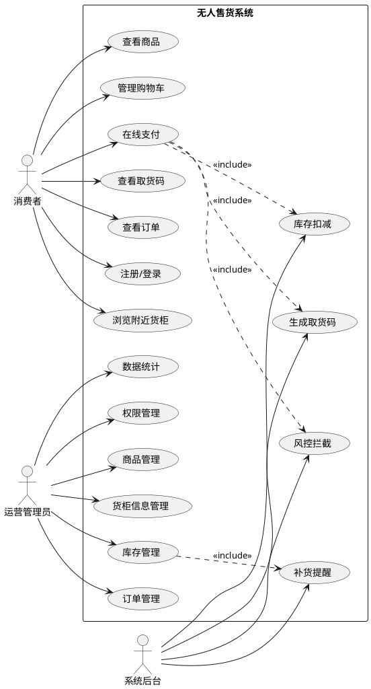
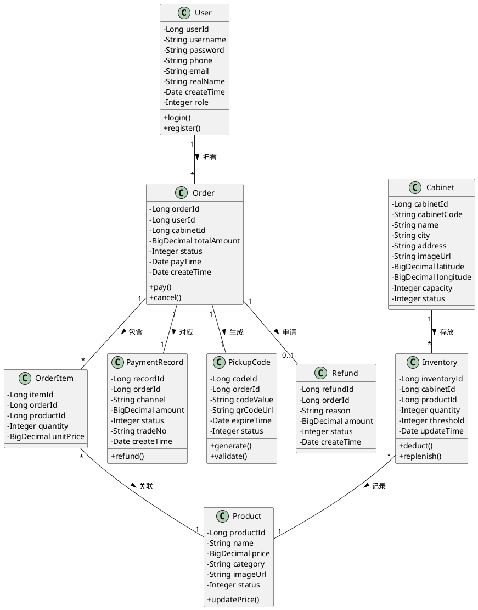
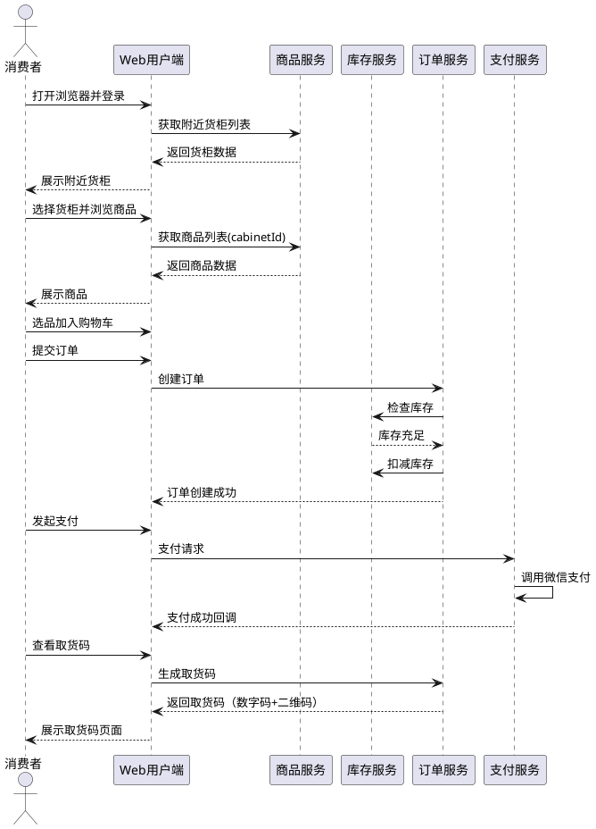
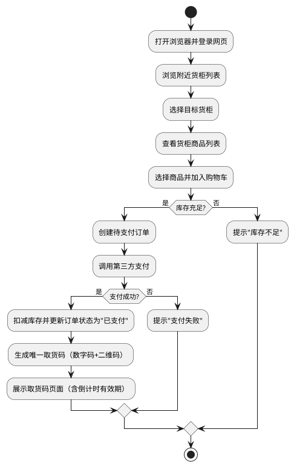

# 无人售货系统 —— 软件工程结课报告

---

## 摘要

本报告针对无人售货系统，运用软件工程方法完成了从可行性分析到系统设计的全过程研究。本系统采用前后端分离的三层架构设计，基于Spring Boot框架构建业务服务层（原型阶段为单体架构，预留微服务拆分能力），结合MySQL数据库与Redis缓存实现数据持久化与高性能访问。安全认证方面采用JWT双Token机制（Access Token + Refresh Token），支持JWT黑名单机制；Redis除提供高性能缓存外，还用于存储Token信息和黑名单。系统面向两类用户群体：消费者可通过Web端完成浏览货柜、选购商品、在线支付、获取取货码等全流程购物流程；运营管理员可通过管理后台进行商品管理、库存管理、订单管理、数据统计等运营操作。报告详细阐述了系统的可行性分析、功能需求分析、非功能需求分析、架构设计、功能模块设计、用户界面设计以及详细的UML模型设计，并制定了完整的系统测试计划。本系统方案具备较强的工程落地价值，能够有效降低无人零售场景的运营成本，提升用户购物体验。

**关键词**：无人售货系统；软件工程；前后端分离；Spring Boot；UML建模

---

## 0 论文结构说明

本报告按照软件工程标准流程组织内容，各章节要解决的问题及使用的工具如下：

| 章节 | 解决的问题 | 使用的工具/技术 |
|------|-----------|----------------|
| 第1章 绪论 | 阐述项目背景与意义，说明研究动机和论文结构 | 文字描述 |
| 第2章 可行性分析 | 从技术、经济、操作三个维度论证项目可行性 | 技术栈评估、成本分析 |
| 第3章 需求分析 | 明确系统功能需求与非功能需求，确定系统边界 | 用例图（PlantUML）、功能需求表、非功能需求表 |
| 第4章 系统设计 | 完成系统的整体架构与详细设计 | 架构图、模块划分图、类图（PlantUML）、时序图（PlantUML）、活动图（PlantUML） |
| 第5章 系统测试计划 | 制定测试策略与测试用例，保证系统质量 | 测试用例表、性能指标表 |
| 第6章 总结与参考文献 | 总结研究成果，列出参考依据 | 参考文献列表 |

---

## 1 绪论

### 1.1 项目背景

随着移动支付和电子商务技术的快速发展，无人零售行业迎来了爆发式增长。传统零售模式面临着人力成本高、营业时间受限、运营效率低等痛点。无人售货系统通过线上选购与自助结算相结合的模式，有效降低了运营成本，提升了用户购物体验，已成为新零售领域的重要发展方向。

本项目旨在开发一套完整的无人售货系统软件平台，为无人零售商提供线上交易与运营管理能力。系统采用Web网页端作为用户入口，便于演示与部署，专注于无人零售场景中的线上交易与运营管理，通过取货码机制衔接线上线下流程。

### 1.2 项目意义

本系统的研发具有以下实际意义：

- **降低运营成本**：减少收银员、导购员等人力投入，实现24小时无人值守运营。
- **提升购物效率**：用户在线选购，无需排队等待结账，支付后凭取货码即可提货。
- **优化管理决策**：通过销售数据统计分析，帮助运营方精准补货、调整商品策略。
- **技术实践价值**：综合运用软件工程方法，完成从需求分析到系统设计的完整流程。

### 1.3 论文结构

本文后续章节安排如下：

- 第2章进行可行性分析，论证项目在技术、经济、操作三个维度的可行性。
- 第3章进行需求分析，明确系统的功能需求与非功能需求，并以用例图辅助说明。
- 第4章进行系统设计，包括架构设计、功能模块设计、界面设计和详细设计（UML模型）。
- 第5章编写系统测试计划，确保系统质量。
- 第6章总结全文并列出参考文献。

---

## 2 可行性分析

### 2.1 技术可行性

- **软件层面**：Spring Boot 后端框架、MySQL 数据库、Vue.js 前端框架技术成熟，开发团队具备相应技术储备。
- **支付对接**：微信支付、支付宝等第三方支付接口开放完善，SDK 文档齐全，集成难度低。
- **云部署**：系统可部署于主流云平台（阿里云/腾讯云），支持弹性扩容与高可用配置。

### 2.2 经济可行性

- **开发成本**：采用开源技术栈（Spring Boot + MySQL + Vue），无需购买商业软件授权；4人团队开发周期约4-6周，人力成本可控。
- **运营成本**：系统部署后可大幅降低收银员人力支出，单点货柜月均人力成本可降低 80% 以上。
- **收益预期**：通过提升运营时长（24小时营业）和购物转化率，预计可在 6-12 个月内收回系统建设成本。

### 2.3 操作可行性

- **用户侧**：用户通过浏览器访问网页即可完成选购，操作流程简单直观，学习成本极低。
- **运营侧**：管理后台提供可视化操作界面，商品上下架、库存查询、销售统计等功能直观易懂，无需专业技术人员即可日常维护。

**结论**：本项目在技术、经济、操作三个维度均具备可行性，可以进入需求分析阶段。

---

## 3 需求分析

### 3.1 功能需求

系统主要涉及三类参与者：**普通用户（消费者）**、**运营管理员**、**系统本身**。

#### 3.1.1 用户端功能

| 功能模块 | 功能描述 |
|---------|---------|
| 身份认证 | 用户通过账号密码注册登录 |
| 货柜定位 | 基于IP或手动选择城市展示附近货柜点位，点击绑定指定货柜 |
| 商品浏览 | 展示所选货柜内商品列表，包括图片、名称、价格、库存状态 |
| 购物车管理 | 用户可添加/移除商品，实时计算总价 |
| 在线支付 | 调用微信支付/支付宝接口完成扣款 |
| 取货码生成 | 支付成功后自动生成取货码（二维码/数字码），用于线下提货验证 |
| 订单查询 | 查看历史订单详情、支付状态、取货码状态、退款入口 |

#### 3.1.2 管理端功能

| 功能模块 | 功能描述 |
|---------|---------|
| 商品管理 | 添加、编辑、删除、上架、下架商品信息，设置商品所属货柜 |
| 货柜信息管理 | 维护货柜基础信息（编号、位置、容量、状态），不控制硬件 |
| 库存管理 | 实时查看各货柜库存，设置库存预警阈值，生成补货提醒 |
| 订单管理 | 查看全部订单流水，处理退款申请，导出销售报表 |
| 数据统计 | 按日/周/月统计销售额、热销商品、客单价、复购率等 |
| 权限管理 | 分配运营人员角色与操作权限 |

#### 3.1.3 系统核心功能

| 功能模块 | 功能描述 |
|---------|---------|
| 库存扣减 | 支付成功后自动扣减对应货柜库存，防止超卖 |
| 取货码管理 | 生成唯一取货码，设置有效时长，支持核销与过期失效 |
| 风控拦截 | 识别异常支付行为（如高频刷单、盗刷），自动冻结交易 |
| 对账结算 | 每日自动生成支付渠道对账文件，核对交易流水 |

### 3.2 非功能需求

| 类别 | 需求描述 |
|-----|---------|
| **性能需求** | 页面加载时间 ≤ 2 秒；支付接口响应时间 ≤ 1 秒；单货柜并发下单支持 ≥ 50 人/分钟 |
| **安全性** | 用户支付信息采用 AES-256 加密传输与存储；采用 JWT 双 Token 机制（Access Token + Refresh Token），支持 JWT 黑名单；接口访问需携带 JWT Token 并校验签名；敏感操作需二次确认 |
| **可靠性** | 系统可用性 ≥ 99.5%；核心数据每日自动备份 |
| **易用性** | 用户端界面简洁，从选柜到完成购物步骤 ≤ 4 步；管理后台提供搜索、筛选、批量操作等便捷功能 |
| **可扩展性** | 系统架构支持水平扩展，可方便接入新的货柜点位和支付渠道 |
| **兼容性** | 用户端与管理端均兼容 Chrome、Edge、Safari、Firefox 等主流浏览器 |

### 3.3 用例图说明

系统主要参与者及用例：
- **消费者**：注册/登录、浏览附近货柜、查看商品、管理购物车、在线支付、查看取货码、查看订单
- **运营管理员**：登录后台、管理商品、管理货柜信息、管理库存、查看订单、查看统计报表、权限分配
- **系统后台**：库存扣减、生成取货码、交易对账、风控拦截、补货提醒

---

## 附录：PlantUML 用例图代码



---

## 4 系统设计

### 4.1 系统架构设计

本系统采用 **前后端分离的三层架构**，整体分为：表现层、业务服务层、数据层。架构图如下：

```
┌─────────────────────────────────────────────────────────────┐
│                        表现层 (Presentation)                  │
│  ┌──────────────┐  ┌──────────────┐                        │
│  │  Web用户端    │  │ Web管理后台   │                        │
│  │   (Vue.js)   │  │   (Vue.js)   │                        │
│  └──────────────┘  └──────────────┘                        │
└────────────────────────┬────────────────────────────────────┘
                         │ HTTPS / JSON
┌────────────────────────▼────────────────────────────────────┐
│                      业务服务层 (Business)                    │
│                                                             │
│   ┌───────────────────────────────────────────────────┐     │
│   │           Spring Boot 单体应用                    │     │
│   │  ┌─────────┐ ┌─────────┐ ┌─────────┐ ┌─────────┐ │     │
│   │  │用户模块  │ │商品模块  │ │订单模块  │ │支付模块  │ │     │
│   │  └─────────┘ └─────────┘ └─────────┘ └─────────┘ │     │
│   │  ┌─────────┐ ┌─────────┐ ┌─────────┐             │     │
│   │  │库存模块  │ │货柜模块  │ │统计模块  │             │     │
│   │  └─────────┘ └─────────┘ └─────────┘             │     │
│   └───────────────────────────────────────────────────┘     │
│                                                             │
└────────────────────────┬────────────────────────────────────┘
                         │
┌────────────────────────▼────────────────────────────────────┐
│                        数据层 (Data)                          │
│  ┌──────────────┐  ┌──────────────┐  ┌──────────────────┐  │
│  │    MySQL     │  │    Redis     │  │    MinIO         │  │
│  │  (主数据库)   │  │ (缓存/会话)   │  │   (图片存储)     │  │
│  └──────────────┘  └──────────────┘  └──────────────────┘  │
└─────────────────────────────────────────────────────────────┘
```

**各层说明：**
- **表现层**：消费者通过浏览器访问 Web 用户端（Vue.js）浏览商品、下单支付、获取取货码；运营人员通过 Web 管理后台（Vue.js）进行商品、库存、订单等运营操作。
- **业务服务层**：基于 Spring Boot 构建，原型阶段采用**单体架构（按模块分包）**，各模块通过内部方法调用交互，便于开发调试。各模块边界清晰，预留了后续拆分为微服务的能力。
- **数据层**：MySQL 存储核心业务数据；Redis 缓存热点商品、会话 Token、库存扣减分布式锁、取货码信息；对象存储服务保存商品图片。

### 4.2 功能模块设计

系统共划分为七大功能模块：

| 模块名称 | 职责说明 | 核心子功能 |
|---------|---------|-----------|
| **用户服务模块** | 管理用户身份与权限 | 注册/登录、手机号绑定、JWT鉴权、角色分配 |
| **商品服务模块** | 维护商品基础信息 | 商品CRUD、分类标签、价格策略、图片管理 |
| **订单服务模块** | 处理交易全流程 | 订单创建、状态流转、取消/退款、订单查询 |
| **支付服务模块** | 对接第三方支付 | 支付下单、结果回调、对账文件、退款处理 |
| **库存服务模块** | 管理各货柜库存 | 库存扣减/回滚、多货柜库存、预警阈值、补货提醒 |
| **货柜信息服务模块** | 维护货柜基础数据 | 货柜注册、位置信息、容量配置、状态标记 |
| **数据统计模块** | 分析与报表输出 | 销售统计、库存周转、用户画像、货柜销售排行 |

**模块依赖关系：**
- 订单模块依赖：用户模块（校验用户）、商品模块（校验商品）、库存模块（扣减库存）、支付模块（发起支付）
- 支付模块依赖：订单模块（更新订单状态）
- 库存模块依赖：货柜信息模块（获取货柜信息）
- 数据统计模块依赖：所有业务模块（读取数据）

> **说明**：原型阶段各模块在同一个 Spring Boot 应用内，依赖关系体现为 Service 层的内部方法调用。未来拆分为微服务时，模块间调用将替换为 RESTful API 或 RPC。

### 4.3 用户界面设计

#### 4.3.1 消费者端（Web网页）

采用响应式布局，兼顾 PC 浏览器与移动端浏览器访问，以 PC 端为主进行展示。

| 页面 | 布局说明 |
|-----|---------|
| **登录/注册页** | 居中卡片式设计，左侧品牌图 + 右侧表单（手机号/验证码/密码），底部第三方登录入口 |
| **附近货柜页** | 顶部导航栏（Logo+搜索+个人中心入口）+ 左侧城市选择器 + 右侧地图/列表双视图切换，货柜卡片展示距离、地址、营业状态 |
| **货柜商品页** | 顶部货柜信息横幅 + 左侧商品分类导航 + 右侧商品网格卡片（图片+名称+价格+库存状态），支持分页与排序 |
| **商品详情页** | 左右分栏布局：左侧大图轮播（带缩略图），右侧商品名称/价格/规格/库存 + 数量选择器 + "加入购物车" / "立即购买" 按钮 |
| **购物车页** | 全宽表格形式（商品图片/名称/单价/数量/小计/操作）+ 底部悬浮结算栏（全选、合计金额、去结算按钮） |
| **支付页** | 订单信息摘要卡片 + 支付方式选择（微信/支付宝，带二维码或跳转支付）+ "确认支付" 按钮 |
| **取货码页** | 居中展示大字号 6 位数字码 + 二维码图片 + 倒计时有效期提示 + 使用说明文字 |
| **订单页** | 顶部Tab切换（全部/待支付/已完成/售后）+ 订单列表卡片（时间、金额、状态、商品缩略图、取货码入口） |
| **个人中心** | 左侧固定侧边栏菜单（我的订单、附近货柜、账户设置、联系客服）+ 右侧内容区 |

#### 4.3.2 运营管理后台（Web）

| 页面 | 布局说明 |
|-----|---------|
| **登录页** | 居中登录卡片（账号/密码/验证码）+ 记住密码选项 |
| **Dashboard** | 顶部数据看板（今日销售额/订单数/新增用户）+ 图表区（销售趋势折线图 + 热销商品TOP10柱状图） |
| **商品管理页** | 左侧筛选栏（分类/状态）+ 右侧表格（商品信息+操作按钮：编辑/上架/下架）+ 顶部"新增商品"按钮 |
| **货柜信息页** | 货柜表格（编号/位置/容量/状态）+ 地图标注视图 + 编辑/禁用操作 |
| **库存管理页** | 货柜选择器 + 库存表格（商品/当前库存/预警值/操作：修改库存）+ 补货提醒列表 |
| **订单管理页** | 查询条件栏（时间/订单号/状态）+ 订单表格 + 批量导出按钮 |
| **数据统计页** | 日期范围选择器 + 多维度报表（销售额/利润/客单价/复购率/货柜销售排行）+ 导出PDF/Excel |

### 4.4 详细设计（UML模型）

#### 4.4.1 类图（Class Diagram）

核心领域类及其关系：

```
┌──────────────┐       ┌──────────────┐       ┌──────────────┐
│    User      │       │    Order     │       │   Product    │
├──────────────┤       ├──────────────┤       ├──────────────┤
│ - userId     │1    * │ - orderId    │*    1 │ - productId  │
│ - username   │◄──────│ - userId     │──────►│ - name       │
│ - phone      │       │ - cabinetId  │       │ - price      │
│ - realName   │       │ - totalAmount│       │ - category   │
│ - createTime │       │ - status     │       │ - imageUrl   │
│ - role       │       │ - payTime    │       │ - status     │
└──────────────┘       │ - createTime │       └──────────────┘
                       └──────────────┘
                              │
                              │1
                              ▼
                       ┌──────────────┐
                       │  OrderItem   │
                       ├──────────────┤
                       │ - itemId     │
                       │ - orderId    │
                       │ - productId  │
                       │ - quantity   │
                       │ - unitPrice  │
                       └──────────────┘

┌──────────────┐       ┌──────────────┐       ┌──────────────┐
│   Cabinet    │       │  Inventory   │       │ PaymentRecord│
├──────────────┤       ├──────────────┤       ├──────────────┤
│ - cabinetId  │1    * │ - inventoryId│*    1 │ - recordId   │
│ - cabinetCode│◄──────│ - cabinetId  │       │ - orderId    │
│ - name       │       │ - productId  │──────►│ - channel    │
│ - city       │       │ - quantity   │       │ - amount     │
│ - address    │       │ - threshold  │       │ - status     │
│ - imageUrl   │       │ - updateTime │       │ - tradeNo    │
│ - latitude    │       └──────────────┘       │ - createTime │
│ - longitude    │                               └──────────────┘
│ - capacity    │
│ - status      │
└──────────────┘

┌──────────────┐       ┌──────────────┐
│  PickupCode  │       │   Refund     │
├──────────────┤       ├──────────────┤
│ - codeId     │       │ - refundId   │
│ - orderId    │1─────1│ - orderId    │
│ - codeValue  │       │ - reason     │
│ - qrCodeUrl  │       │ - amount     │
│ - expireTime │       │ - status     │
│ - status     │       │ - createTime │
└──────────────┘       └──────────────┘
```

**类说明：**
- **User**：系统用户，包含 username、password、phone 等字段，通过 role 字段区分消费者与管理员
- **Product**：商品基础信息，与具体货柜库存解耦
- **Cabinet**：货柜信息实体，记录地理位置、地址、容量、营业状态，不包含硬件控制逻辑
- **Inventory**：各货柜内具体商品的库存记录，设置 threshold 触发补货提醒
- **Order / OrderItem**：订单主表与明细表，支持一个订单多商品
- **PaymentRecord**：支付流水记录，与第三方支付渠道对账
- **PickupCode**：取货码实体，关联订单，包含数字码、二维码URL、过期时间、使用状态
- **Refund**：退款申请记录，关联订单，记录退款原因、金额与审核状态

#### 4.4.4 数据字典

##### 订单状态枚举

| 值 | 含义 | 说明 |
|----|------|------|
| 0 | 待支付 | 订单已创建，等待用户支付 |
| 1 | 已支付 | 支付成功，等待取货 |
| 2 | 已完成 | 用户已取货，订单完成 |
| 3 | 已取消 | 用户取消或超时未支付 |
| 4 | 退款中 | 用户申请退款，等待审核 |
| 5 | 已退款 | 退款完成 |

##### 用户角色枚举

| 值 | 含义 | 说明 |
|----|------|------|
| 0 | 普通用户 | 消费者 |
| 1 | 运营管理员 | 可管理商品、订单、库存 |
| 2 | 超级管理员 | 拥有所有权限，含权限管理 |

##### 货柜状态枚举

| 值 | 含义 | 说明 |
|----|------|------|
| 0 | 停用 | 货柜已停用，不可下单 |
| 1 | 营业中 | 正常运营 |
| 2 | 维护中 | 临时维护，不可下单 |

#### 4.4.2 时序图（Sequence Diagram）

**场景一：消费者网页购物流程**

```
消费者        Web用户端      商品服务      库存服务      订单服务      支付服务
  │            │            │            │            │            │
  │──打开网页──►│            │            │            │            │
  │            │──获取附近货柜────────────►│            │            │
  │            │◄────────货柜列表─────────│            │            │
  │◄──选择货柜──│            │            │            │            │
  │            │            │            │            │            │
  │──浏览商品──►│            │            │            │            │
  │            │──获取商品列表(cabinetId)──►│            │            │
  │            │◄────────商品数据─────────│            │            │
  │◄──展示商品──│            │            │            │            │
  │            │            │            │            │            │
  │──选品加购──►│            │            │            │            │
  │──提交订单──►│            │            │            │            │
  │            │──创建订单────────────────────────────────────────►│
  │            │            │            │──检查库存──►│            │
  │            │            │            │◄──库存充足──│            │
  │            │            │            │──扣减库存──►│            │
  │            │◄────────订单创建成功────────────────────────────────│
  │            │            │            │            │            │
  │──发起支付──►│            │            │            │            │
  │            │──支付请求────────────────────────────────────────────────────►│
  │            │            │            │            │            │──调用微信───►
  │            │            │            │            │            │◄──支付结果──│
  │            │◄────────支付成功回调──────────────────────────────────────────│
  │            │            │            │            │            │
  │──查看取货码─►│            │            │            │            │
  │            │──生成取货码────────────────────────────────────────►│
  │            │◄────────返回取货码（数字码+二维码）───────────────────────────│
  │◄───────────│            │            │            │            │
```

**场景二：管理员处理退款流程**

```
管理员        管理后台        订单服务        支付服务        库存服务
  │            │              │              │              │
  │──登录─────►│              │              │              │
  │◄──首页─────│              │              │              │
  │            │              │              │              │
  │──查看订单──►│              │              │              │
  │            │──查询订单────►│              │              │
  │            │◄──订单列表──────────────────────────────────│
  │◄───────────│              │              │              │
  │            │              │              │              │
  │──审核退款──►│              │              │              │
  │            │──提交退款────►│              │              │
  │            │              │──调用退款接口────────────────►│
  │            │              │◄──退款成功───────────────────│
  │            │              │──更新订单状态                │
  │            │              │──恢复库存────────────────────────────────►│
  │            │◄──退款完成──────────────────────────────────────────────│
  │◄───────────│              │              │              │
```

#### 4.4.3 活动图（Activity Diagram）

**场景：消费者购物流程（从打开网页到获取取货码）**

```
[开始]
  │
  ▼
[打开浏览器并登录网页]
  │
  ▼
[浏览附近货柜列表]
  │
  ▼
[选择目标货柜]
  │
  ▼
[查看货柜商品列表]
  │
  ▼
[选择商品并加入购物车]
  │
  ▼
[检查库存是否充足?]
  │
  ├───── 否 ─────► [提示"库存不足"] ──► [结束]
  │
  ▼
 是
  │
  ▼
[创建待支付订单]
  │
  ▼
[调用第三方支付]
  │
  ▼
[支付是否成功?]
  │
  ├───── 否 ─────► [提示"支付失败"] ──► [结束]
  │
  ▼
 是
  │
  ▼
[扣减库存并更新订单状态为"已支付"]
  │
  ▼
[生成唯一取货码（数字码+二维码）]
  │
  ▼
[展示取货码页面（含倒计时有效期）]
  │
  ▼
[结束]
```

---

## 5 系统测试计划

### 5.1 测试策略

本系统测试分为三个阶段：
1. **单元测试**：针对各模块的 Controller / Service / Mapper 层编写 JUnit 测试用例，覆盖核心业务逻辑与异常分支。
2. **集成测试**：验证模块间接口调用、数据库事务一致性、第三方支付沙箱环境对接、Redis 缓存一致性。
3. **系统测试**：在完整部署环境中进行端到端功能验证、性能压测、安全渗透测试、兼容性测试。

### 5.2 测试环境

| 项目 | 配置 |
|-----|------|
| 服务端 | 4核8G 云服务器 × 2，CentOS 8 |
| 数据库 | MySQL 8.0，Redis 6.2 |
| 客户端 | PC（Windows 11 + Chrome 120 / Edge 120 / Firefox 121） |
| 网络 | 有线宽带 / Wi-Fi / 弱网模拟 (Chrome DevTools 限速) |
| 测试工具 | JMeter (性能)、Postman (接口)、Selenium (Web UI) |

### 5.3 功能测试用例

| 用例编号 | 功能模块 | 测试项 | 前置条件 | 操作步骤 | 预期结果 | 优先级 |
|---------|---------|--------|---------|---------|---------|--------|
| TC-001 | 用户登录 | 账号密码登录 | 用户已注册账号 | 打开首页→点击登录→输入手机号/密码→点击登录 | 登录成功，跳转附近货柜页，显示用户名 | 高 |
| TC-002 | 用户注册 | 账号注册 | 手机号未注册 | 打开首页→点击注册→输入用户名/手机号/密码→提交 | 注册成功，跳转登录页 | 高 |
| TC-003 | 货柜定位 | 查看附近货柜 | 已选择城市 | 进入首页→选择城市→浏览货柜列表 | 按距离由近及远展示货柜列表，显示地址与营业状态 | 高 |
| TC-004 | 商品浏览 | 查看货柜商品 | 货柜已上架商品 | 点击货柜→浏览商品列表 | 商品图片、名称、价格、库存状态正确显示 | 高 |
| TC-005 | 购物车 | 添加商品到购物车 | 商品库存充足 | 点击商品→选择数量→点击"加入购物车" | 购物车图标角标+1，购物车页面显示该商品 | 高 |
| TC-006 | 订单创建 | 提交订单 | 购物车已有商品 | 进入购物车→勾选商品→点击"去结算" | 订单创建成功，跳转支付页，订单状态为"待支付" | 高 |
| TC-007 | 在线支付 | 微信支付成功 | 订单状态为"待支付" | 选择微信支付→扫码或确认支付 | 支付成功，订单状态变为"已支付"，生成取货码 | 高 |
| TC-008 | 取货码 | 取货码生成与展示 | 订单已支付 | 支付完成后跳转取货码页 | 显示6位数字码与二维码，显示倒计时有效期 | 高 |
| TC-009 | 库存管理 | 库存扣减准确性 | 商品A库存为10 | 用户购买2件商品A并支付成功 | 商品A库存变为8，数据库与Redis缓存一致 | 高 |
| TC-010 | 退款流程 | 支付后申请退款 | 订单状态"已支付" | 订单页点击"申请退款"→选择原因→提交 | 退款申请提交成功，后台审核通过后原路退回，库存恢复 | 中 |
| TC-011 | 库存预警 | 低库存提醒 | 商品B预警阈值设为5 | 商品B库存通过销售降至5 | 管理后台收到补货提醒通知 | 中 |
| TC-012 | 货柜信息 | 新增货柜信息 | 管理员已登录 | 进入货柜信息页→点击新增→填写编号/位置/容量→保存 | 货柜信息保存成功，列表与地图中正常显示 | 中 |
| TC-013 | 并发安全 | 多人同时购买最后1件商品 | 商品C库存为1 | 用户A与用户B同时提交订单并支付 | 仅有一人支付成功并扣减库存，另一人提示"库存不足" | 高 |
| TC-014 | 数据统计 | 销售报表准确性 | 当日已产生10笔订单 | 管理员登录后台→选择今日→查看销售报表 | 订单数显示10，销售额与各订单金额之和一致 | 低 |
| TC-015 | 权限控制 | 越权访问拦截 | 使用普通运营账号登录 | 尝试访问"权限管理"菜单或直接请求管理员接口 | 前端菜单隐藏，后端接口返回 403 Forbidden | 高 |
| TC-016 | 安全测试 | SQL注入防护 | 在搜索框输入SQL注入语句 | 商品搜索框输入 `' OR 1=1 --` 并搜索 | 系统正常处理，返回空结果或提示输入非法，无异常报错 | 高 |
| TC-017 | 兼容性 | 多浏览器兼容 | 系统已部署 | 分别使用 Chrome、Edge、Firefox 访问用户端与管理后台 | 各浏览器下页面布局正常，功能操作无异常 | 中 |

### 5.4 性能测试指标

| 测试项 | 目标指标 | 测试方法 |
|-------|---------|---------|
| 首页加载时间 | ≤ 2 秒 | 使用 Chrome DevTools / JMeter 测量 |
| 支付接口响应时间 | ≤ 1 秒 | JMeter 单接口压测 |
| 并发下单 | ≥ 50 TPS | JMeter 模拟50虚拟用户同时下单 |
| 系统可用性 | ≥ 99.5% | 7×24小时持续运行监控 |
| 数据库连接池 | 支持 ≥ 200 并发连接 | 调整连接池参数后压测验证 |

### 5.5 安全测试要点

- **传输安全**：所有接口强制 HTTPS，禁止 HTTP 明文传输。
- **身份鉴权**：采用 JWT 双 Token 机制，Access Token（2小时）用于 API 访问，Refresh Token（7天）用于刷新；支持 JWT 黑名单机制，可主动注销 Token；敏感接口校验 Token 有效性。
- **支付安全**：支付签名使用平台证书校验，防止中间人篡改金额。
- **越权防护**：横向越权（用户A查看用户B订单）、纵向越权（普通运营访问管理员接口）均返回 403。
- **输入校验**：所有外部输入参数进行长度、类型、特殊字符校验，防止 SQL 注入与 XSS。

---

## 6 总结与参考文献

### 6.1 总结

本文围绕无人售货系统，运用软件工程方法完成了从需求分析到系统设计的全过程。首先通过可行性分析论证了项目在技术、经济和操作层面的可行性；随后通过需求分析明确了系统的功能需求与非功能需求，并以用例图辅助呈现系统边界；在系统设计阶段，采用前后端分离的三层架构，将系统划分为七大功能模块，完成了架构设计、界面设计和详细设计（类图、时序图、活动图）；最后制定了覆盖功能、性能、安全等多维度的系统测试计划。

本系统作为纯软件平台，采用 Web 网页端作为用户入口，便于演示与部署。系统专注于无人零售场景中的线上交易与运营管理，通过取货码机制衔接线上线下流程，方案具备较强的工程落地价值。

### 6.2 参考文献

[1] 张海藩, 吕云翔. 软件工程（第4版）[M]. 北京: 人民邮电出版社, 2013.

[2] 邵维忠, 麻志毅. UML 用户指南（第2版）[M]. 北京: 人民邮电出版社, 2006.

[3] 微信支付开发文档[EB/OL]. https://pay.weixin.qq.com/wiki/doc/apiv3/index.shtml

[4] 支付宝开放平台文档[EB/OL]. https://opendocs.alipay.com/

[5] 黄健宏. Redis 设计与实现[M]. 北京: 机械工业出版社, 2014.

[6] Spring Boot 官方文档[EB/OL]. https://spring.io/projects/spring-boot

[7] 葛一鸣. Java 高并发程序设计（第3版）[M]. 北京: 电子工业出版社, 2020.

[8] 王珊, 萨师煊. 数据库系统概论（第5版）[M]. 北京: 高等教育出版社, 2014.

[9] 刘伟. 设计模式：可复用面向对象软件的基础[M]. 北京: 机械工业出版社, 2019.

[10] Vue.js 官方文档[EB/OL]. https://vuejs.org/

---

## 附录：PlantUML 图代码汇总

### 用例图


### 类图（Class Diagram）



### 时序图：消费者网页购物流程



### 活动图：消费者购物流程



---

*文档生成日期：2026-05-01*
