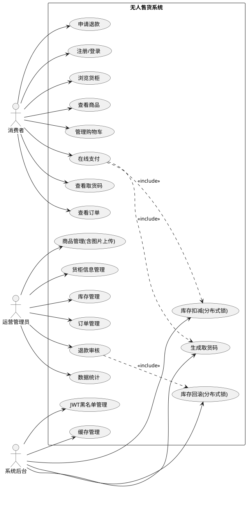
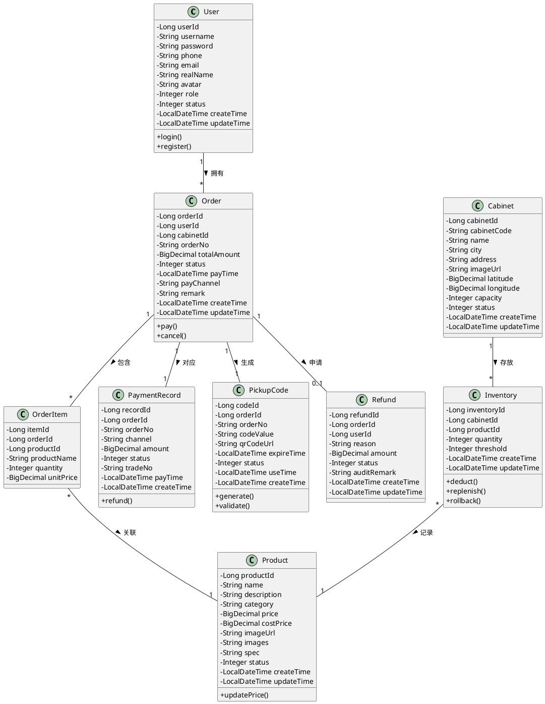
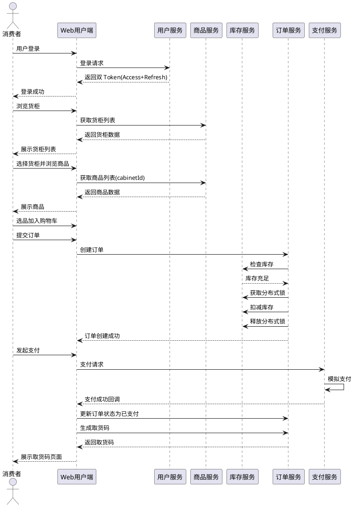
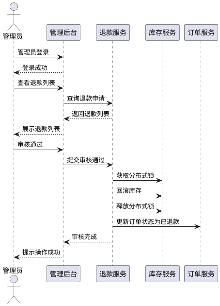
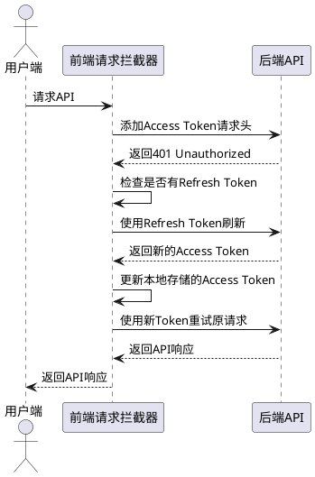
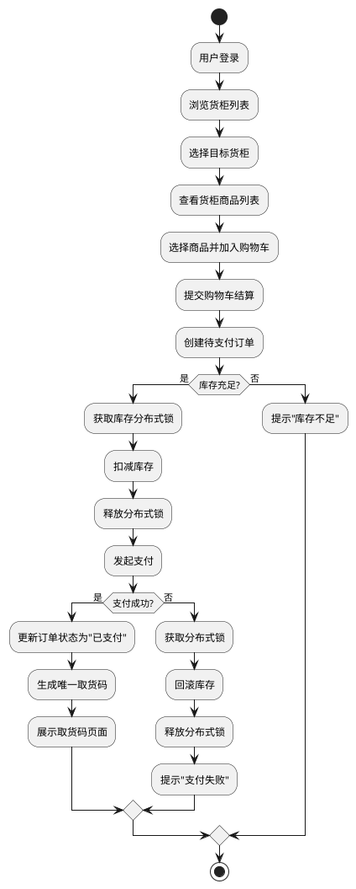

# 无人售货系统 —— 软件工程结课报告

---

## 摘要

本报告针对无人售货系统，运用软件工程方法完成了从可行性分析到系统设计与实现的全过程研究。本系统采用前后端分离的三层架构设计，基于 Spring Boot 3.2.5 框架构建业务服务层（单体架构，预留微服务拆分能力），结合 MySQL 8.0 数据库与 Redis 缓存实现数据持久化与高性能访问，使用 MinIO 对象存储服务管理商品和货柜图片。安全认证方面采用 JWT 双 Token 机制（Access Token + Refresh Token），支持 JWT 黑名单机制；Redis 除提供高性能缓存外，还用于存储 Token 信息和黑名单，并实现库存操作的分布式锁防止超卖。配置管理方面采用环境变量模式，避免敏感信息硬编码。系统面向两类用户群体：消费者可通过 Web 端完成浏览货柜、选购商品、在线支付、获取取货码等全流程购物流程；运营管理员可通过管理后台进行商品管理（含图片上传）、库存管理、订单管理、退款审核、数据统计等运营操作。报告详细阐述了系统的可行性分析、功能需求分析、非功能需求分析、架构设计、功能模块设计、用户界面设计、详细的 UML 模型设计、核心实现要点，并制定了完整的系统测试计划。本系统方案具备较强的工程落地价值，能够有效降低无人零售场景的运营成本，提升用户购物体验。

**关键词**：无人售货系统；软件工程；前后端分离；Spring Boot；JWT 双 Token；分布式锁；MinIO；UML建模

---

## 0 论文结构说明

本报告按照软件工程标准流程组织内容，各章节要解决的问题及使用的工具如下：

| 章节 | 解决的问题 | 使用的工具/技术 |
|------|-----------|----------------|
| 第1章 绪论 | 阐述项目背景与意义，说明研究动机和论文结构 | 文字描述 |
| 第2章 可行性分析 | 从技术、经济、操作三个维度论证项目可行性 | 技术栈评估、成本分析 |
| 第3章 需求分析 | 明确系统功能需求与非功能需求，确定系统边界 | 用例图（PlantUML）、功能需求表、非功能需求表 |
| 第4章 系统设计与实现 | 完成系统的整体架构与详细设计，说明核心实现要点 | 架构图、模块划分图、类图（PlantUML）、时序图（PlantUML）、活动图（PlantUML）、代码实现说明 |
| 第5章 系统测试计划 | 制定测试策略与测试用例，保证系统质量 | 测试用例表、性能指标表 |
| 第6章 总结与参考文献 | 总结研究成果，列出参考依据 | 参考文献列表 |

---

## 1 绪论

### 1.1 项目背景

随着移动支付和电子商务技术的快速发展，无人零售行业迎来了爆发式增长。传统零售模式面临着人力成本高、营业时间受限、运营效率低等痛点。无人售货系统通过线上选购与自助结算相结合的模式，有效降低了运营成本，提升了用户购物体验，已成为新零售领域的重要发展方向。

本项目旨在开发一套完整的无人售货系统软件平台，为无人零售商提供线上交易与运营管理能力。系统采用 Web 网页端作为用户入口，便于演示与部署，专注于无人零售场景中的线上交易与运营管理，通过取货码机制衔接线上线下流程。

### 1.2 项目意义

本系统的研发具有以下实际意义：

- **降低运营成本**：减少收银员、导购员等人力投入，实现 24 小时无人值守运营。
- **提升购物效率**：用户在线选购，无需排队等待结账，支付后凭取货码即可提货。
- **优化管理决策**：通过销售数据统计分析，帮助运营方精准补货、调整商品策略。
- **技术实践价值**：综合运用软件工程方法，完成从需求分析到系统实现的完整流程。
- **安全保障**：实现完善的权限控制、并发控制、配置安全等企业级特性。

### 1.3 论文结构

本文后续章节安排如下：

- 第 2 章进行可行性分析，论证项目在技术、经济、操作三个维度的可行性。
- 第 3 章进行需求分析，明确系统的功能需求与非功能需求，并以用例图辅助说明。
- 第 4 章进行系统设计与实现，包括架构设计、功能模块设计、界面设计、详细设计（UML 模型）和核心实现要点。
- 第 5 章编写系统测试计划，确保系统质量。
- 第 6 章总结全文并列出参考文献。

---

## 2 可行性分析

### 2.1 技术可行性

- **软件层面**：Spring Boot 3.2.5 后端框架、MySQL 8.0 数据库、Vue 3 前端框架技术成熟，开发团队具备相应技术储备。MyBatis-Plus 3.5.5 简化数据访问层开发。
- **缓存与存储**：Redis 提供高性能缓存和分布式锁支持；MinIO 提供对象存储服务管理图片资源。
- **安全认证**：Spring Security + JWT 双 Token 机制实现安全可靠的身份认证与权限控制。
- **支付对接**：微信支付、支付宝等第三方支付接口开放完善，SDK 文档齐全，集成难度低（当前实现模拟支付，预留对接接口）。
- **云部署**：系统可部署于主流云平台（阿里云/腾讯云），支持弹性扩容与高可用配置。

### 2.2 经济可行性

- **开发成本**：采用开源技术栈（Spring Boot + MySQL + Vue + Redis + MinIO），无需购买商业软件授权；4 人团队开发周期约 4-6 周，人力成本可控。
- **运营成本**：系统部署后可大幅降低收银员人力支出，单点货柜月均人力成本可降低 80% 以上。
- **收益预期**：通过提升运营时长（24 小时营业）和购物转化率，预计可在 6-12 个月内收回系统建设成本。

### 2.3 操作可行性

- **用户侧**：用户通过浏览器访问网页即可完成选购，操作流程简单直观，学习成本极低。
- **运营侧**：管理后台提供可视化操作界面，商品上下架、库存查询、销售统计等功能直观易懂，无需专业技术人员即可日常维护。

**结论**：本项目在技术、经济、操作三个维度均具备可行性，可以进入需求分析与实现阶段。

---

## 3 需求分析

### 3.1 功能需求

系统主要涉及三类参与者：**普通用户（消费者）**、**运营管理员**、**系统本身**。

#### 3.1.1 用户端功能

| 功能模块 | 功能描述 |
|---------|---------|
| 身份认证 | 用户通过账号密码注册登录，支持 Token 自动刷新 |
| 货柜浏览 | 按城市展示货柜列表，查看货柜详情与图片 |
| 商品浏览 | 展示所选货柜内商品列表，包括图片、名称、价格、库存状态 |
| 购物车管理 | 用户可添加/移除商品，实时计算总价 |
| 在线支付 | 模拟支付流程，预留微信/支付宝接口 |
| 取货码生成 | 支付成功后自动生成取货码（数字码），用于线下提货验证 |
| 订单查询 | 查看历史订单详情、支付状态、取货码状态、退款申请入口 |

#### 3.1.2 管理端功能

| 功能模块 | 功能描述 |
|---------|---------|
| 商品管理 | 添加、编辑、删除、上架、下架商品信息，支持商品图片上传至 MinIO |
| 货柜信息管理 | 维护货柜基础信息（编号、位置、容量、状态、图片），不控制硬件 |
| 库存管理 | 实时查看各货柜库存，调整库存数量，设置库存预警阈值 |
| 订单管理 | 查看全部订单流水，订单状态查询 |
| 退款管理 | 查看退款申请，审核通过/拒绝退款，退款时自动恢复库存 |
| 数据统计 | 查看 Dashboard 数据看板，销售额、订单数等统计信息 |
| 权限控制 | 管理端接口仅限 ADMIN/SUPER_ADMIN 角色访问 |

#### 3.1.3 系统核心功能

| 功能模块 | 功能描述 |
|---------|---------|
| 库存扣减 | 支付成功后自动扣减对应货柜库存，采用 Redis 分布式锁 + 数据库乐观锁防止超卖 |
| 库存回滚 | 退款审核通过后自动恢复库存，同样采用分布式锁保证并发安全 |
| 取货码管理 | 生成唯一取货码，支持核销与过期失效 |
| 缓存管理 | Redis 缓存热点数据，缓存删除采用 SCAN 替代 KEYS 避免阻塞 |
| JWT 黑名单 | 支持主动注销 Token，防止已注销 Token 被滥用 |
| 配置管理 | 支持通过环境变量配置敏感信息，避免硬编码 |

### 3.2 非功能需求

| 类别 | 需求描述 |
|-----|---------|
| **性能需求** | 页面加载时间 ≤ 2 秒；支付接口响应时间 ≤ 1 秒；单货柜并发下单支持 ≥ 50 人/分钟 |
| **安全性** | 采用 JWT 双 Token 机制（Access Token 2 小时 + Refresh Token 7 天），支持 JWT 黑名单；接口访问需携带 JWT Token 并校验签名；管理端接口（/api/admin/**、/api/inventory/**、/api/refund/admin/**、/api/user/list）仅限 ADMIN/SUPER_ADMIN 角色访问；敏感信息（数据库密码、JWT 密钥、MinIO 密钥等）通过环境变量配置，不硬编码；库存操作采用 Redis 分布式锁防止并发问题 |
| **可靠性** | 系统可用性 ≥ 99.5%；核心数据每日自动备份；库存操作具备事务一致性 |
| **易用性** | 用户端界面简洁，从选柜到完成购物步骤 ≤ 4 步；管理后台提供搜索、筛选等便捷功能；前端 Token 过期自动刷新，提升用户体验 |
| **可扩展性** | 系统架构支持水平扩展，可方便接入新的货柜点位和支付渠道 |
| **兼容性** | 用户端与管理端均兼容 Chrome、Edge、Safari、Firefox 等主流浏览器 |
| **可维护性** | 配置与代码分离，支持多环境配置；代码结构清晰，模块化设计 |

### 3.3 用例图说明

系统主要参与者及用例：
- **消费者**：注册/登录、浏览货柜、查看商品、管理购物车、在线支付、查看取货码、查看订单、申请退款
- **运营管理员**：登录后台、管理商品（含图片上传）、管理货柜信息、管理库存、查看订单、审核退款、查看统计报表
- **系统后台**：库存扣减（含分布式锁）、库存回滚（含分布式锁）、生成取货码、缓存管理、JWT 黑名单管理

---

## 附录：PlantUML 用例图代码



---

## 4 系统设计与实现

### 4.1 系统架构设计

本系统采用 **前后端分离的三层架构**，整体分为：表现层、业务服务层、数据层。架构图如下：

```
┌─────────────────────────────────────────────────────────────┐
│                        表现层 (Presentation)                  │
│  ┌──────────────┐  ┌──────────────┐                        │
│  │  Web用户端    │  │ Web管理后台   │                        │
│  │   (Vue 3)    │  │   (Vue 3)    │                        │
│  └──────────────┘  └──────────────┘                        │
└────────────────────────┬────────────────────────────────────┘
                         │ HTTPS / JSON
┌────────────────────────▼────────────────────────────────────┐
│                      业务服务层 (Business)                    │
│                                                             │
│   ┌───────────────────────────────────────────────────┐     │
│   │        Spring Boot 3.2.5 单体应用                  │     │
│   │  ┌─────────┐ ┌─────────┐ ┌─────────┐ ┌─────────┐ │     │
│   │  │用户模块  │ │商品模块  │ │订单模块  │ │支付模块  │ │     │
│   │  └─────────┘ └─────────┘ └─────────┘ └─────────┘ │     │
│   │  ┌─────────┐ ┌─────────┐ ┌─────────┐ ┌─────────┐ │     │
│   │  │库存模块  │ │货柜模块  │ │退款模块  │ │统计模块  │ │     │
│   │  └─────────┘ └─────────┘ └─────────┘ └─────────┘ │     │
│   │  ┌─────────────────────────────────────────┐    │     │
│   │  │  公共模块：安全、缓存、异常、配置、工具   │    │     │
│   │  └─────────────────────────────────────────┘    │     │
│   └───────────────────────────────────────────────────┘     │
│                                                             │
└────────────────────────┬────────────────────────────────────┘
                         │
┌────────────────────────▼────────────────────────────────────┐
│                        数据层 (Data)                          │
│  ┌──────────────┐  ┌──────────────┐  ┌──────────────────┐  │
│  │    MySQL     │  │    Redis     │  │    MinIO         │  │
│  │  (主数据库)   │  │ (缓存/分布式锁)│  │ (图片对象存储)    │  │
│  └──────────────┘  └──────────────┘  └──────────────────┘  │
└─────────────────────────────────────────────────────────────┘
```

**各层说明：**
- **表现层**：消费者通过浏览器访问 Web 用户端（Vue 3 + Vite + Element Plus）浏览商品、下单支付、获取取货码；运营人员通过 Web 管理后台（Vue 3 + Vite + Element Plus + ECharts）进行商品、库存、订单、退款等运营操作。前端统一管理 Token，支持自动刷新。
- **业务服务层**：基于 Spring Boot 3.2.5 构建，采用单体架构（按模块分包），各模块通过内部方法调用交互，便于开发调试。各模块边界清晰，预留了后续拆分为微服务的能力。核心安全机制在该层实现。
- **数据层**：MySQL 8.0 存储核心业务数据；Redis 缓存热点商品、会话 Token、库存扣减分布式锁、取货码信息；MinIO 8.5.7 保存商品和货柜图片。

### 4.2 功能模块设计

系统共划分为七大功能模块 + 公共模块：

| 模块名称 | 职责说明 | 核心子功能 |
|---------|---------|-----------|
| **用户服务模块** | 管理用户身份与权限 | 注册/登录、JWT 双 Token 鉴权、Token 刷新、角色分配、JWT 黑名单 |
| **商品服务模块** | 维护商品基础信息 | 商品 CRUD、分类标签、价格策略、图片上传至 MinIO |
| **订单服务模块** | 处理交易全流程 | 订单创建、状态流转、取消/退款、订单查询 |
| **支付服务模块** | 处理支付逻辑 | 模拟支付、预留第三方支付接口、支付记录管理 |
| **库存服务模块** | 管理各货柜库存 | 库存扣减/回滚（含 Redis 分布式锁）、多货柜库存、预警阈值 |
| **货柜信息服务模块** | 维护货柜基础数据 | 货柜注册、位置信息、容量配置、状态标记、图片管理 |
| **退款服务模块** | 处理退款流程 | 退款申请、退款审核、库存回滚 |
| **数据统计模块** | 分析与报表输出 | 销售统计、Dashboard 看板 |
| **公共模块** | 系统公共能力 | 统一响应、全局异常处理、Redis 缓存工具、MinIO 服务、安全配置、跨域配置、**Swagger/OpenAPI 文档** |

**模块依赖关系：**
- 订单模块依赖：用户模块（校验用户）、商品模块（校验商品）、库存模块（扣减库存）、支付模块（发起支付）
- 支付模块依赖：订单模块（更新订单状态）
- 库存模块依赖：货柜信息模块（获取货柜信息）
- 退款模块依赖：订单模块、库存模块（回滚库存）
- 数据统计模块依赖：所有业务模块（读取数据）

> **说明**：各模块在同一个 Spring Boot 应用内，依赖关系体现为 Service 层的内部方法调用。未来拆分为微服务时，模块间调用将替换为 RESTful API 或 RPC。

### 4.3 数据库设计

#### 4.3.1 数据库概览

数据库名称：`vending_db`

共 9 张核心表：

| 表名 | 说明 | 关键字段数 |
|------|------|-----------|
| `sys_user` | 用户表 | 10 |
| `product` | 商品表 | 11 |
| `cabinet` | 货柜表 | 9 |
| `inventory` | 库存表 | 7 |
| `orders` | 订单主表 | 11 |
| `order_item` | 订单明细表 | 6 |
| `payment_record` | 支付记录表 | 9 |
| `pickup_code` | 取货码表 | 8 |
| `refund` | 退款表 | 8 |

#### 4.3.2 核心表结构 DDL

**（1）用户表 (sys_user)**

```sql
CREATE TABLE `sys_user` (
    `user_id` BIGINT NOT NULL AUTO_INCREMENT COMMENT '用户ID',
    `username` VARCHAR(50) NOT NULL COMMENT '用户名',
    `password` VARCHAR(100) NOT NULL COMMENT '密码(Bcrypt加密)',
    `phone` VARCHAR(20) DEFAULT NULL COMMENT '手机号',
    `email` VARCHAR(100) DEFAULT NULL COMMENT '邮箱',
    `real_name` VARCHAR(50) DEFAULT NULL COMMENT '真实姓名',
    `avatar` VARCHAR(255) DEFAULT NULL COMMENT '头像URL',
    `role` TINYINT NOT NULL DEFAULT 0 COMMENT '角色: 0-普通用户 1-运营管理员 2-超级管理员',
    `status` TINYINT NOT NULL DEFAULT 1 COMMENT '状态: 0-禁用 1-正常',
    `create_time` DATETIME NOT NULL DEFAULT CURRENT_TIMESTAMP COMMENT '创建时间',
    `update_time` DATETIME NOT NULL DEFAULT CURRENT_TIMESTAMP ON UPDATE CURRENT_TIMESTAMP COMMENT '更新时间',
    PRIMARY KEY (`user_id`),
    UNIQUE KEY `uk_username` (`username`),
    UNIQUE KEY `uk_phone` (`phone`),
    KEY `idx_role` (`role`),
    KEY `idx_status` (`status`)
) ENGINE=InnoDB DEFAULT CHARSET=utf8mb4 COLLATE=utf8mb4_unicode_ci COMMENT='用户表';
```

**（2）商品表 (product)**

```sql
CREATE TABLE `product` (
    `product_id` BIGINT NOT NULL AUTO_INCREMENT COMMENT '商品ID',
    `name` VARCHAR(100) NOT NULL COMMENT '商品名称',
    `description` TEXT DEFAULT NULL COMMENT '商品描述',
    `category` VARCHAR(50) NOT NULL COMMENT '商品分类',
    `price` DECIMAL(10, 2) NOT NULL COMMENT '价格(元)',
    `cost_price` DECIMAL(10, 2) DEFAULT NULL COMMENT '成本价(元)',
    `image_url` VARCHAR(255) DEFAULT NULL COMMENT '主图URL',
    `images` JSON DEFAULT NULL COMMENT '图片列表(JSON数组)',
    `spec` VARCHAR(255) DEFAULT NULL COMMENT '规格(如: 500ml/瓶)',
    `status` TINYINT NOT NULL DEFAULT 1 COMMENT '状态: 0-下架 1-上架',
    `create_time` DATETIME NOT NULL DEFAULT CURRENT_TIMESTAMP COMMENT '创建时间',
    `update_time` DATETIME NOT NULL DEFAULT CURRENT_TIMESTAMP ON UPDATE CURRENT_TIMESTAMP COMMENT '更新时间',
    PRIMARY KEY (`product_id`),
    KEY `idx_category` (`category`),
    KEY `idx_status` (`status`),
    KEY `idx_name` (`name`)
) ENGINE=InnoDB DEFAULT CHARSET=utf8mb4 COLLATE=utf8mb4_unicode_ci COMMENT='商品表';
```

**（3）货柜表 (cabinet)**

```sql
CREATE TABLE `cabinet` (
    `cabinet_id` BIGINT NOT NULL AUTO_INCREMENT COMMENT '货柜ID',
    `cabinet_code` VARCHAR(50) NOT NULL COMMENT '货柜编号(唯一)',
    `name` VARCHAR(100) NOT NULL COMMENT '货柜名称',
    `city` VARCHAR(50) NOT NULL COMMENT '所在城市',
    `address` VARCHAR(255) NOT NULL COMMENT '详细地址',
    `image_url` VARCHAR(255) DEFAULT NULL COMMENT '货柜图片URL',
    `latitude` DECIMAL(10, 7) DEFAULT NULL COMMENT '纬度',
    `longitude` DECIMAL(10, 7) DEFAULT NULL COMMENT '经度',
    `capacity` INT NOT NULL DEFAULT 50 COMMENT '货柜容量(商品格数)',
    `status` TINYINT NOT NULL DEFAULT 1 COMMENT '状态: 0-停用 1-营业中 2-维护中',
    `create_time` DATETIME NOT NULL DEFAULT CURRENT_TIMESTAMP COMMENT '创建时间',
    `update_time` DATETIME NOT NULL DEFAULT CURRENT_TIMESTAMP ON UPDATE CURRENT_TIMESTAMP COMMENT '更新时间',
    PRIMARY KEY (`cabinet_id`),
    UNIQUE KEY `uk_cabinet_code` (`cabinet_code`),
    KEY `idx_city` (`city`),
    KEY `idx_status` (`status`)
) ENGINE=InnoDB DEFAULT CHARSET=utf8mb4 COLLATE=utf8mb4_unicode_ci COMMENT='货柜表';
```

**（4）库存表 (inventory)**

```sql
CREATE TABLE `inventory` (
    `inventory_id` BIGINT NOT NULL AUTO_INCREMENT COMMENT '库存ID',
    `cabinet_id` BIGINT NOT NULL COMMENT '货柜ID',
    `product_id` BIGINT NOT NULL COMMENT '商品ID',
    `quantity` INT NOT NULL DEFAULT 0 COMMENT '当前库存数量',
    `threshold` INT NOT NULL DEFAULT 5 COMMENT '预警阈值',
    `create_time` DATETIME NOT NULL DEFAULT CURRENT_TIMESTAMP COMMENT '创建时间',
    `update_time` DATETIME NOT NULL DEFAULT CURRENT_TIMESTAMP ON UPDATE CURRENT_TIMESTAMP COMMENT '更新时间',
    PRIMARY KEY (`inventory_id`),
    UNIQUE KEY `uk_cabinet_product` (`cabinet_id`, `product_id`),
    KEY `idx_cabinet` (`cabinet_id`),
    KEY `idx_product` (`product_id`),
    KEY `idx_quantity` (`quantity`),
    CONSTRAINT `fk_inventory_cabinet` FOREIGN KEY (`cabinet_id`) REFERENCES `cabinet` (`cabinet_id`),
    CONSTRAINT `fk_inventory_product` FOREIGN KEY (`product_id`) REFERENCES `product` (`product_id`)
) ENGINE=InnoDB DEFAULT CHARSET=utf8mb4 COLLATE=utf8mb4_unicode_ci COMMENT='库存表';
```

**（5）订单主表 (orders)**

```sql
CREATE TABLE `orders` (
    `order_id` BIGINT NOT NULL AUTO_INCREMENT COMMENT '订单ID',
    `order_no` VARCHAR(32) NOT NULL COMMENT '订单号(业务唯一)',
    `user_id` BIGINT NOT NULL COMMENT '用户ID',
    `cabinet_id` BIGINT NOT NULL COMMENT '货柜ID',
    `total_amount` DECIMAL(10, 2) NOT NULL COMMENT '订单总金额',
    `status` TINYINT NOT NULL DEFAULT 0 COMMENT '状态: 0-待支付 1-已支付 2-已完成 3-已取消 4-退款中 5-已退款',
    `pay_time` DATETIME DEFAULT NULL COMMENT '支付时间',
    `pay_channel` VARCHAR(20) DEFAULT NULL COMMENT '支付渠道: wechat/alipay',
    `remark` VARCHAR(255) DEFAULT NULL COMMENT '备注',
    `create_time` DATETIME NOT NULL DEFAULT CURRENT_TIMESTAMP COMMENT '创建时间',
    `update_time` DATETIME NOT NULL DEFAULT CURRENT_TIMESTAMP ON UPDATE CURRENT_TIMESTAMP COMMENT '更新时间',
    PRIMARY KEY (`order_id`),
    UNIQUE KEY `uk_order_no` (`order_no`),
    KEY `idx_user_id` (`user_id`),
    KEY `idx_cabinet_id` (`cabinet_id`),
    KEY `idx_status` (`status`),
    KEY `idx_create_time` (`create_time`),
    CONSTRAINT `fk_order_user` FOREIGN KEY (`user_id`) REFERENCES `sys_user` (`user_id`),
    CONSTRAINT `fk_order_cabinet` FOREIGN KEY (`cabinet_id`) REFERENCES `cabinet` (`cabinet_id`)
) ENGINE=InnoDB DEFAULT CHARSET=utf8mb4 COLLATE=utf8mb4_unicode_ci COMMENT='订单主表';
```

**（6）订单明细表 (order_item)**

```sql
CREATE TABLE `order_item` (
    `item_id` BIGINT NOT NULL AUTO_INCREMENT COMMENT '明细ID',
    `order_id` BIGINT NOT NULL COMMENT '订单ID',
    `product_id` BIGINT NOT NULL COMMENT '商品ID',
    `product_name` VARCHAR(100) NOT NULL COMMENT '商品名称(快照)',
    `quantity` INT NOT NULL COMMENT '购买数量',
    `unit_price` DECIMAL(10, 2) NOT NULL COMMENT '购买时单价',
    PRIMARY KEY (`item_id`),
    KEY `idx_order_id` (`order_id`),
    KEY `idx_product_id` (`product_id`),
    CONSTRAINT `fk_item_order` FOREIGN KEY (`order_id`) REFERENCES `orders` (`order_id`)
) ENGINE=InnoDB DEFAULT CHARSET=utf8mb4 COLLATE=utf8mb4_unicode_ci COMMENT='订单明细表';
```

**（7）支付记录表 (payment_record)**

```sql
CREATE TABLE `payment_record` (
    `record_id` BIGINT NOT NULL AUTO_INCREMENT COMMENT '记录ID',
    `order_id` BIGINT NOT NULL COMMENT '订单ID',
    `order_no` VARCHAR(32) NOT NULL COMMENT '订单号',
    `channel` VARCHAR(20) NOT NULL COMMENT '支付渠道: wechat/alipay/mock',
    `amount` DECIMAL(10, 2) NOT NULL COMMENT '支付金额',
    `status` TINYINT NOT NULL DEFAULT 0 COMMENT '状态: 0-待支付 1-支付成功 2-支付失败 3-已退款',
    `trade_no` VARCHAR(64) DEFAULT NULL COMMENT '第三方交易流水号',
    `pay_time` DATETIME DEFAULT NULL COMMENT '支付成功时间',
    `create_time` DATETIME NOT NULL DEFAULT CURRENT_TIMESTAMP COMMENT '创建时间',
    PRIMARY KEY (`record_id`),
    UNIQUE KEY `uk_order_no` (`order_no`),
    KEY `idx_order_id` (`order_id`),
    KEY `idx_trade_no` (`trade_no`),
    KEY `idx_status` (`status`),
    CONSTRAINT `fk_payment_order` FOREIGN KEY (`order_id`) REFERENCES `orders` (`order_id`)
) ENGINE=InnoDB DEFAULT CHARSET=utf8mb4 COLLATE=utf8mb4_unicode_ci COMMENT='支付记录表';
```

**（8）取货码表 (pickup_code)**

```sql
CREATE TABLE `pickup_code` (
    `code_id` BIGINT NOT NULL AUTO_INCREMENT COMMENT '取货码ID',
    `order_id` BIGINT NOT NULL COMMENT '订单ID',
    `order_no` VARCHAR(32) NOT NULL COMMENT '订单号',
    `code_value` VARCHAR(10) NOT NULL COMMENT '6位数字取货码',
    `qr_code_url` VARCHAR(255) DEFAULT NULL COMMENT '二维码图片URL',
    `status` TINYINT NOT NULL DEFAULT 0 COMMENT '状态: 0-未使用 1-已使用 2-已过期',
    `expire_time` DATETIME NOT NULL COMMENT '过期时间',
    `use_time` DATETIME DEFAULT NULL COMMENT '使用时间',
    `create_time` DATETIME NOT NULL DEFAULT CURRENT_TIMESTAMP COMMENT '创建时间',
    PRIMARY KEY (`code_id`),
    UNIQUE KEY `uk_code_value` (`code_value`),
    UNIQUE KEY `uk_order_id` (`order_id`),
    KEY `idx_status` (`status`),
    KEY `idx_expire_time` (`expire_time`),
    CONSTRAINT `fk_pickup_order` FOREIGN KEY (`order_id`) REFERENCES `orders` (`order_id`)
) ENGINE=InnoDB DEFAULT CHARSET=utf8mb4 COLLATE=utf8mb4_unicode_ci COMMENT='取货码表';
```

**（9）退款表 (refund)**

```sql
CREATE TABLE `refund` (
    `refund_id` BIGINT NOT NULL AUTO_INCREMENT COMMENT '退款ID',
    `order_id` BIGINT NOT NULL COMMENT '订单ID',
    `order_no` VARCHAR(32) NOT NULL COMMENT '订单号',
    `user_id` BIGINT NOT NULL COMMENT '申请用户ID',
    `reason` VARCHAR(255) NOT NULL COMMENT '退款原因',
    `amount` DECIMAL(10, 2) NOT NULL COMMENT '退款金额',
    `status` TINYINT NOT NULL DEFAULT 0 COMMENT '状态: 0-申请中 1-审核通过 2-审核拒绝 3-已退款',
    `audit_remark` VARCHAR(255) DEFAULT NULL COMMENT '审核备注',
    `create_time` DATETIME NOT NULL DEFAULT CURRENT_TIMESTAMP COMMENT '申请时间',
    `update_time` DATETIME NOT NULL DEFAULT CURRENT_TIMESTAMP ON UPDATE CURRENT_TIMESTAMP COMMENT '更新时间',
    PRIMARY KEY (`refund_id`),
    KEY `idx_order_id` (`order_id`),
    KEY `idx_user_id` (`user_id`),
    KEY `idx_status` (`status`),
    CONSTRAINT `fk_refund_order` FOREIGN KEY (`order_id`) REFERENCES `orders` (`order_id`),
    CONSTRAINT `fk_refund_user` FOREIGN KEY (`user_id`) REFERENCES `sys_user` (`user_id`)
) ENGINE=InnoDB DEFAULT CHARSET=utf8mb4 COLLATE=utf8mb4_unicode_ci COMMENT='退款表';
```

#### 4.3.3 ER 关系图

```
┌──────────────┐       ┌──────────────┐       ┌──────────────┐
│  sys_user    │       │   orders    │       │   product   │
│  (用户表)     │       │  (订单主表)  │       │  (商品表)    │
├──────────────┤       ├──────────────┤       ├──────────────┤
│ user_id (PK) │◄──────│ user_id (FK)│       │product_id(PK)│
│ username     │  1:N  │ order_id(PK)│       │ name         │
│ password     │       │ cabinet_id  │       │ category     │
│ phone        │       │ total_amount│       │ price        │
│ role         │       │ status      │       │ image_url    │
│ status       │       │ create_time │       │ status       │
└──────────────┘       └──────────────┘       └──────────────┘
       │                     │                      ▲
       │                     │ 1:N                  │ N
       │                     ▼                      │
       │              ┌──────────────┐       ┌──────────────┐
       │              │ order_item   │       │  inventory   │
       │              │ (订单明细表)  │       │  (库存表)     │
       │              ├──────────────┤       ├──────────────┤
       │              │ order_id(FK) │       │cabinet_id(FK)│►┐
       │              │ product_id   │►──────│product_id(FK)│  │
       │              │ quantity     │  N:1  │ quantity     │  │
       │              │ unit_price   │       │ threshold    │  │
       │              └──────────────┘       └──────────────┘  │
       │                                                  N:1  │
       │                     ┌──────────────┐               │  │
       │                     │   cabinet    │◄──────────────┘  │
       │                     │  (货柜表)     │                 │
       │                     ├──────────────┤                 │
       └─────────────────────│cabinet_id(PK)│                 │
                     1:N     │ cabinet_code │                 │
                     │       │ city         │                 │
                     │       │ address      │                 │
                     │       │ status       │                 │
                     │       └──────────────┘                 │
                     │                                      │
                     │       ┌──────────────┐               │
                     │       │payment_record│               │
                     │       │ (支付记录表)  │               │
                     │       ├──────────────┤               │
                     └──────►│ order_id (FK)│◄──────────────┘
                             │ trade_no     │               │
                             │ channel      │               │
                             │ amount       │               │
                             │ status       │               │
                             └──────────────┘               │
                                   │                       │
                                   │ 1:1                   │
                                   ▼                       │
                             ┌──────────────┐               │
                             │ pickup_code  │               │
                             │ (取货码表)    │               │
                             ├──────────────┤               │
                             │ order_id(FK) │               │
                             │ code_value   │               │
                             │ expire_time  │               │
                             │ status       │               │
                             └──────────────┘               │
                                   │                       │
                                   │ 0..1:1               │
                                   ▼                       │
                             ┌──────────────┐               │
                             │   refund     │               │
                             │  (退款表)     │               │
                             ├──────────────┤               │
                             │ refund_id(PK)│               │
                             │ order_id(FK) │───────────────┘
                             │ user_id(FK) │
                             │ reason      │
                             │ amount      │
                             │ status      │
                             └──────────────┘
```

#### 4.3.4 表关系说明

| 关系 | 说明 |
|------|------|
| `sys_user` 1:N `orders` | 一个用户可以创建多个订单 |
| `sys_user` 1:N `refund` | 一个用户可以发起多个退款申请 |
| `orders` N:1 `cabinet` | 多个订单可以属于同一个货柜 |
| `orders` 1:N `order_item` | 一个订单包含多条订单明细 |
| `orders` 1:1 `payment_record` | 一个订单对应一条支付记录 |
| `orders` 1:1 `pickup_code` | 一个订单生成一个取货码 |
| `orders` 1:0..1 `refund` | 一个订单最多有一个退款申请 |
| `cabinet` 1:N `inventory` | 一个货柜有多条库存记录 |
| `product` 1:N `inventory` | 一个商品在多个货柜中有库存记录 |
| `product` 1:N `order_item` | 一个商品可以出现在多条订单明细中 |

#### 4.3.5 数据库初始化数据

```sql
-- 插入测试用户（密码为 123456 的 Bcrypt 加密哈希）
INSERT INTO `sys_user` (`username`, `password`, `phone`, `role`, `status`) VALUES
('admin', '$2a$10$4K.OlkM6X8VqB3YzK6qEiO9xJ5pR2wN7mS8tL1cA3dB5eF7gH9jK0L', '13800138000', 2, 1),
('operator1', '$2a$10$4K.OlkM6X8VqB3YzK6qEiO9xJ5pR2wN7mS8tL1cA3dB5eF7gH9jK0L', '13800138001', 1, 1),
('user001', '$2a$10$4K.OlkM6X8VqB3YzK6qEiO9xJ5pR2wN7mS8tL1cA3dB5eF7gH9jK0L', '13900139000', 0, 1);

-- 插入测试货柜
INSERT INTO `cabinet` (`cabinet_code`, `name`, `city`, `address`, `latitude`, `longitude`, `capacity`, `status`) VALUES
('CAB001', '科技园A栋货柜', '深圳', '深圳市南山区科技园南路A栋一楼', 22.5329080, 113.9431060, 50, 1),
('CAB002', '科技园B栋货柜', '深圳', '深圳市南山区科技园南路B栋一楼', 22.5331080, 113.9441060, 40, 1),
('CAB003', '大学城货柜', '深圳', '深圳市南山区大学城C区', 22.5900080, 113.9701060, 60, 1);

-- 插入测试商品
INSERT INTO `product` (`name`, `description`, `category`, `price`, `cost_price`, `spec`, `status`) VALUES
('可口可乐', '经典口味 330ml', '饮料', 3.50, 2.00, '330ml/罐', 1),
('百事可乐', '经典口味 330ml', '饮料', 3.50, 2.00, '330ml/罐', 1),
('农夫山泉', '天然饮用水', '饮料', 2.00, 1.00, '550ml/瓶', 1),
('康师傅红烧牛肉面', '经典方便面', '零食', 5.00, 3.00, '105g/袋', 1),
('乐事薯片', '原味薯片', '零食', 7.50, 4.50, '70g/袋', 1),
('卫龙辣条', '经典辣条', '零食', 1.50, 0.80, '65g/袋', 1);

-- 插入测试库存
INSERT INTO `inventory` (`cabinet_id`, `product_id`, `quantity`, `threshold`) VALUES
(1, 1, 20, 5), (1, 2, 15, 5), (1, 3, 30, 10), (1, 4, 10, 3), (1, 5, 8, 3), (1, 6, 25, 5),
(2, 1, 18, 5), (2, 3, 25, 10), (2, 4, 12, 3), (2, 5, 6, 3),
(3, 1, 30, 10), (3, 2, 25, 10), (3, 3, 50, 15), (3, 4, 20, 5), (3, 5, 15, 5), (3, 6, 40, 10);
```

### 4.4 技术实现要点

#### 4.3.1 环境变量配置

为避免敏感信息硬编码，系统支持通过环境变量配置，主要配置项：

| 环境变量 | 说明 | 默认值 |
|---------|------|--------|
| SERVER_PORT | 服务端口 | 8080 |
| DB_URL | 数据库连接 URL | jdbc:mysql://localhost:3306/vending_db?useUnicode=true&characterEncoding=utf-8&serverTimezone=Asia/Shanghai&useSSL=false&allowPublicKeyRetrieval=true |
| DB_USERNAME | 数据库用户名 | vending |
| DB_PASSWORD | 数据库密码 | vending1234 |
| REDIS_HOST | Redis 主机 | localhost |
| REDIS_PORT | Redis 端口 | 6379 |
| REDIS_DATABASE | Redis 数据库 | 0 |
| JWT_SECRET | JWT 签名密钥（生产环境必须修改） | vending-system-secret-key-2026-must-be-at-least-256-bits |
| JWT_EXPIRATION | Access Token 过期时间（毫秒） | 7200000 (2小时) |
| MINIO_ENDPOINT | MinIO 服务地址 | http://localhost:9000 |
| MINIO_ACCESS_KEY | MinIO 访问密钥 | minioadmin |
| MINIO_SECRET_KEY | MinIO 密钥 | minioadmin1234 |
| MINIO_BUCKET | MinIO 存储桶名称 | vending-images |
| LOG_LEVEL | 应用日志级别 | info |
| SECURITY_LOG_LEVEL | 安全日志级别 | info |

#### 4.3.2 安全配置实现

**Spring Security 权限控制规则：**

```java
// 公开接口（无需认证）
- /api/user/login
- /api/user/register
- /api/user/refresh
- /api/public/**
- /api/cabinet/list
- /api/cabinet/*/products
- /api/product/**
- /api/upload
- /error
- /swagger-ui/**
- /swagger-ui.html
- /v3/api-docs/**

// 管理员接口（需 ADMIN 或 SUPER_ADMIN 角色）
- /api/admin/**
- /api/inventory/**
- /api/refund/admin/**
- /api/user/list

// 其他接口（需登录认证）
- 其他所有接口
```

**API 文档（Swagger/OpenAPI）：**
系统集成 springdoc-openAPI 组件，自动生成 OpenAPI 3.0 规范的 API 文档：
- 访问地址：`http://localhost:8080/swagger-ui.html`
- API JSON：`http://localhost:8080/v3/api-docs`
- 支持 JWT Bearer Token 认证展示，在页面右上角输入 `Bearer {access_token}` 即可测试需要认证的接口
- 配置文件：`OpenApiConfig.java`，设置文档标题为"无人售货系统API文档"

**JWT 双 Token 机制：**
- Access Token：有效期 2 小时，用于 API 访问认证
- Refresh Token：有效期 7 天，用于刷新 Access Token
- JWT 黑名单：支持主动注销 Token，将已注销 Token 加入黑名单

**前端 Token 管理：**
- 使用 Pinia 统一管理 Token 状态
- 请求拦截器自动在 Header 中添加 Access Token
- 响应拦截器检测 401 错误，自动使用 Refresh Token 刷新
- 刷新成功后自动重试原请求

#### 4.3.3 库存并发控制实现

为防止库存超卖和库存回滚并发问题，系统采用 **Redis 分布式锁 + 数据库乐观锁** 双重保障机制：

**Redis 分布式锁实现要点：**
- 使用 `setIfAbsent` (SETNX) 命令获取锁
- 锁 Key 格式：`inventory:lock:{cabinetId}:{productId}`
- 锁过期时间：10 秒，防止死锁
- 操作完成后在 finally 块中释放锁
- 扣减库存和回滚库存都使用相同的锁机制

**数据库乐观锁实现：**
- 库存扣减 SQL：`UPDATE inventory SET quantity = quantity - ? WHERE cabinet_id = ? AND product_id = ? AND quantity >= ?`
- 通过受影响行数判断是否扣减成功
- 返回 0 表示库存不足

#### 4.3.4 Redis 缓存优化

**缓存 Key 设计：**
- 商品列表缓存：`cache:product:list:*`
- 货柜列表缓存：`cache:cabinet:list:*`
- 货柜商品缓存：`cache:cabinet:products:*`
- JWT 黑名单：`jwt:blacklist:*`
- Refresh Token 存储：`jwt:refresh:*`

**缓存删除优化：**
- 使用 `SCAN` 命令替代 `KEYS` 命令，避免 Redis 阻塞
- 批量删除，每批处理 100 个 Key

#### 4.3.6 MinIO 图片存储实现

**MinIO 服务功能：**
- 自动创建 Bucket（如不存在）
- 自动设置 Bucket 为 public-read 权限
- 支持图片上传（JPG/PNG/GIF）
- 文件命名使用 UUID 避免重名冲突
- 支持文件删除

**上传接口：**
- `POST /api/upload`
- 参数：`file`（文件）、`prefix`（路径前缀，默认 products）
- 返回：图片访问 URL

#### 4.3.7 API 文档生成实现

**SpringDoc OpenAPI 集成：**
- 依赖：`springdoc-openapi-starter-webmvc-ui` (版本 2.3.0)
- 配置文件：`OpenApiConfig.java`，设置文档标题为"无人售货系统API文档"
- 支持自动生成 OpenAPI 3.0 JSON/YAML 描述文件

**访问地址：**
- Swagger UI：`http://localhost:8080/swagger-ui.html`
- API JSON：`http://localhost:8080/v3/api-docs`
- API YAML：`http://localhost:8080/v3/api-docs.yaml`

**JWT Token 配置：**
- 页面右上角 "Authorize" 按钮输入 `Bearer {access_token}`
- 输入一次后，所有接口文档页面自动携带 Token
- 方便测试需要认证的管理员接口

#### 4.4.1 核心代码实现

**（1）统一响应对象 Result.java**

```java
package com.vending.common.result;

import lombok.Data;

@Data
public class Result<T> {
    private int code;       // 业务状态码
    private String message;  // 响应消息
    private T data;         // 响应数据

    public static <T> Result<T> success() {
        return success(null);
    }

    public static <T> Result<T> success(T data) {
        Result<T> result = new Result<>();
        result.setCode(ResultCode.SUCCESS.getCode());
        result.setMessage(ResultCode.SUCCESS.getMessage());
        result.setData(data);
        return result;
    }

    public static <T> Result<T> fail(String message) {
        return fail(ResultCode.FAILURE.getCode(), message);
    }

    public static <T> Result<T> fail(int code, String message) {
        Result<T> result = new Result<>();
        result.setCode(code);
        result.setMessage(message);
        return result;
    }

    public static <T> Result<T> fail(ResultCode resultCode) {
        return fail(resultCode.getCode(), resultCode.getMessage());
    }
}
```

**（2）响应码枚举 ResultCode.java**

```java
package com.vending.common.result;

import lombok.Getter;

@Getter
public enum ResultCode {
    SUCCESS(200, "操作成功"),
    FAILURE(500, "操作失败"),
    UNAUTHORIZED(401, "未登录或登录已过期"),
    FORBIDDEN(403, "无权限访问"),
    NOT_FOUND(404, "资源不存在"),
    BAD_REQUEST(400, "请求参数错误"),

    // 用户模块
    USER_NOT_FOUND(1001, "用户不存在"),
    USER_ALREADY_EXISTS(1002, "用户已存在"),
    PASSWORD_WRONG(1003, "密码错误"),
    ACCOUNT_DISABLED(1004, "账号已被禁用"),

    // 货柜模块
    CABINET_NOT_FOUND(2001, "货柜不存在"),
    CABINET_NOT_AVAILABLE(2002, "货柜不可用"),

    // 商品模块
    PRODUCT_NOT_FOUND(3001, "商品不存在"),
    PRODUCT_OFF_SHELF(3002, "商品已下架"),

    // 库存模块
    INSUFFICIENT_STOCK(4001, "库存不足"),
    INVENTORY_ERROR(4002, "库存操作失败"),

    // 订单模块
    ORDER_NOT_FOUND(5001, "订单不存在"),
    ORDER_STATUS_ERROR(5002, "订单状态异常"),
    ORDER_EXPIRED(5003, "订单已过期"),

    // 支付模块
    PAYMENT_FAILED(6001, "支付失败"),
    PAYMENT_TIMEOUT(6002, "支付超时"),

    // 取货码模块
    PICKUP_CODE_EXPIRED(7001, "取货码已过期"),
    PICKUP_CODE_USED(7002, "取货码已使用");

    private final int code;
    private final String message;

    ResultCode(int code, String message) {
        this.code = code;
        this.message = message;
    }
}
```

**（3）JWT 工具类 JwtUtil.java**

```java
package com.vending.common.util;

import io.jsonwebtoken.Claims;
import io.jsonwebtoken.Jwts;
import io.jsonwebtoken.security.Keys;
import org.springframework.beans.factory.annotation.Value;
import org.springframework.stereotype.Component;

import javax.crypto.SecretKey;
import java.nio.charset.StandardCharsets;
import java.util.Date;

@Component
public class JwtUtil {

    @Value("${jwt.secret}")
    private String secret;

    @Value("${jwt.expiration}")
    private Long accessExpiration;

    @Value("${jwt.refreshExpiration:604800000}")
    private Long refreshExpiration;

    private SecretKey getSigningKey() {
        return Keys.hmacShaKeyFor(secret.getBytes(StandardCharsets.UTF_8));
    }

    public String generateAccessToken(Long userId, String username, Integer role) {
        return Jwts.builder()
                .subject(username)
                .claim("userId", userId)
                .claim("role", role)
                .claim("type", "access")
                .issuedAt(new Date())
                .expiration(new Date(System.currentTimeMillis() + accessExpiration))
                .signWith(getSigningKey())
                .compact();
    }

    public String generateRefreshToken(Long userId, String username) {
        return Jwts.builder()
                .subject(username)
                .claim("userId", userId)
                .claim("type", "refresh")
                .issuedAt(new Date())
                .expiration(new Date(System.currentTimeMillis() + refreshExpiration))
                .signWith(getSigningKey())
                .compact();
    }

    public Claims parseToken(String token) {
        return Jwts.parser()
                .verifyWith(getSigningKey())
                .build()
                .parseSignedClaims(token)
                .getPayload();
    }

    public Long getUserId(String token) {
        return parseToken(token).get("userId", Long.class);
    }

    public Integer getRole(String token) {
        return parseToken(token).get("role", Integer.class);
    }

    public boolean isTokenExpired(String token) {
        return parseToken(token).getExpiration().before(new Date());
    }
}
```

**（4）订单服务核心实现 OrderServiceImpl.java**

```java
package com.vending.module.order.service.impl;

import com.baomidou.mybatisplus.extension.service.impl.ServiceImpl;
import com.vending.common.exception.BusinessException;
import com.vending.common.result.ResultCode;
import com.vending.module.inventory.service.InventoryService;
import com.vending.module.order.dto.CreateOrderRequest;
import com.vending.module.order.dto.OrderVO;
import com.vending.module.order.entity.Order;
import com.vending.module.order.entity.OrderItem;
import com.vending.module.order.mapper.OrderItemMapper;
import com.vending.module.order.mapper.OrderMapper;
import com.vending.module.order.service.OrderService;
import com.vending.module.payment.service.PaymentService;
import com.vending.module.pickup.service.PickupCodeService;
import com.vending.module.product.entity.Product;
import com.vending.module.product.service.ProductService;
import lombok.RequiredArgsConstructor;
import org.springframework.stereotype.Service;
import org.springframework.transaction.annotation.Transactional;

import java.math.BigDecimal;
import java.time.LocalDateTime;
import java.util.List;
import java.util.stream.Collectors;

@Service
@RequiredArgsConstructor
public class OrderServiceImpl extends ServiceImpl<OrderMapper, Order> implements OrderService {

    private final InventoryService inventoryService;
    private final ProductService productService;
    private final PaymentService paymentService;
    private final PickupCodeService pickupCodeService;
    private final OrderItemMapper orderItemMapper;

    @Override
    @Transactional(rollbackFor = Exception.class)
    public OrderVO createOrder(Long userId, CreateOrderRequest request) {
        // 1. 校验商品并计算总价
        BigDecimal totalAmount = BigDecimal.ZERO;
        List<OrderItem> orderItems = request.getItems().stream().map(itemDTO -> {
            Product product = productService.getById(itemDTO.getProductId());
            if (product == null) {
                throw new BusinessException(ResultCode.PRODUCT_NOT_FOUND);
            }
            if (product.getStatus() == 0) {
                throw new BusinessException(ResultCode.PRODUCT_OFF_SHELF);
            }

            // 2. 检查库存
            if (!inventoryService.checkStock(request.getCabinetId(), itemDTO.getProductId(), itemDTO.getQuantity())) {
                throw new BusinessException(ResultCode.INSUFFICIENT_STOCK);
            }

            OrderItem orderItem = new OrderItem();
            orderItem.setProductId(product.getProductId());
            orderItem.setProductName(product.getName());
            orderItem.setQuantity(itemDTO.getQuantity());
            orderItem.setUnitPrice(product.getPrice());
            return orderItem;
        }).collect(Collectors.toList());

        totalAmount = orderItems.stream()
                .map(item -> item.getUnitPrice().multiply(BigDecimal.valueOf(item.getQuantity())))
                .reduce(BigDecimal.ZERO, BigDecimal::add);

        // 3. 创建订单
        Order order = new Order();
        order.setOrderNo(generateOrderNo());
        order.setUserId(userId);
        order.setCabinetId(request.getCabinetId());
        order.setTotalAmount(totalAmount);
        order.setStatus(0); // 待支付
        this.save(order);

        // 4. 保存订单明细
        orderItems.forEach(item -> item.setOrderId(order.getOrderId()));
        orderItems.forEach(orderItemMapper::insert);

        return convertToVO(order, orderItems);
    }

    @Override
    @Transactional(rollbackFor = Exception.class)
    public void payOrder(Long orderId, String payChannel) {
        Order order = this.getById(orderId);
        if (order == null) {
            throw new BusinessException(ResultCode.ORDER_NOT_FOUND);
        }
        if (order.getStatus() != 0) {
            throw new BusinessException(ResultCode.ORDER_STATUS_ERROR);
        }

        // 1. 扣减库存（使用 Redis 分布式锁防止超卖）
        inventoryService.deductStock(order.getCabinetId(), order.getOrderId());

        // 2. 更新订单状态
        order.setStatus(1); // 已支付
        order.setPayTime(LocalDateTime.now());
        order.setPayChannel(payChannel);
        this.updateById(order);

        // 3. 创建支付记录
        paymentService.createPaymentRecord(order, payChannel);

        // 4. 生成取货码
        pickupCodeService.generatePickupCode(order);
    }

    private String generateOrderNo() {
        return "ORD" + System.currentTimeMillis() + String.format("%04d", (int)(Math.random() * 10000));
    }

    private OrderVO convertToVO(Order order, List<OrderItem> items) {
        OrderVO vo = new OrderVO();
        vo.setOrderId(order.getOrderId());
        vo.setOrderNo(order.getOrderNo());
        vo.setTotalAmount(order.getTotalAmount());
        vo.setStatus(order.getStatus());
        vo.setItems(items.stream().map(item -> {
            OrderVO.ItemVO itemVO = new OrderVO.ItemVO();
            itemVO.setProductId(item.getProductId());
            itemVO.setProductName(item.getProductName());
            itemVO.setQuantity(item.getQuantity());
            itemVO.setUnitPrice(item.getUnitPrice());
            return itemVO;
        }).collect(Collectors.toList()));
        return vo;
    }
}
```

**（5）库存扣减服务（含分布式锁）InventoryServiceImpl.java**

```java
package com.vending.module.inventory.service.impl;

import com.baomidou.mybatisplus.extension.service.impl.ServiceImpl;
import com.baomidou.mybatisplus.core.conditions.query.LambdaQueryWrapper;
import com.vending.module.order.entity.OrderItem;
import com.vending.module.order.mapper.OrderItemMapper;
import com.vending.common.exception.BusinessException;
import com.vending.common.result.ResultCode;
import com.vending.module.inventory.entity.Inventory;
import com.vending.module.inventory.mapper.InventoryMapper;
import com.vending.module.inventory.service.InventoryService;
import lombok.RequiredArgsConstructor;
import org.springframework.data.redis.core.StringRedisTemplate;
import org.springframework.stereotype.Service;
import org.springframework.transaction.annotation.Transactional;

import java.util.List;
import java.util.concurrent.TimeUnit;

@Service
@RequiredArgsConstructor
public class InventoryServiceImpl extends ServiceImpl<InventoryMapper, Inventory> implements InventoryService {

    private final StringRedisTemplate redisTemplate;
    private final OrderItemMapper orderItemMapper;

    private static final String INVENTORY_LOCK_KEY = "inventory:lock:";

    @Override
    public boolean checkStock(Long cabinetId, Long productId, Integer quantity) {
        Inventory inventory = this.lambdaQuery()
                .eq(Inventory::getCabinetId, cabinetId)
                .eq(Inventory::getProductId, productId)
                .one();
        return inventory != null && inventory.getQuantity() >= quantity;
    }

    @Override
    @Transactional(rollbackFor = Exception.class)
    public void deductStock(Long cabinetId, Long orderId) {
        String lockKey = INVENTORY_LOCK_KEY + cabinetId;

        // 获取分布式锁（SETNX）
        Boolean locked = redisTemplate.opsForValue()
                .setIfAbsent(lockKey, "1", 10, TimeUnit.SECONDS);
        if (Boolean.FALSE.equals(locked)) {
            throw new BusinessException(ResultCode.INVENTORY_ERROR, "库存操作繁忙，请稍后重试");
        }

        try {
            // 获取订单明细
            List<OrderItem> items = orderItemMapper.selectList(
                    new LambdaQueryWrapper<OrderItem>()
                            .eq(OrderItem::getOrderId, orderId));

            for (OrderItem item : items) {
                // 使用乐观扣减：UPDATE inventory SET quantity = quantity - ? WHERE cabinet_id = ? AND product_id = ? AND quantity >= ?
                int affected = this.getBaseMapper().deductStock(
                        cabinetId, item.getProductId(), item.getQuantity());
                if (affected == 0) {
                    throw new BusinessException(ResultCode.INSUFFICIENT_STOCK);
                }
            }
        } finally {
            // 释放锁
            redisTemplate.delete(lockKey);
        }
    }

    @Override
    @Transactional(rollbackFor = Exception.class)
    public void rollbackStock(Long cabinetId, Long orderId) {
        List<OrderItem> items = orderItemMapper.selectList(
                new LambdaQueryWrapper<OrderItem>()
                        .eq(OrderItem::getOrderId, orderId));

        for (OrderItem item : items) {
            this.getBaseMapper().addStock(cabinetId, item.getProductId(), item.getQuantity());
        }
    }
}
```

**（6）库存 Mapper 接口 InventoryMapper.java**

```java
package com.vending.module.inventory.mapper;

import com.baomidou.mybatisplus.core.mapper.BaseMapper;
import com.vending.module.inventory.entity.Inventory;
import org.apache.ibatis.annotations.Mapper;
import org.apache.ibatis.annotations.Param;
import org.apache.ibatis.annotations.Update;

@Mapper
public interface InventoryMapper extends BaseMapper<Inventory> {

    @Update("UPDATE inventory SET quantity = quantity - #{quantity}, update_time = NOW() " +
            "WHERE cabinet_id = #{cabinetId} AND product_id = #{productId} AND quantity >= #{quantity}")
    int deductStock(@Param("cabinetId") Long cabinetId,
                    @Param("productId") Long productId,
                    @Param("quantity") Integer quantity);

    @Update("UPDATE inventory SET quantity = quantity + #{quantity}, update_time = NOW() " +
            "WHERE cabinet_id = #{cabinetId} AND product_id = #{productId}")
    int addStock(@Param("cabinetId") Long cabinetId,
                 @Param("productId") Long productId,
                 @Param("quantity") Integer quantity);
}
```

**（7）取货码生成服务 PickupCodeServiceImpl.java**

```java
package com.vending.module.pickup.service.impl;

import com.baomidou.mybatisplus.extension.service.impl.ServiceImpl;
import com.vending.module.order.entity.Order;
import com.vending.module.pickup.entity.PickupCode;
import com.vending.module.pickup.mapper.PickupCodeMapper;
import com.vending.module.pickup.service.PickupCodeService;
import lombok.RequiredArgsConstructor;
import org.springframework.stereotype.Service;

import java.time.LocalDateTime;
import java.util.Random;

@Service
@RequiredArgsConstructor
public class PickupCodeServiceImpl extends ServiceImpl<PickupCodeMapper, PickupCode> implements PickupCodeService {

    @Override
    public void generatePickupCode(Order order) {
        PickupCode pickupCode = new PickupCode();
        pickupCode.setOrderId(order.getOrderId());
        pickupCode.setOrderNo(order.getOrderNo());
        pickupCode.setCodeValue(generateCode());
        pickupCode.setStatus(0); // 未使用
        pickupCode.setExpireTime(LocalDateTime.now().plusHours(2)); // 2小时有效

        this.save(pickupCode);
    }

    private String generateCode() {
        Random random = new Random();
        int code = 100000 + random.nextInt(900000);
        String codeStr = String.valueOf(code);

        // 确保唯一性
        while (this.lambdaQuery().eq(PickupCode::getCodeValue, codeStr).exists()) {
            code = 100000 + random.nextInt(900000);
            codeStr = String.valueOf(code);
        }
        return codeStr;
    }
}
```

**（8）前端 Axios 请求封装 request.js**

```javascript
import axios from 'axios'
import { ElMessage } from 'element-plus'
import router from '@/router'

const request = axios.create({
  baseURL: '/api',
  timeout: 10000
})

// 请求拦截器：添加 Token
request.interceptors.request.use(
  config => {
    const token = localStorage.getItem('token')
    if (token) {
      config.headers.Authorization = `Bearer ${token}`
    }
    return config
  },
  error => Promise.reject(error)
)

// 响应拦截器：处理错误码
request.interceptors.response.use(
  response => {
    const res = response.data
    if (res.code === 200) {
      return res
    } else {
      ElMessage.error(res.message || '请求失败')
      if (res.code === 401) {
        localStorage.removeItem('token')
        router.push('/login')
      }
      return Promise.reject(new Error(res.message))
    }
  },
  error => {
    ElMessage.error(error.message || '网络错误')
    return Promise.reject(error)
  }
)

export default request
```

**（9）购物车状态管理 stores/cart.js**

```javascript
import { defineStore } from 'pinia'
import { ref, computed } from 'vue'

export const useCartStore = defineStore('cart', () => {
  const items = ref([])
  const cabinetId = ref(null)

  const totalCount = computed(() =>
    items.value.reduce((sum, item) => sum + item.quantity, 0)
  )

  const totalPrice = computed(() =>
    items.value.reduce((sum, item) => sum + item.price * item.quantity, 0)
  )

  function addToCart(product) {
    const existing = items.value.find(item => item.productId === product.productId)
    if (existing) {
      existing.quantity++
    } else {
      items.value.push({
        productId: product.productId,
        name: product.name,
        price: product.price,
        imageUrl: product.imageUrl,
        quantity: 1,
        stock: product.stock
      })
    }
  }

  function removeFromCart(productId) {
    const index = items.value.findIndex(item => item.productId === productId)
    if (index > -1) {
      items.value.splice(index, 1)
    }
  }

  function updateQuantity(productId, quantity) {
    const item = items.value.find(item => item.productId === productId)
    if (item) {
      if (quantity <= 0) {
        removeFromCart(productId)
      } else {
        item.quantity = quantity
      }
    }
  }

  function clearCart() {
    items.value = []
    cabinetId.value = null
  }

  return {
    items, cabinetId, totalCount, totalPrice,
    addToCart, removeFromCart, updateQuantity, clearCart
  }
})
```

### 4.5 用户界面设计

#### 4.4.1 消费者端（Web 网页）

采用响应式布局，兼顾 PC 浏览器与移动端浏览器访问，以 PC 端为主进行展示。

| 页面 | 布局说明 |
|-----|---------|
| **登录/注册页** | 居中卡片式设计，表单输入用户名/密码，登录成功后跳转首页 |
| **首页/货柜列表** | 顶部导航栏 + 货柜列表卡片展示，显示货柜名称、地址、状态、图片 |
| **货柜商品页** | 顶部货柜信息横幅 + 商品网格卡片（图片+名称+价格+库存状态），支持加入购物车 |
| **购物车页** | 购物车商品列表 + 底部结算栏（合计金额、去结算按钮） |
| **支付页** | 订单信息摘要 + 模拟支付按钮 |
| **取货码页** | 居中展示大字号 6 位数字码 + 使用说明文字 |
| **订单页** | 订单列表卡片（时间、金额、状态、商品缩略图、取货码入口、退款入口） |
| **个人中心** | 个人信息展示 + 退出登录按钮 |

#### 4.4.2 运营管理后台（Web）

| 页面 | 布局说明 |
|-----|---------|
| **登录页** | 居中登录卡片（账号/密码） |
| **Dashboard** | 顶部数据看板（今日销售额/订单数/用户数） + 统计图表 |
| **商品管理页** | 商品列表表格（图片/名称/分类/价格/状态/操作）+ 新增/编辑商品对话框（支持图片上传） |
| **货柜管理页** | 货柜列表表格（编号/名称/城市/地址/容量/状态/操作）+ 新增/编辑货柜对话框 |
| **库存管理页** | 货柜选择器 + 库存列表表格（商品/当前库存/预警值/操作） |
| **订单管理页** | 订单列表表格（订单号/用户/货柜/金额/状态/时间/操作） |
| **退款管理页** | 退款列表表格（订单号/用户/退款原因/金额/状态/操作） |

### 4.5 详细设计（UML 模型）

#### 4.5.1 类图（Class Diagram）

核心领域类及其关系：

```
┌──────────────┐       ┌──────────────┐       ┌──────────────┐
│    User      │       │    Order     │       │   Product    │
├──────────────┤       ├──────────────┤       ├──────────────┤
│ - userId     │1    * │ - orderId    │*    1 │ - productId  │
│ - username   │◄──────│ - userId     │──────►│ - name       │
│ - password   │       │ - cabinetId  │       │ - description│
│ - phone      │       │ - orderNo    │       │ - category   │
│ - email      │       │ - totalAmount│       │ - price      │
│ - realName   │       │ - status     │       │ - costPrice  │
│ - avatar     │       │ - payTime    │       │ - imageUrl   │
│ - role       │       │ - payChannel │       │ - images     │
│ - status     │       │ - remark     │       │ - spec       │
│ - createTime │       │ - createTime │       │ - status     │
│ - updateTime │       │ - updateTime │       │ - createTime │
└──────────────┘       └──────────────┘       │ - updateTime │
                              │               └──────────────┘
                              │1
                              ▼
                       ┌──────────────┐
                       │  OrderItem   │
                       ├──────────────┤
                       │ - itemId     │
                       │ - orderId    │
                       │ - productId  │
                       │ - productName│
                       │ - quantity   │
                       │ - unitPrice  │
                       └──────────────┘

┌──────────────┐       ┌──────────────┐       ┌──────────────┐
│   Cabinet    │       │  Inventory   │       │ PaymentRecord│
├──────────────┤       ├──────────────┤       ├──────────────┤
│ - cabinetId  │1    * │ - inventoryId│*    1 │ - recordId   │
│ - cabinetCode│◄──────│ - cabinetId  │       │ - orderId    │
│ - name       │       │ - productId  │──────►│ - orderNo    │
│ - city       │       │ - quantity   │       │ - channel    │
│ - address    │       │ - threshold  │       │ - amount     │
│ - imageUrl   │       │ - createTime │       │ - status     │
│ - latitude   │       │ - updateTime │       │ - tradeNo    │
│ - longitude  │       └──────────────┘       │ - payTime    │
│ - capacity   │                               │ - createTime │
│ - status     │                               └──────────────┘
│ - createTime │
│ - updateTime │
└──────────────┘

┌──────────────┐       ┌──────────────┐
│  PickupCode  │       │   Refund     │
├──────────────┤       ├──────────────┤
│ - codeId     │       │ - refundId   │
│ - orderId    │1─────1│ - orderId    │
│ - orderNo    │       │ - userId     │
│ - codeValue  │       │ - reason     │
│ - qrCodeUrl  │       │ - amount     │
│ - expireTime │       │ - status     │
│ - status     │       │ - auditRemark│
│ - useTime    │       │ - createTime │
│ - createTime │       │ - updateTime │
└──────────────┘       └──────────────┘
```

**类说明：**
- **User**：系统用户，包含 username、password、phone 等字段，通过 role 字段区分消费者（0）、运营管理员（1）、超级管理员（2）
- **Product**：商品基础信息，与具体货柜库存解耦，支持图片存储
- **Cabinet**：货柜信息实体，记录地理位置、地址、容量、营业状态、图片，不包含硬件控制逻辑
- **Inventory**：各货柜内具体商品的库存记录，设置 threshold 触发补货提醒
- **Order / OrderItem**：订单主表与明细表，支持一个订单多商品
- **PaymentRecord**：支付流水记录，与第三方支付渠道对账
- **PickupCode**：取货码实体，关联订单，包含数字码、二维码URL、过期时间、使用状态
- **Refund**：退款申请记录，关联订单，记录退款原因、金额、审核状态、审核备注

#### 4.5.2 数据字典

##### 订单状态枚举

| 值 | 含义 | 说明 |
|----|------|------|
| 0 | 待支付 | 订单已创建，等待用户支付 |
| 1 | 已支付 | 支付成功，等待取货 |
| 2 | 已完成 | 用户已取货，订单完成 |
| 3 | 已取消 | 用户取消或超时未支付 |
| 4 | 退款中 | 用户申请退款，等待审核 |
| 5 | 已退款 | 退款完成 |

##### 用户角色枚举

| 值 | 含义 | 说明 |
|----|------|------|
| 0 | 普通用户 | 消费者 |
| 1 | 运营管理员 | 可管理商品、订单、库存、退款审核 |
| 2 | 超级管理员 | 拥有所有权限 |

##### 货柜状态枚举

| 值 | 含义 | 说明 |
|----|------|------|
| 0 | 停用 | 货柜已停用，不可下单 |
| 1 | 营业中 | 正常运营 |
| 2 | 维护中 | 临时维护，不可下单 |

##### 退款状态枚举

| 值 | 含义 | 说明 |
|----|------|------|
| 0 | 申请中 | 用户已申请退款，等待审核 |
| 1 | 审核通过 | 管理员已审核通过，待退款 |
| 2 | 审核拒绝 | 管理员已拒绝退款申请 |
| 3 | 已退款 | 退款已完成 |

#### 4.5.3 时序图（Sequence Diagram）

**场景一：消费者网页购物流程**

```
消费者        Web用户端      用户服务      商品服务      库存服务      订单服务      支付服务
  │            │            │            │            │            │            │
  │──登录─────►│            │            │            │            │            │
  │            │──登录请求────────────►│            │            │            │            │
  │            │◄──────双Token──────────│            │            │            │            │
  │◄──登录成功─│            │            │            │            │            │
  │            │            │            │            │            │            │
  │──浏览货柜──►│            │            │            │            │            │
  │            │──获取货柜列表──────────────────────►│            │            │            │
  │            │◄──────货柜列表───────────────────────│            │            │            │
  │◄──展示货柜─│            │            │            │            │            │
  │            │            │            │            │            │            │
  │──选择货柜──►│            │            │            │            │            │
  │            │──获取商品列表(cabinetId)────────────►│            │            │            │
  │            │◄──────商品数据───────────────────────│            │            │            │
  │◄──展示商品─│            │            │            │            │            │
  │            │            │            │            │            │            │
  │──选品加购──►│            │            │            │            │            │
  │──提交订单──►│            │            │            │            │            │
  │            │──创建订单────────────────────────────────────────────────────►│            │
  │            │            │            │            │──检查库存────────────────►│            │
  │            │            │            │            │◄──────库存充足─────────────│            │
  │            │            │            │            │──获取分布式锁─────────────►│            │
  │            │            │            │            │──扣减库存──────────────────►│            │
  │            │            │            │            │──释放分布式锁─────────────►│            │
  │            │◄──────订单创建成功─────────────────────────────────────────────────│            │
  │            │            │            │            │            │            │
  │──发起支付──►│            │            │            │            │            │
  │            │──支付请求─────────────────────────────────────────────────────────────────────►│
  │            │            │            │            │            │            │──模拟支付────►│
  │            │            │            │            │            │            │◄──支付成功────│
  │            │──更新订单状态(已支付)───────────────────────────────────────────────────────────►│
  │            │◄──────支付成功──────────────────────────────────────────────────────────────────│
  │            │            │            │            │            │            │
  │──查看取货码─►│            │            │            │            │            │
  │            │──生成取货码────────────────────────────────────────────────────────────────────►│
  │            │◄──────返回取货码（数字码）───────────────────────────────────────────────────────│
  │◄──展示取货码│            │            │            │            │            │
```

**场景二：管理员审核退款流程**

```
管理员        管理后台        订单服务        退款服务        库存服务
  │            │              │              │              │
  │──登录─────►│              │              │              │
  │◄──首页─────│              │              │              │
  │            │              │              │              │
  │──查看退款──►│              │              │              │
  │            │──查询退款列表────────────────────────────►│              │
  │            │◄──退款列表──────────────────────────────────│              │
  │◄───────────│              │              │              │
  │            │              │              │              │
  │──审核通过──►│              │              │              │
  │            │──提交审核──────────────────────────────────►│              │
  │            │              │              │──获取分布式锁─────────────────►│
  │            │              │              │──回滚库存──────────────────────►│
  │            │              │              │──释放分布式锁─────────────────►│
  │            │              │──更新订单状态(已退款)───────────────────────────────────│
  │            │◄──审核完成──────────────────────────────────────────────────────────────│
  │◄───────────│              │              │              │
```

**场景三：Token 自动刷新流程**

```
用户端      前端请求拦截器      后端 API      刷新成功后重试原请求
  │              │                │                  │
  │──请求 API───►│                │                  │
  │              │──添加 Access Token 请求头────────►│
  │              │                │                  │
  │              │◄──────返回 401 Unauthorized────────│
  │              │                │                  │
  │              │──检查是否有 Refresh Token───────│
  │              │                │                  │
  │              │──使用 Refresh Token 刷新────────►│
  │              │                │                  │
  │              │◄──────返回新的 Access Token──────│
  │              │                │                  │
  │              │──更新本地存储的 Access Token────│
  │              │                │                  │
  │              │──使用新 Token 重试原请求─────────►│
  │              │                │                  │
  │◄────返回API响应─────────────────────────────────────│
```

#### 4.5.4 活动图（Activity Diagram）

**场景：消费者购物流程（从登录到获取取货码）**

```
[开始]
  │
  ▼
[用户登录]
  │
  ▼
[浏览货柜列表]
  │
  ▼
[选择目标货柜]
  │
  ▼
[查看货柜商品列表]
  │
  ▼
[选择商品并加入购物车]
  │
  ▼
[提交购物车结算]
  │
  ▼
[创建待支付订单]
  │
  ▼
[检查库存是否充足?]
  │
  ├───── 否 ─────► [提示"库存不足"] ──► [结束]
  │
  ▼
  是
  │
  ▼
[获取库存分布式锁]
  │
  ▼
[扣减库存]
  │
  ▼
[释放分布式锁]
  │
  ▼
[发起支付]
  │
  ▼
[支付是否成功?]
  │
  ├───── 否 ─────► [获取锁→回滚库存→释放锁] ──► [提示"支付失败"] ──► [结束]
  │
  ▼
  是
  │
  ▼
[更新订单状态为"已支付"]
  │
  ▼
[生成唯一取货码]
  │
  ▼
[展示取货码页面]
  │
  ▼
[结束]
```

### 4.6 系统实现

#### 4.6.1 开发环境搭建

**（1）前置软件要求**

| 软件 | 最低版本 | 推荐版本 | 用途 |
|------|---------|---------|------|
| JDK | 17 | 17.0.10 | 后端运行环境 |
| Maven | 3.8 | 3.9.6 | 后端构建工具 |
| Node.js | 18 | 20.11 LTS | 前端运行环境 |
| Docker Desktop | 4.25 | 4.28 | 数据层服务 |
| Git | 2.40 | 2.43 | 版本控制 |

**（2）开发工具推荐**

| 工具 | 用途 |
|------|------|
| IntelliJ IDEA | 后端开发 IDE（Spring Boot 项目） |
| VS Code | 前端开发 IDE（Vue.js 项目） |
| Postman / Apifox | API 调试与接口文档管理 |
| DBeaver | 数据库管理（可视化操作 MySQL） |
| Docker Desktop | 本地服务部署（MySQL/Redis/MinIO） |
| PlantUML | UML 图生成（支持 IDEA/VS Code 插件） |

**（3）Docker Desktop 安装与启动**

1. 访问 https://www.docker.com/products/docker-desktop 下载 Windows 版
2. 安装过程中如果提示开启 WSL2，勾选并继续（Windows 11 通常已自带）
3. 安装完成后重启电脑
4. 打开 Docker Desktop，确保左下角显示 **绿色 running** 状态

**（4）启动数据层服务**

在项目根目录下打开 PowerShell，执行：

```powershell
# 启动 MySQL、Redis、MinIO（使用 docker-compose）
docker-compose up -d

# 等待 1-2 分钟，验证服务状态
docker ps
```

应该看到三个容器都在运行：
- `vending_mysql` — MySQL 8.0 数据库
- `vending_redis` — Redis 6.2 缓存
- `vending_minio` — MinIO 对象存储

**（5）初始化数据库**

使用 DBeaver 连接 MySQL：
- 主机：`localhost`
- 端口：`3306`
- 用户名：`vending`
- 密码：`vending1234`
- 数据库：`vending_db`

依次执行以下 SQL 文件（路径根据实际项目目录调整）：
- `schema.sql` — 创建 9 张数据表
- `init_data.sql` — 插入测试数据（用户、货柜、商品、库存）

**（6）启动后端服务**

使用 IntelliJ IDEA 打开 `vending-server` 项目目录：

```powershell
# 或使用命令行
cd vending-server
mvn spring-boot:run
```

启动成功后访问：http://localhost:8080

**（7）启动前端用户端**

```powershell
cd vending-web
npm install
npm run dev
# 访问 http://localhost:5173
```

**（8）启动前端管理后台**

```powershell
cd vending-admin
npm install
npm run dev
# 访问 http://localhost:5174
```

**（9）Vite 代理配置（解决跨域）**

`vending-web/vite.config.js`：

```javascript
import { defineConfig } from 'vite'
import vue from '@vitejs/plugin-vue'

export default defineConfig({
  plugins: [vue()],
  server: {
    port: 5173,
    proxy: {
      '/api': {
        target: 'http://localhost:8080',
        changeOrigin: true
      }
    }
  }
})
```

#### 4.6.2 部署架构设计

**（1）生产环境架构图**

```
┌─────────────────────────────────────────────────────────────────────────────┐
│                              用户访问层                                      │
│  ┌─────────────────┐              ┌─────────────────┐                      │
│  │  Web用户端浏览器  │              │  Web管理端浏览器  │                      │
│  │ vending-web      │              │  vending-admin   │                      │
│  │ (Vue.js + Vite) │              │  (Vue.js + Vite) │                      │
│  └────────┬────────┘              └────────┬────────┘                      │
└───────────┼────────────────────────────────┼────────────────────────────────┘
            │                                │
            │ HTTPS (443)                    │ HTTPS (443)
            │ Nginx反向代理                   │ Nginx反向代理
            ▼                                ▼
┌─────────────────────────────────────────────────────────────────────────────┐
│                              Nginx 负载均衡层                                 │
│  ┌──────────────────────────────────────────────────────────────────────┐   │
│  │                        监听 80/443 端口                               │   │
│  │  • 静态资源缓存                                                        │   │
│  │  • SSL/TLS 终止                                                       │   │
│  │  • 请求路由：/api/* → 后端服务                                        │   │
│  │  • 请求路由：/*    → 对应前端项目                                      │   │
│  └──────────────────────────────────────────────────────────────────────┘   │
└────────────────────────────────────┬───────────────────────────────────────┘
                                     │
                                     │ 内部 HTTP
┌────────────────────────────────────▼───────────────────────────────────────┐
│                              后端服务层                                       │
│  ┌──────────────────────────────────────────────────────────────────────┐   │
│  │              Spring Boot 单体应用（vending-server）                    │   │
│  │  ┌─────────┐ ┌─────────┐ ┌─────────┐ ┌─────────┐ ┌─────────┐     │   │
│  │  │用户模块  │ │商品模块  │ │订单模块  │ │支付模块  │ │库存模块  │     │   │
│  │  └─────────┘ └─────────┘ └─────────┘ └─────────┘ └─────────┘     │   │
│  │  ┌─────────┐ ┌─────────┐ ┌─────────┐ ┌─────────┐                 │   │
│  │  │货柜模块  │ │退款模块  │ │取货码模块│ │统计模块  │                 │   │
│  │  └─────────┘ └─────────┘ └─────────┘ └─────────┘                 │   │
│  └──────────────────────────────────────────────────────────────────────┘   │
│                                │                                             │
│  ┌────────────────────────────┼─────────────────────────────────────┐      │
│  │         MySQL (主库)        │           Redis (缓存/锁)              │      │
│  │    jdbc:mysql://mysql:3306  │         redis://redis:6379          │      │
│  │       vending_db            │                                     │      │
│  └────────────────────────────┴─────────────────────────────────────┘      │
│                                     │                                      │
│                    ┌────────────────┴────────────────┐                       │
│                    │       MinIO (对象存储)         │                       │
│                    │    minio://minio:9000          │                       │
│                    │   Bucket: vending-images        │                       │
│                    └─────────────────────────────────┘                       │
└─────────────────────────────────────────────────────────────────────────────┘
```

**（2）Docker 一键部署配置**

`docker-compose.yml`：

```yaml
version: '3.8'

services:
  mysql:
    image: mysql:8.0
    container_name: vending_mysql
    restart: always
    environment:
      MYSQL_ROOT_PASSWORD: root1234
      MYSQL_DATABASE: vending_db
      MYSQL_USER: vending
      MYSQL_PASSWORD: vending1234
    ports:
      - "3306:3306"
    volumes:
      - mysql_data:/var/lib/mysql
      - ./schema.sql:/docker-entrypoint-initdb.d/schema.sql
      - ./init_data.sql:/docker-entrypoint-initdb.d/init_data.sql
    command: --default-authentication-plugin=mysql_native_password

  redis:
    image: redis:6.2-alpine
    container_name: vending_redis
    restart: always
    ports:
      - "6379:6379"
    volumes:
      - redis_data:/data

  minio:
    image: minio/minio:latest
    container_name: vending_minio
    restart: always
    environment:
      MINIO_ROOT_USER: minioadmin
      MINIO_ROOT_PASSWORD: minioadmin1234
    ports:
      - "9000:9000"
      - "9001:9001"
    volumes:
      - minio_data:/data
    command: server /data --console-address ":9001"

volumes:
  mysql_data:
  redis_data:
  minio_data:
```

**（3）各服务连接信息汇总**

| 服务 | 地址 | 端口 | 用户名 | 密码 |
|-----|------|------|--------|------|
| MySQL | localhost | 3306 | vending | vending1234 |
| Redis | localhost | 6379 | 无 | 无 |
| MinIO API | localhost | 9000 | minioadmin | minioadmin1234 |
| MinIO 控制台 | http://localhost:9001 | 9001 | minioadmin | minioadmin1234 |
| 后端 API | http://localhost:8080 | 8080 | - | - |
| 用户端 | http://localhost:5173 | 5173 | - | - |
| 管理后台 | http://localhost:5174 | 5174 | - | - |

**（4）常用 Docker 命令**

```powershell
# 查看运行状态
docker ps

# 查看服务日志
docker-compose logs -f backend

# 重启单个服务
docker-compose restart mysql

# 停止所有服务
docker-compose down

# 彻底删除（包括数据）
docker-compose down -v
```

#### 4.6.3 API 接口详细说明

**（1）接口概述**

| 基础信息 | 值 |
|---------|-----|
| 基础 URL | `/api` |
| 数据格式 | JSON |
| 认证方式 | Bearer Token (JWT) |
| 字符编码 | UTF-8 |

**（2）用户模块接口**

| 接口 | 方法 | 路径 | 说明 | 认证 |
|------|------|------|------|------|
| 用户登录 | POST | `/user/login` | 用户名密码登录 | 否 |
| 用户注册 | POST | `/user/register` | 用户注册 | 否 |
| 获取用户信息 | GET | `/user/info` | 获取当前用户信息 | 是 |
| 更新用户信息 | PUT | `/user/info` | 更新个人信息 | 是 |
| 刷新 Token | POST | `/user/refresh` | 刷新 Access Token | 是 |

**登录接口详细说明**

```
POST /api/user/login
Content-Type: application/json

请求体：
{
  "username": "user001",
  "password": "123456"
}

成功响应 (200)：
{
  "code": 200,
  "message": "操作成功",
  "data": {
    "token": "eyJhbGciOiJIUzI1NiJ9...",
    "userId": 3,
    "username": "user001",
    "role": 0
  }
}

错误响应 - 用户不存在 (1001)：
{
  "code": 1001,
  "message": "用户不存在",
  "data": null
}

错误响应 - 密码错误 (1003)：
{
  "code": 1003,
  "message": "密码错误",
  "data": null
}
```

**注册接口详细说明**

```
POST /api/user/register
Content-Type: application/json

请求体：
{
  "username": "newuser",
  "password": "123456",
  "phone": "13900139001"
}

成功响应 (200)：
{
  "code": 200,
  "message": "操作成功",
  "data": null
}

错误响应 - 用户已存在 (1002)：
{
  "code": 1002,
  "message": "用户已存在",
  "data": null
}
```

**（3）货柜模块接口**

| 接口 | 方法 | 路径 | 说明 | 认证 |
|------|------|------|------|------|
| 货柜列表 | GET | `/cabinet/list` | 获取货柜列表 | 否 |
| 货柜详情 | GET | `/cabinet/{id}` | 获取货柜详情 | 否 |
| 货柜商品列表 | GET | `/cabinet/{id}/products` | 获取货柜内商品 | 否 |
| 创建货柜 | POST | `/cabinet` | 创建新货柜 | 管理员 |
| 更新货柜 | PUT | `/cabinet/{id}` | 更新货柜信息 | 管理员 |
| 删除货柜 | DELETE | `/cabinet/{id}` | 删除货柜 | 管理员 |

**货柜列表接口详细说明**

```
GET /api/cabinet/list?city=深圳&page=1&size=10
Authorization: Bearer {token}

查询参数：
- city: 城市筛选（可选）
- page: 页码（默认1）
- size: 每页条数（默认10）

成功响应 (200)：
{
  "code": 200,
  "message": "操作成功",
  "data": {
    "records": [
      {
        "cabinetId": 1,
        "cabinetCode": "CAB001",
        "name": "科技园A栋货柜",
        "city": "深圳",
        "address": "深圳市南山区科技园南路A栋一楼",
        "latitude": 22.5329080,
        "longitude": 113.9431060,
        "capacity": 50,
        "status": 1,
        "imageUrl": "https://..."
      }
    ],
    "total": 3,
    "page": 1,
    "size": 10
  }
}
```

**（4）商品模块接口**

| 接口 | 方法 | 路径 | 说明 | 认证 |
|------|------|------|------|------|
| 商品列表 | GET | `/product/list` | 获取商品列表 | 否 |
| 商品详情 | GET | `/product/{id}` | 获取商品详情 | 否 |
| 创建商品 | POST | `/product` | 创建新商品 | 管理员 |
| 更新商品 | PUT | `/product/{id}` | 更新商品信息 | 管理员 |
| 删除商品 | DELETE | `/product/{id}` | 删除商品 | 管理员 |

**（5）订单模块接口**

| 接口 | 方法 | 路径 | 说明 | 认证 |
|------|------|------|------|------|
| 创建订单 | POST | `/order/create` | 创建新订单 | 用户 |
| 发起支付 | POST | `/order/{id}/pay` | 发起订单支付 | 用户 |
| 订单详情 | GET | `/order/{id}` | 获取订单详情 | 用户 |
| 订单列表 | GET | `/order/list` | 获取用户订单列表 | 用户 |
| 取消订单 | POST | `/order/{id}/cancel` | 取消订单 | 用户 |

**创建订单接口详细说明**

```
POST /api/order/create
Authorization: Bearer {token}
Content-Type: application/json

请求体：
{
  "cabinetId": 1,
  "items": [
    { "productId": 1, "quantity": 2 },
    { "productId": 3, "quantity": 1 }
  ]
}

成功响应 (200)：
{
  "code": 200,
  "message": "操作成功",
  "data": {
    "orderId": 1001,
    "orderNo": "ORD1746000000001234",
    "cabinetId": 1,
    "totalAmount": 9.00,
    "status": 0,
    "items": [
      {
        "productId": 1,
        "productName": "可口可乐",
        "quantity": 2,
        "unitPrice": 3.50
      },
      {
        "productId": 3,
        "productName": "农夫山泉",
        "quantity": 1,
        "unitPrice": 2.00
      }
    ]
  }
}

错误响应 - 库存不足 (4001)：
{
  "code": 4001,
  "message": "库存不足",
  "data": null
}
```

**发起支付接口详细说明**

```
POST /api/order/1001/pay
Authorization: Bearer {token}
Content-Type: application/json

请求体：
{
  "payChannel": "mock"
}

成功响应 (200)：
{
  "code": 200,
  "message": "操作成功",
  "data": {
    "orderId": 1001,
    "orderNo": "ORD1746000000001234",
    "status": 1,
    "payChannel": "mock",
    "payTime": "2026-05-06T10:30:00"
  }
}
```

**（6）支付模块接口**

| 接口 | 方法 | 路径 | 说明 | 认证 |
|------|------|------|------|------|
| 支付回调 | POST | `/payment/callback` | 第三方支付回调 | 否 |
| 支付记录查询 | GET | `/payment/record/{orderId}` | 查询支付记录 | 用户 |

**（7）取货码模块接口**

| 接口 | 方法 | 路径 | 说明 | 认证 |
|------|------|------|------|------|
| 获取取货码 | GET | `/pickup-code/{orderId}` | 获取订单取货码 | 用户 |
| 核销取货码 | POST | `/pickup-code/verify` | 管理员核销取货码 | 管理员 |

**获取取货码接口详细说明**

```
GET /api/pickup-code/1001
Authorization: Bearer {token}

成功响应 (200)：
{
  "code": 200,
  "message": "操作成功",
  "data": {
    "codeId": 1,
    "orderId": 1001,
    "orderNo": "ORD1746000000001234",
    "codeValue": "385921",
    "qrCodeUrl": "https://minio-url/bucket/qrcode/xxx.png",
    "status": 0,
    "expireTime": "2026-05-06T12:30:00",
    "useTime": null
  }
}
```

**（8）退款模块接口**

| 接口 | 方法 | 路径 | 说明 | 认证 |
|------|------|------|------|------|
| 申请退款 | POST | `/refund/apply` | 用户申请退款 | 用户 |
| 退款列表 | GET | `/refund/list` | 用户退款记录 | 用户 |
| 审核退款 | POST | `/refund/audit` | 管理员审核退款 | 管理员 |

**申请退款接口详细说明**

```
POST /api/refund/apply
Authorization: Bearer {token}
Content-Type: application/json

请求体：
{
  "orderId": 1001,
  "reason": "商品损坏"
}

成功响应 (200)：
{
  "code": 200,
  "message": "操作成功",
  "data": {
    "refundId": 1,
    "orderId": 1001,
    "amount": 9.00,
    "status": 0,
    "createTime": "2026-05-06T10:35:00"
  }
}
```

**审核退款接口详细说明**

```
POST /api/refund/audit
Authorization: Bearer {token}
Content-Type: application/json

请求体：
{
  "refundId": 1,
  "approved": true,
  "remark": "审核通过"
}

成功响应 (200)：
{
  "code": 200,
  "message": "操作成功",
  "data": null
}
```

**（9）库存模块接口（管理员）**

| 接口 | 方法 | 路径 | 说明 | 认证 |
|------|------|------|------|------|
| 库存列表 | GET | `/inventory/list` | 获取库存列表 | 管理员 |
| 调整库存 | PUT | `/inventory/adjust` | 调整库存数量 | 管理员 |
| 库存预警列表 | GET | `/inventory/alerts` | 获取预警列表 | 管理员 |

**（10）统计模块接口（管理员）**

| 接口 | 方法 | 路径 | 说明 | 认证 |
|------|------|------|------|------|
| Dashboard 数据 | GET | `/statistics/dashboard` | 获取看板数据 | 管理员 |
| 销售统计 | GET | `/statistics/sales` | 获取销售统计 | 管理员 |
| 热销商品 | GET | `/statistics/top-products` | 获取热销商品排行 | 管理员 |

**Dashboard 数据接口详细说明**

```
GET /api/statistics/dashboard
Authorization: Bearer {token}

查询参数：
- startDate: 开始日期（YYYY-MM-DD）
- endDate: 结束日期（YYYY-MM-DD）

成功响应 (200)：
{
  "code": 200,
  "message": "操作成功",
  "data": {
    "todaySales": 12580.50,
    "todayOrders": 156,
    "todayUsers": 89,
    "inventoryAlerts": 3,
    "salesTrend": [
      { "date": "2026-05-01", "amount": 9800.00 },
      { "date": "2026-05-02", "amount": 11200.00 },
      { "date": "2026-05-03", "amount": 10800.00 }
    ],
    "topProducts": [
      { "productId": 1, "name": "可口可乐", "salesCount": 520 },
      { "productId": 3, "name": "农夫山泉", "salesCount": 480 }
    ]
  }
}
```

**（11）统一响应格式**

```json
// 成功响应
{
  "code": 200,
  "message": "操作成功",
  "data": { ... }
}

// 分页响应
{
  "code": 200,
  "message": "操作成功",
  "data": {
    "records": [ ... ],
    "total": 100,
    "page": 1,
    "size": 10
  }
}

// 错误响应
{
  "code": {错误码},
  "message": "{错误消息}",
  "data": null
}
```

---

## 5 系统测试计划

### 5.1 测试策略

本系统测试分为三个阶段：
1. **单元测试**：针对各模块的 Controller / Service / Mapper 层编写 JUnit 测试用例，覆盖核心业务逻辑与异常分支。
2. **集成测试**：验证模块间接口调用、数据库事务一致性、Redis 缓存一致性、分布式锁并发安全性。
3. **系统测试**：在完整部署环境中进行端到端功能验证、性能压测、安全渗透测试、兼容性测试。

### 5.2 测试环境

| 项目 | 配置 |
|-----|------|
| 服务端 | 4核8G 云服务器 × 2，CentOS 8 |
| 数据库 | MySQL 8.0，Redis 7.x，MinIO 8.5.7 |
| 客户端 | PC（Windows 11 + Chrome 120 / Edge 120 / Firefox 121） |
| 网络 | 有线宽带 / Wi-Fi / 弱网模拟 (Chrome DevTools 限速) |
| 测试工具 | JMeter (性能)、Postman (接口)、Selenium (Web UI)、**Swagger UI (API 文档与接口测试)** |

### 5.3 功能测试用例

| 用例编号 | 功能模块 | 测试项 | 前置条件 | 操作步骤 | 预期结果 | 优先级 |
|---------|---------|--------|---------|---------|---------|--------|
| TC-001 | 用户登录 | 账号密码登录 | 用户已注册账号 | 打开首页→点击登录→输入用户名/密码→点击登录 | 登录成功，获得双 Token，跳转首页 | 高 |
| TC-002 | 用户注册 | 账号注册 | 用户名未注册 | 打开首页→点击注册→输入用户名/密码/确认密码→提交 | 注册成功，跳转登录页 | 高 |
| TC-003 | Token刷新 | Token自动刷新 | Access Token已过期，Refresh Token有效 | 发起API请求 | 前端自动刷新Token，请求成功，无感知 | 高 |
| TC-004 | Token注销 | JWT黑名单 | 用户已登录 | 用户点击退出登录 | Token加入黑名单，无法再使用该Token访问 | 高 |
| TC-005 | 货柜浏览 | 查看货柜列表 | 货柜已录入 | 进入首页→浏览货柜列表 | 显示货柜名称、地址、状态、图片 | 高 |
| TC-006 | 商品浏览 | 查看货柜商品 | 货柜已上架商品 | 点击货柜→浏览商品列表 | 商品图片、名称、价格、库存状态正确显示 | 高 |
| TC-007 | 购物车 | 添加商品到购物车 | 商品库存充足 | 点击商品→选择数量→点击"加入购物车" | 购物车显示该商品，数量正确 | 高 |
| TC-008 | 订单创建 | 提交订单 | 购物车已有商品 | 进入购物车→点击"去结算" | 订单创建成功，订单状态为"待支付" | 高 |
| TC-009 | 库存扣减 | 库存扣减准确性 | 商品A库存为10 | 用户购买2件商品A并支付成功 | 商品A库存变为8，数据库与缓存一致 | 高 |
| TC-010 | 库存并发 | 多人同时购买最后1件 | 商品C库存为1 | 用户A与用户B同时提交订单并支付 | 仅有一人支付成功并扣减库存，另一人提示"库存不足" | 高 |
| TC-011 | 在线支付 | 模拟支付成功 | 订单状态为"待支付" | 点击"确认支付" | 支付成功，订单状态变为"已支付"，生成取货码 | 高 |
| TC-012 | 取货码 | 取货码生成与展示 | 订单已支付 | 支付完成后跳转取货码页 | 显示6位数字码 | 高 |
| TC-013 | 退款申请 | 支付后申请退款 | 订单状态"已支付" | 订单页点击"申请退款"→选择原因→提交 | 退款申请提交成功，订单状态变为"退款中" | 中 |
| TC-014 | 退款审核 | 管理员审核退款 | 存在待审核退款申请 | 管理员登录→退款管理→点击"审核通过" | 退款审核通过，订单状态变为"已退款"，库存恢复 | 高 |
| TC-015 | 库存回滚 | 退款时库存回滚 | 商品A库存8，用户退款2件 | 管理员审核退款通过 | 商品A库存恢复为10 | 高 |
| TC-016 | 商品管理 | 新增商品（含图片） | 管理员已登录 | 进入商品管理→点击新增→填写信息→上传图片→保存 | 商品保存成功，图片上传至MinIO，图片URL正确保存 | 高 |
| TC-017 | 库存管理 | 管理员调整库存 | 管理员已登录 | 进入库存管理→选择货柜→修改库存数量→保存 | 库存数量更新成功 | 中 |
| TC-018 | 权限控制 | 普通用户访问管理接口 | 使用普通用户账号登录 | 尝试访问 /api/inventory/** 或 /api/admin/** 接口 | 后端返回403 Forbidden，前端提示无权限 | 高 |
| TC-019 | 权限控制 | 用户列表接口权限 | 使用普通用户账号登录 | 尝试访问 /api/user/list 接口 | 后端返回403 Forbidden | 高 |
| TC-020 | 安全测试 | SQL注入防护 | 在搜索框输入SQL注入语句 | 商品搜索框输入 `' OR 1=1 --` 并搜索 | 系统正常处理，返回空结果或提示输入非法，无异常报错 | 高 |
| TC-021 | 兼容性 | 多浏览器兼容 | 系统已部署 | 分别使用 Chrome、Edge、Firefox 访问用户端与管理后台 | 各浏览器下页面布局正常，功能操作无异常 | 中 |
| TC-022 | API文档 | Swagger UI 访问 | 后端服务已启动 | 访问 http://localhost:8080/swagger-ui.html | 显示 API 文档页面，包含所有接口说明 | 高 |
| TC-023 | API文档 | Swagger JWT 认证 | 获取有效 Access Token | Swagger UI 右上角输入 Bearer Token，点击 Authorize | 所有需认证接口可正常测试，返回正确响应 | 中 |

### 5.4 性能测试指标

| 测试项 | 目标指标 | 测试方法 |
|-------|---------|---------|
| 首页加载时间 | ≤ 2 秒 | 使用 Chrome DevTools / JMeter 测量 |
| 支付接口响应时间 | ≤ 1 秒 | JMeter 单接口压测 |
| 并发下单 | ≥ 50 TPS | JMeter 模拟 50 虚拟用户同时下单，验证库存不超卖 |
| 系统可用性 | ≥ 99.5% | 7×24 小时持续运行监控 |
| 数据库连接池 | 支持 ≥ 200 并发连接 | 调整连接池参数后压测验证 |

### 5.5 安全测试要点

- **传输安全**：生产环境建议使用 HTTPS，禁止 HTTP 明文传输。
- **身份鉴权**：采用 JWT 双 Token 机制，Access Token（2 小时）用于 API 访问，Refresh Token（7 天）用于刷新；支持 JWT 黑名单机制，可主动注销 Token；敏感接口校验 Token 有效性。
- **权限控制**：基于角色的访问控制（RBAC），管理端接口仅限 ADMIN/SUPER_ADMIN 角色访问；横向越权（用户A查看用户B订单）、纵向越权（普通用户访问管理员接口）均返回 403。
- **并发安全**：库存扣减和回滚操作使用 Redis 分布式锁，防止超卖和库存数据不一致。
- **配置安全**：敏感信息（数据库密码、JWT 密钥、MinIO 密钥等）通过环境变量配置，不提交到代码仓库。
- **输入校验**：所有外部输入参数进行长度、类型、特殊字符校验，防止 SQL 注入与 XSS。
- **缓存安全**：使用 SCAN 替代 KEYS 命令，避免 Redis 阻塞。

---

## 6 总结与参考文献

### 6.1 总结

本文围绕无人售货系统，运用软件工程方法完成了从需求分析到系统设计与实现的全过程。首先通过可行性分析论证了项目在技术、经济和操作层面的可行性；随后通过需求分析明确了系统的功能需求与非功能需求，并以用例图辅助呈现系统边界；在系统设计与实现阶段，采用前后端分离的三层架构，将系统划分为七大功能模块，完成了架构设计、界面设计、详细设计（类图、时序图、活动图），并阐述了核心实现要点，包括环境变量配置、安全认证、分布式锁并发控制、缓存优化、MinIO 图片存储等；最后制定了覆盖功能、性能、安全等多维度的系统测试计划。

本系统作为纯软件平台，采用 Web 网页端作为用户入口，便于演示与部署。系统专注于无人零售场景中的线上交易与运营管理，通过取货码机制衔接线上线下流程。系统实现了完善的企业级特性：JWT 双 Token 安全认证、基于角色的权限控制、Redis 分布式锁防止库存超卖、环境变量配置管理、MinIO 对象存储等，方案具备较强的工程落地价值，能够有效降低无人零售场景的运营成本，提升用户购物体验。

### 6.2 参考文献

[1] 张海藩, 吕云翔. 软件工程（第4版）[M]. 北京: 人民邮电出版社, 2013.

[2] 邵维忠, 麻志毅. UML 用户指南（第2版）[M]. 北京: 人民邮电出版社, 2006.

[3] 微信支付开发文档[EB/OL]. https://pay.weixin.qq.com/wiki/doc/apiv3/index.shtml

[4] 支付宝开放平台文档[EB/OL]. https://opendocs.alipay.com/

[5] 黄健宏. Redis 设计与实现[M]. 北京: 机械工业出版社, 2014.

[6] Spring Boot 官方文档[EB/OL]. https://spring.io/projects/spring-boot

[7] 葛一鸣. Java 高并发程序设计（第3版）[M]. 北京: 电子工业出版社, 2020.

[8] 王珊, 萨师煊. 数据库系统概论（第5版）[M]. 北京: 高等教育出版社, 2014.

[9] 刘伟. 设计模式：可复用面向对象软件的基础[M]. 北京: 机械工业出版社, 2019.

[10] Vue.js 官方文档[EB/OL]. https://vuejs.org/

[11] MinIO 官方文档[EB/OL]. https://min.io/docs

---

## 附录：PlantUML 图代码汇总

### 用例图


### 类图（Class Diagram）



### 时序图：消费者网页购物流程



### 时序图：管理员审核退款流程


### 时序图：Token 自动刷新流程


### 活动图：消费者购物流程


---

*文档生成日期：2026-05-06*
*文档版本：v2.1（新增：Swagger/OpenAPI 文档说明、更新安全配置白名单、新增 API 测试用例、补充 PlantUML 图）*
