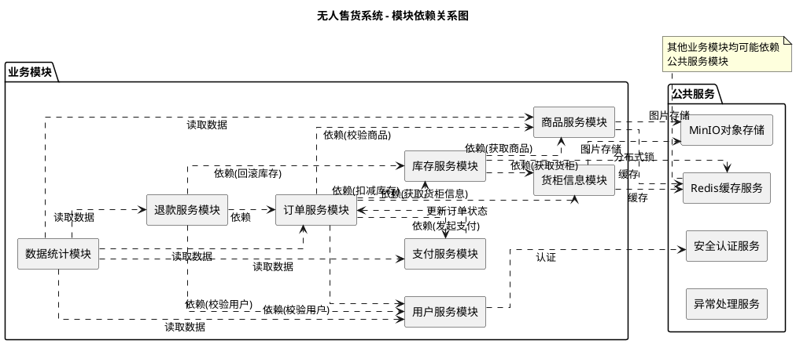
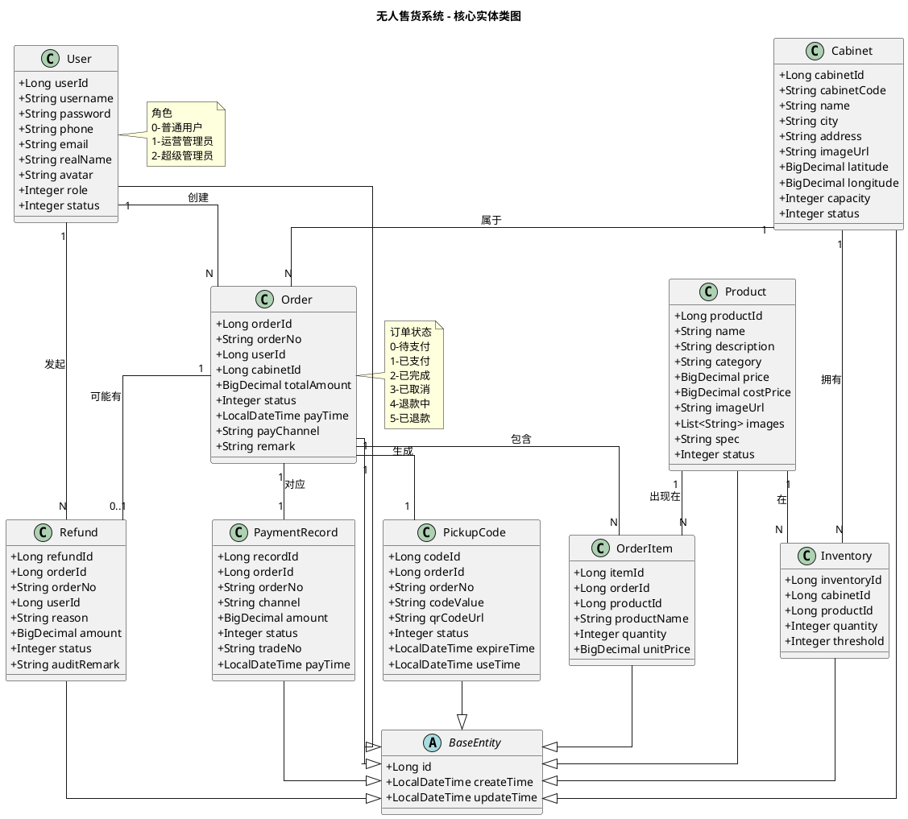
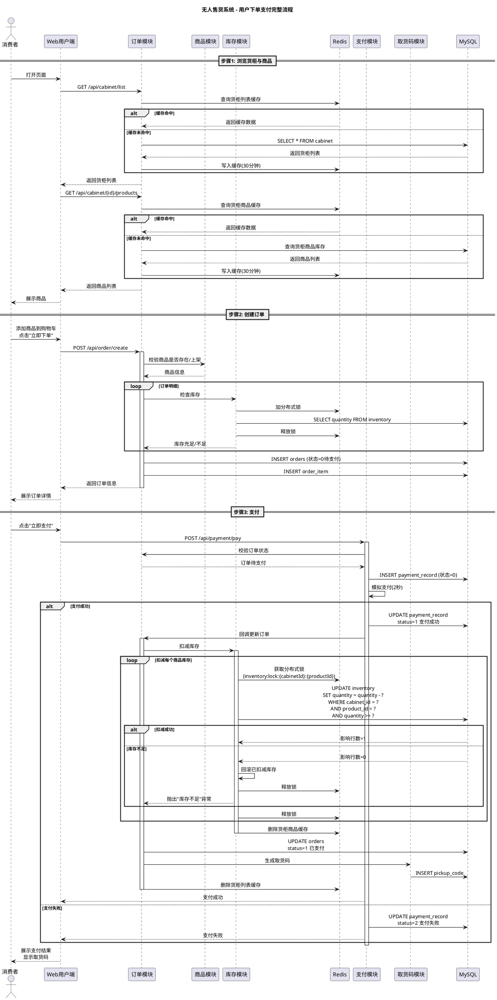
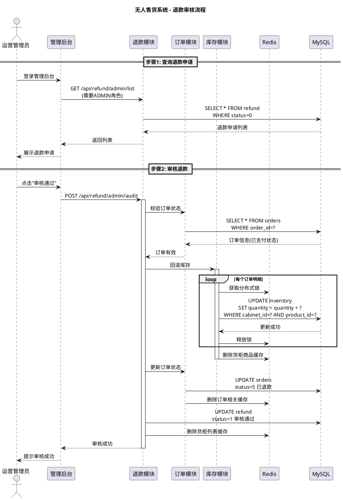
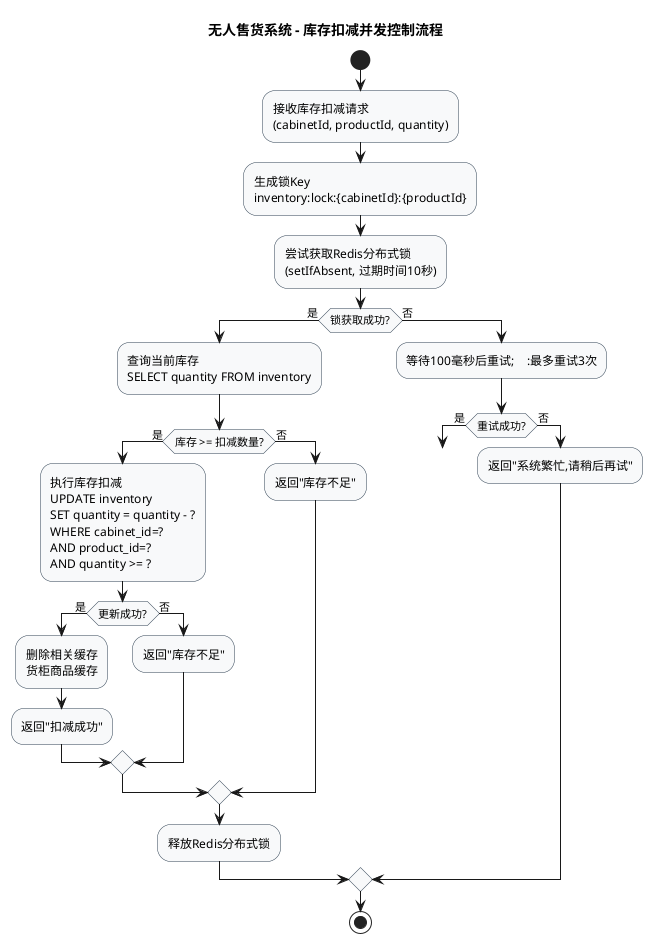
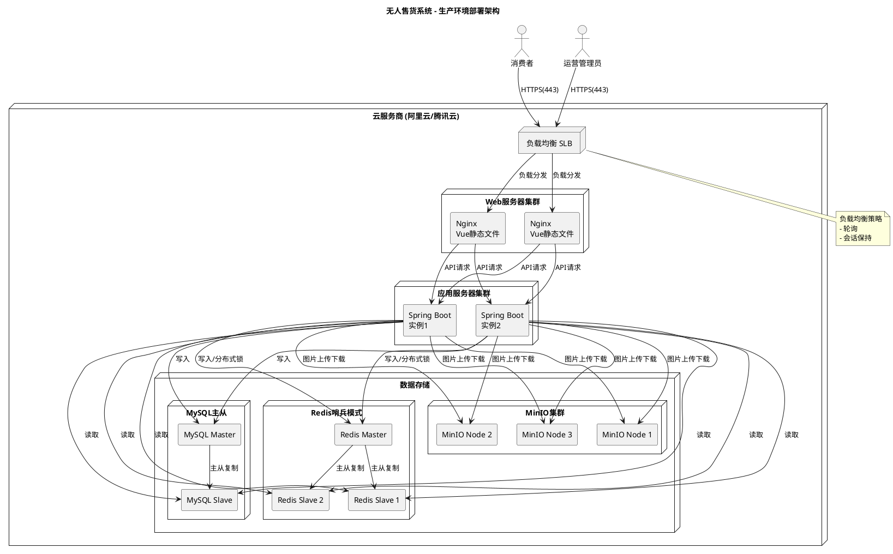

# 无人售货系统 - 系统架构设计UML代码

本文件包含系统架构设计相关的PlantUML代码，可在支持PlantUML的工具中渲染为图形。

---

## 1. 系统整体架构图

```plantuml
@startuml 系统整体架构图

!define RECTANGLE class

skinparam componentStyle rectangle
skinparam backgroundColor #FEFEFE
skinparam handwritten false

title 无人售货系统 - 整体架构图

package "表现层 (Presentation Layer)" {
    [Web用户端 (Vue 3)] as UserWeb
    [Web管理后台 (Vue 3)] as AdminWeb
}

package "API网关/负载均衡" {
    [Nginx] as Nginx
}

package "业务服务层 (Business Layer)" {
    [Spring Boot 3.2.5\n单体应用] as SpringBoot {
        package "业务模块" {
            [用户模块] as UserModule
            [商品模块] as ProductModule
            [订单模块] as OrderModule
            [支付模块] as PaymentModule
            [库存模块] as InventoryModule
            [货柜模块] as CabinetModule
            [退款模块] as RefundModule
            [统计模块] as StatsModule
        }
        
        package "公共服务" {
            [安全认证\n(JWT+Security)] as Security
            [Redis缓存服务] as CacheService
            [全局异常处理] as ExceptionHandler
            [Swagger文档] as Swagger
        }
    }
}

package "数据层 (Data Layer)" {
    database "MySQL 8.0\n(主数据库)" as MySQL
    database "Redis 7.0\n(缓存/分布式锁)" as Redis
    database "MinIO 8.5\n(图片对象存储)" as MinIO
}

UserWeb -down-> Nginx : HTTPS/JSON
AdminWeb -down-> Nginx : HTTPS/JSON
Nginx -down-> SpringBoot : API请求

SpringBoot -down-> MySQL : JDBC/MyBatis
SpringBoot -down-> Redis : Redis Client
SpringBoot -down-> MinIO : S3 Client

note right of MySQL
  核心业务数据表
  - sys_user (用户表)
  - product (商品表)
  - cabinet (货柜表)
  - inventory (库存表)
  - orders (订单表)
  - order_item (订单明细)
  - payment_record (支付记录)
  - pickup_code (取货码表)
  - refund (退款表)
end note

note right of Redis
  缓存内容
  - 商品列表缓存
  - 货柜列表缓存
  - 货柜商品缓存
  - JWT黑名单
  - Refresh Token
  - 分布式锁
end note

note right of MinIO
  存储内容
  - 商品图片
  - 货柜图片
  - 用户头像
end note

@enduml
```

---

## 2. 模块依赖关系图



---

## 3. 核心实体类图



---

## 4. 用户下单支付时序图



---

## 5. 管理员退款审核时序图



---

## 6. 库存扣减并发控制流程图



---

## 7. 部署架构图



---

## 使用说明

1. **PlantUML工具**：可使用以下工具渲染上述代码
   - VS Code + PlantUML 插件
   - IntelliJ IDEA + PlantUML 插件
   - 在线工具：http://www.plantuml.com/plantuml/
   - 本地安装 PlantUML

2. **语法说明**：
   - 所有代码均使用标准PlantUML语法
   - 支持中文注释和标签
   - 可根据需要调整颜色、布局等

3. **导出格式**：
   - PNG/JPG 图片格式
   - SVG 矢量格式
   - PDF 文档格式
